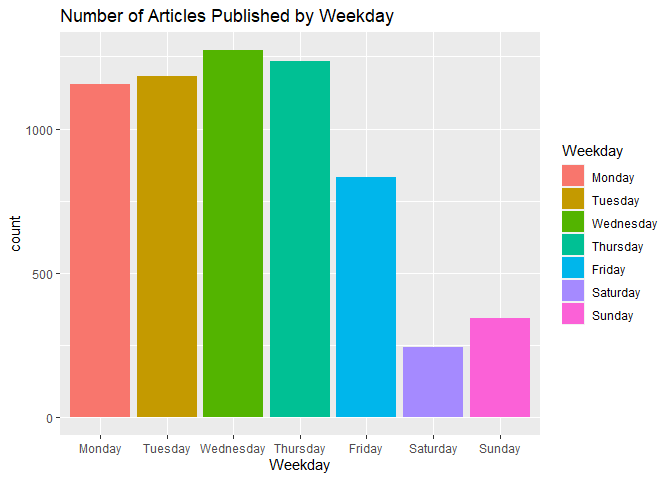
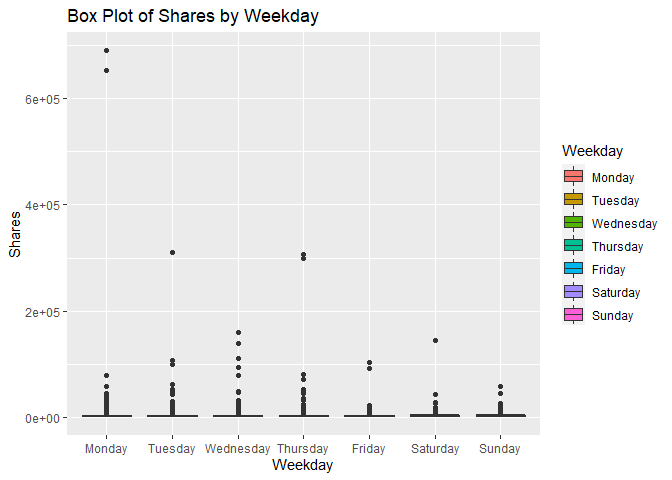
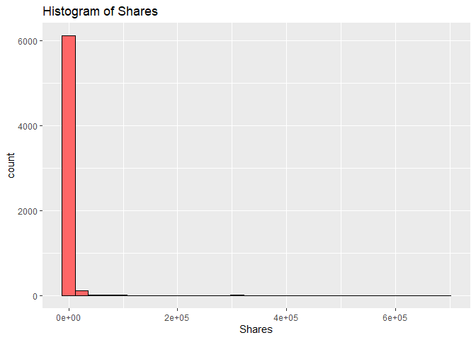
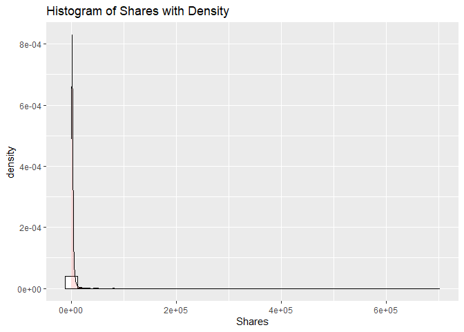
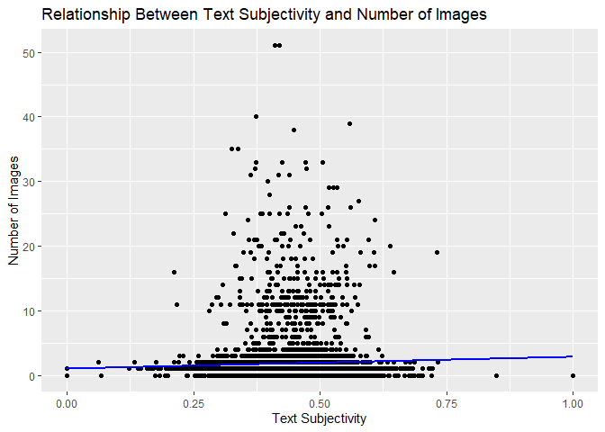
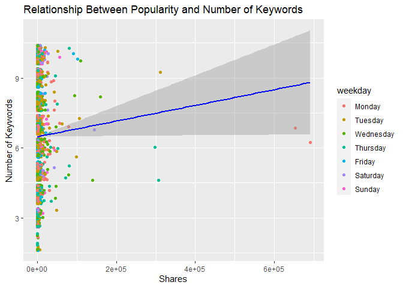
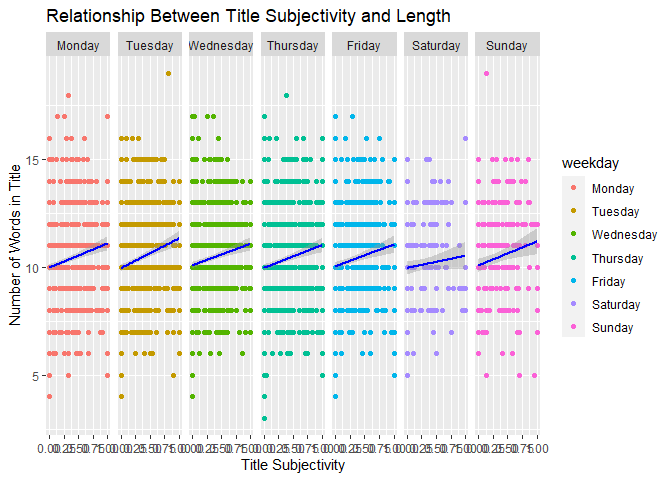

ST 558 Project 3
================
Melanie Kahn & Rachel Hardy
2022-11-14

-   <a href="#required-libraries" id="toc-required-libraries">Required
    Libraries</a>
-   <a href="#introduction-to-the-data"
    id="toc-introduction-to-the-data">Introduction to the Data</a>
-   <a href="#data" id="toc-data">Data</a>
    -   <a href="#reading-in-the-data" id="toc-reading-in-the-data">Reading in
        the Data</a>
    -   <a href="#modifying-the-data" id="toc-modifying-the-data">Modifying the
        Data</a>
    -   <a href="#splitting-the-data" id="toc-splitting-the-data">Splitting the
        Data</a>
-   <a href="#summarizations" id="toc-summarizations">Summarizations</a>
    -   <a href="#summary-statistics" id="toc-summary-statistics">Summary
        Statistics</a>
    -   <a href="#contingency-tables" id="toc-contingency-tables">Contingency
        Tables</a>
    -   <a href="#graphical-summaries" id="toc-graphical-summaries">Graphical
        Summaries</a>
        -   <a href="#bar-plot" id="toc-bar-plot">Bar Plot</a>
        -   <a href="#box-plot" id="toc-box-plot">Box Plot</a>
        -   <a href="#histograms" id="toc-histograms">Histograms</a>
        -   <a href="#scatter-plots" id="toc-scatter-plots">Scatter Plots</a>
-   <a href="#modeling" id="toc-modeling">Modeling</a>
    -   <a href="#linear-regression" id="toc-linear-regression">Linear
        Regression</a>
    -   <a href="#random-forest" id="toc-random-forest">Random Forest</a>
    -   <a href="#boosted-tree" id="toc-boosted-tree">Boosted Tree</a>
-   <a href="#comparison" id="toc-comparison">Comparison</a>

# Required Libraries

Running the code chunk below loads the `tidyverse`, `readr`, `ggplot2`,
`shiny`, `caret`, and `rmarkdown` packages.

``` r
library(tidyverse)
library(readr)
library(ggplot2)
library(shiny)
library(caret)
library(rmarkdown)
```

# Introduction to the Data

The online news popularity data used for this project summarizes a
diverse set of features about articles published by
[Mashable](http://www.mashable.com) over a two year period with the goal
of predicting the number of shares in social networks - a proxy for
popularity.

The original online news popularity data set included 58 predictive
variables, 2 non-predictive variables, 1 target variable. For the
purposes of this project, we are only using 14 non-predictive variables,
keeping the same target variable.

The variables present for each observation in this subset of the online
news popularity data set are as follows:

Non-Predictive Variables:

-   `url` - URL of the article  
-   `timedelta` - The number of days between the article publication and
    the data set acquisition

Predictive Variables:

-   `data_channel_is_*` - Binary variable indicating the type of data
    channel
    -   `lifestyle` - Lifestyle  
    -   `entertainment` - Entertainment  
    -   `bus` - Business  
    -   `socmed` - Social Media  
    -   `tech` - Tech  
    -   `world` - World  
-   `is_weekend` - Binary variable indicating if the article published
    on the weekend  
-   `weekday` - What day of the week the article was published (factor
    variable with seven levels)  
-   `num_imgs` - The number of images in the article  
-   `num_keywords` - The number of keywords in the metadata  
-   `n_tokens_title` - The number of words in the title  
-   `title_subjectivity` - Score of 0 - 1 indicating how subjective the
    title of the article is  
-   `global_subjectivity` - Score of 0 - 1 indicating how subjective the
    text of the article is

Target Variable:

-   `shares` - Number of shares

The purpose of the following analysis is to create predictive models for
this data set and find which one performs the best. After splitting the
data into a training and test set, the performance of a simple linear
regression model, a multiple regression model, a random forest model,
and a boosted tree model will be compared based on the root-mean-square
error (RMSE) calculation. The best model will have the smallest RMSE
from the test set. This process will be done across each data channel
(lifestyle,entertainment, business, social media, tech, and world) using
automated RMarkdown reports.

# Data

## Reading in the Data

Running the code chunk below reads in the online news popularity data
set using `read_csv()`.

``` r
newsOriginal <- read_csv(file = "./OnlineNewsPopularity.csv")
newsOriginal
```

    ## # A tibble: 39,644 × 61
    ##    url      timed…¹ n_tok…² n_tok…³ n_uni…⁴ n_non…⁵ n_non…⁶ num_h…⁷ num_s…⁸ num_i…⁹ num_v…˟ avera…˟ num_k…˟ data_…˟ data_…˟ data_…˟ data_…˟ data_…˟
    ##    <chr>      <dbl>   <dbl>   <dbl>   <dbl>   <dbl>   <dbl>   <dbl>   <dbl>   <dbl>   <dbl>   <dbl>   <dbl>   <dbl>   <dbl>   <dbl>   <dbl>   <dbl>
    ##  1 http://…     731      12     219   0.664    1.00   0.815       4       2       1       0    4.68       5       0       1       0       0       0
    ##  2 http://…     731       9     255   0.605    1.00   0.792       3       1       1       0    4.91       4       0       0       1       0       0
    ##  3 http://…     731       9     211   0.575    1.00   0.664       3       1       1       0    4.39       6       0       0       1       0       0
    ##  4 http://…     731       9     531   0.504    1.00   0.666       9       0       1       0    4.40       7       0       1       0       0       0
    ##  5 http://…     731      13    1072   0.416    1.00   0.541      19      19      20       0    4.68       7       0       0       0       0       1
    ##  6 http://…     731      10     370   0.560    1.00   0.698       2       2       0       0    4.36       9       0       0       0       0       1
    ##  7 http://…     731       8     960   0.418    1.00   0.550      21      20      20       0    4.65      10       1       0       0       0       0
    ##  8 http://…     731      12     989   0.434    1.00   0.572      20      20      20       0    4.62       9       0       0       0       0       1
    ##  9 http://…     731      11      97   0.670    1.00   0.837       2       0       0       0    4.86       7       0       0       0       0       1
    ## 10 http://…     731      10     231   0.636    1.00   0.797       4       1       1       1    5.09       5       0       0       0       0       0
    ## # … with 39,634 more rows, 43 more variables: data_channel_is_world <dbl>, kw_min_min <dbl>, kw_max_min <dbl>, kw_avg_min <dbl>, kw_min_max <dbl>,
    ## #   kw_max_max <dbl>, kw_avg_max <dbl>, kw_min_avg <dbl>, kw_max_avg <dbl>, kw_avg_avg <dbl>, self_reference_min_shares <dbl>,
    ## #   self_reference_max_shares <dbl>, self_reference_avg_sharess <dbl>, weekday_is_monday <dbl>, weekday_is_tuesday <dbl>,
    ## #   weekday_is_wednesday <dbl>, weekday_is_thursday <dbl>, weekday_is_friday <dbl>, weekday_is_saturday <dbl>, weekday_is_sunday <dbl>,
    ## #   is_weekend <dbl>, LDA_00 <dbl>, LDA_01 <dbl>, LDA_02 <dbl>, LDA_03 <dbl>, LDA_04 <dbl>, global_subjectivity <dbl>,
    ## #   global_sentiment_polarity <dbl>, global_rate_positive_words <dbl>, global_rate_negative_words <dbl>, rate_positive_words <dbl>,
    ## #   rate_negative_words <dbl>, avg_positive_polarity <dbl>, min_positive_polarity <dbl>, max_positive_polarity <dbl>, …

## Modifying the Data

Running the code chunk below subsets the data to only include
observations for the data channel we’re interested in.

``` r
news <- newsOriginal %>% filter(get(params$dataChannel) == 1)
news
```

    ## # A tibble: 6,258 × 61
    ##    url      timed…¹ n_tok…² n_tok…³ n_uni…⁴ n_non…⁵ n_non…⁶ num_h…⁷ num_s…⁸ num_i…⁹ num_v…˟ avera…˟ num_k…˟ data_…˟ data_…˟ data_…˟ data_…˟ data_…˟
    ##    <chr>      <dbl>   <dbl>   <dbl>   <dbl>   <dbl>   <dbl>   <dbl>   <dbl>   <dbl>   <dbl>   <dbl>   <dbl>   <dbl>   <dbl>   <dbl>   <dbl>   <dbl>
    ##  1 http://…     731       9     255   0.605    1.00   0.792       3       1       1       0    4.91       4       0       0       1       0       0
    ##  2 http://…     731       9     211   0.575    1.00   0.664       3       1       1       0    4.39       6       0       0       1       0       0
    ##  3 http://…     731       8     397   0.625    1.00   0.806      11       0       1       0    5.45       6       0       0       1       0       0
    ##  4 http://…     731      13     244   0.560    1.00   0.680       3       2       1       0    4.42       4       0       0       1       0       0
    ##  5 http://…     731      11     723   0.491    1.00   0.642      18       1       1       0    5.23       6       0       0       1       0       0
    ##  6 http://…     731       8     708   0.482    1.00   0.688       8       3       1       1    4.62       7       0       0       1       0       0
    ##  7 http://…     731      10     142   0.655    1.00   0.792       2       1       1       0    4.27       5       0       0       1       0       0
    ##  8 http://…     731      12     444   0.601    1.00   0.755       9       8      23       0    4.81      10       0       0       1       0       0
    ##  9 http://…     731       6     109   0.667    1.00   0.737       3       2       1       0    4.73       6       0       0       1       0       0
    ## 10 http://…     730      13     306   0.535    1.00   0.705       3       2       1       0    4.58      10       0       0       1       0       0
    ## # … with 6,248 more rows, 43 more variables: data_channel_is_world <dbl>, kw_min_min <dbl>, kw_max_min <dbl>, kw_avg_min <dbl>, kw_min_max <dbl>,
    ## #   kw_max_max <dbl>, kw_avg_max <dbl>, kw_min_avg <dbl>, kw_max_avg <dbl>, kw_avg_avg <dbl>, self_reference_min_shares <dbl>,
    ## #   self_reference_max_shares <dbl>, self_reference_avg_sharess <dbl>, weekday_is_monday <dbl>, weekday_is_tuesday <dbl>,
    ## #   weekday_is_wednesday <dbl>, weekday_is_thursday <dbl>, weekday_is_friday <dbl>, weekday_is_saturday <dbl>, weekday_is_sunday <dbl>,
    ## #   is_weekend <dbl>, LDA_00 <dbl>, LDA_01 <dbl>, LDA_02 <dbl>, LDA_03 <dbl>, LDA_04 <dbl>, global_subjectivity <dbl>,
    ## #   global_sentiment_polarity <dbl>, global_rate_positive_words <dbl>, global_rate_negative_words <dbl>, rate_positive_words <dbl>,
    ## #   rate_negative_words <dbl>, avg_positive_polarity <dbl>, min_positive_polarity <dbl>, max_positive_polarity <dbl>, …

Running the code chunk below creates the categorical variable `weekday`
to the data set that tells us what day of the week the article was
published.

``` r
news <- news %>% mutate(weekday = if_else((weekday_is_monday == 1), "Monday",
                                  if_else((weekday_is_tuesday == 1), "Tuesday", 
                                  if_else((weekday_is_wednesday == 1), "Wednesday", 
                                  if_else((weekday_is_thursday == 1), "Thursday", 
                                  if_else((weekday_is_friday == 1), "Friday",
                                  if_else((weekday_is_saturday == 1), "Saturday", 
                                  if_else((weekday_is_sunday == 1), "Sunday", " ")))))))) %>%
                 select(url, shares, weekday, everything())

news$weekday <- factor(news$weekday, levels=c("Monday", "Tuesday", "Wednesday",
                                              "Thursday", "Friday", "Saturday", "Sunday"))
levels(news$weekday)
```

    ## [1] "Monday"    "Tuesday"   "Wednesday" "Thursday"  "Friday"    "Saturday"  "Sunday"

``` r
news
```

    ## # A tibble: 6,258 × 62
    ##    url       shares weekday timed…¹ n_tok…² n_tok…³ n_uni…⁴ n_non…⁵ n_non…⁶ num_h…⁷ num_s…⁸ num_i…⁹ num_v…˟ avera…˟ num_k…˟ data_…˟ data_…˟ data_…˟
    ##    <chr>      <dbl> <fct>     <dbl>   <dbl>   <dbl>   <dbl>   <dbl>   <dbl>   <dbl>   <dbl>   <dbl>   <dbl>   <dbl>   <dbl>   <dbl>   <dbl>   <dbl>
    ##  1 http://m…    711 Monday      731       9     255   0.605    1.00   0.792       3       1       1       0    4.91       4       0       0       1
    ##  2 http://m…   1500 Monday      731       9     211   0.575    1.00   0.664       3       1       1       0    4.39       6       0       0       1
    ##  3 http://m…   3100 Monday      731       8     397   0.625    1.00   0.806      11       0       1       0    5.45       6       0       0       1
    ##  4 http://m…    852 Monday      731      13     244   0.560    1.00   0.680       3       2       1       0    4.42       4       0       0       1
    ##  5 http://m…    425 Monday      731      11     723   0.491    1.00   0.642      18       1       1       0    5.23       6       0       0       1
    ##  6 http://m…   3200 Monday      731       8     708   0.482    1.00   0.688       8       3       1       1    4.62       7       0       0       1
    ##  7 http://m…    575 Monday      731      10     142   0.655    1.00   0.792       2       1       1       0    4.27       5       0       0       1
    ##  8 http://m…    819 Monday      731      12     444   0.601    1.00   0.755       9       8      23       0    4.81      10       0       0       1
    ##  9 http://m…    732 Monday      731       6     109   0.667    1.00   0.737       3       2       1       0    4.73       6       0       0       1
    ## 10 http://m…   1200 Tuesday     730      13     306   0.535    1.00   0.705       3       2       1       0    4.58      10       0       0       1
    ## # … with 6,248 more rows, 44 more variables: data_channel_is_socmed <dbl>, data_channel_is_tech <dbl>, data_channel_is_world <dbl>,
    ## #   kw_min_min <dbl>, kw_max_min <dbl>, kw_avg_min <dbl>, kw_min_max <dbl>, kw_max_max <dbl>, kw_avg_max <dbl>, kw_min_avg <dbl>,
    ## #   kw_max_avg <dbl>, kw_avg_avg <dbl>, self_reference_min_shares <dbl>, self_reference_max_shares <dbl>, self_reference_avg_sharess <dbl>,
    ## #   weekday_is_monday <dbl>, weekday_is_tuesday <dbl>, weekday_is_wednesday <dbl>, weekday_is_thursday <dbl>, weekday_is_friday <dbl>,
    ## #   weekday_is_saturday <dbl>, weekday_is_sunday <dbl>, is_weekend <dbl>, LDA_00 <dbl>, LDA_01 <dbl>, LDA_02 <dbl>, LDA_03 <dbl>, LDA_04 <dbl>,
    ## #   global_subjectivity <dbl>, global_sentiment_polarity <dbl>, global_rate_positive_words <dbl>, global_rate_negative_words <dbl>,
    ## #   rate_positive_words <dbl>, rate_negative_words <dbl>, avg_positive_polarity <dbl>, min_positive_polarity <dbl>, max_positive_polarity <dbl>, …

## Splitting the Data

Running the code chunk below splits the modified `news` data set into a
training and testing set using `createDataPartition()`. First the seed
is set to make sure the random sampling will be reproducible.
`createDataPartition()` then creates an indexing vector (`trainIndex`)
with a subset of the `shares` variable where the training subset
(`newsTrain`) will result in a vector (`list = FALSE`) that has
approximately 70% (`p = 0.7`) of the observations from the updated
`news` data set. This training vector is then used to create the
training set (`newsTrain`) with approximately 70% of the observations
from the updated `news` data set, and the test set (`newsTest`) with the
remaining 30% of the observations.

``` r
set.seed(100)
newsIndex <- createDataPartition(news$shares, p = 0.7, list = FALSE)

newsTrain <- news[newsIndex, ]
newsTest <- news[-newsIndex, ]

newsTrain
```

    ## # A tibble: 4,382 × 62
    ##    url       shares weekday timed…¹ n_tok…² n_tok…³ n_uni…⁴ n_non…⁵ n_non…⁶ num_h…⁷ num_s…⁸ num_i…⁹ num_v…˟ avera…˟ num_k…˟ data_…˟ data_…˟ data_…˟
    ##    <chr>      <dbl> <fct>     <dbl>   <dbl>   <dbl>   <dbl>   <dbl>   <dbl>   <dbl>   <dbl>   <dbl>   <dbl>   <dbl>   <dbl>   <dbl>   <dbl>   <dbl>
    ##  1 http://m…    711 Monday      731       9     255   0.605    1.00   0.792       3       1       1       0    4.91       4       0       0       1
    ##  2 http://m…   3100 Monday      731       8     397   0.625    1.00   0.806      11       0       1       0    5.45       6       0       0       1
    ##  3 http://m…    852 Monday      731      13     244   0.560    1.00   0.680       3       2       1       0    4.42       4       0       0       1
    ##  4 http://m…    425 Monday      731      11     723   0.491    1.00   0.642      18       1       1       0    5.23       6       0       0       1
    ##  5 http://m…   3200 Monday      731       8     708   0.482    1.00   0.688       8       3       1       1    4.62       7       0       0       1
    ##  6 http://m…    575 Monday      731      10     142   0.655    1.00   0.792       2       1       1       0    4.27       5       0       0       1
    ##  7 http://m…    732 Monday      731       6     109   0.667    1.00   0.737       3       2       1       0    4.73       6       0       0       1
    ##  8 http://m…   1200 Tuesday     730      13     306   0.535    1.00   0.705       3       2       1       0    4.58      10       0       0       1
    ##  9 http://m…   2000 Wednes…     729       9     233   0.553    1.00   0.714       5       1       1       0    4.64       4       0       0       1
    ## 10 http://m…   1900 Wednes…     729      10     468   0.534    1.00   0.722       7       6       1       0    4.53       5       0       0       1
    ## # … with 4,372 more rows, 44 more variables: data_channel_is_socmed <dbl>, data_channel_is_tech <dbl>, data_channel_is_world <dbl>,
    ## #   kw_min_min <dbl>, kw_max_min <dbl>, kw_avg_min <dbl>, kw_min_max <dbl>, kw_max_max <dbl>, kw_avg_max <dbl>, kw_min_avg <dbl>,
    ## #   kw_max_avg <dbl>, kw_avg_avg <dbl>, self_reference_min_shares <dbl>, self_reference_max_shares <dbl>, self_reference_avg_sharess <dbl>,
    ## #   weekday_is_monday <dbl>, weekday_is_tuesday <dbl>, weekday_is_wednesday <dbl>, weekday_is_thursday <dbl>, weekday_is_friday <dbl>,
    ## #   weekday_is_saturday <dbl>, weekday_is_sunday <dbl>, is_weekend <dbl>, LDA_00 <dbl>, LDA_01 <dbl>, LDA_02 <dbl>, LDA_03 <dbl>, LDA_04 <dbl>,
    ## #   global_subjectivity <dbl>, global_sentiment_polarity <dbl>, global_rate_positive_words <dbl>, global_rate_negative_words <dbl>,
    ## #   rate_positive_words <dbl>, rate_negative_words <dbl>, avg_positive_polarity <dbl>, min_positive_polarity <dbl>, max_positive_polarity <dbl>, …

``` r
newsTest
```

    ## # A tibble: 1,876 × 62
    ##    url       shares weekday timed…¹ n_tok…² n_tok…³ n_uni…⁴ n_non…⁵ n_non…⁶ num_h…⁷ num_s…⁸ num_i…⁹ num_v…˟ avera…˟ num_k…˟ data_…˟ data_…˟ data_…˟
    ##    <chr>      <dbl> <fct>     <dbl>   <dbl>   <dbl>   <dbl>   <dbl>   <dbl>   <dbl>   <dbl>   <dbl>   <dbl>   <dbl>   <dbl>   <dbl>   <dbl>   <dbl>
    ##  1 http://m…   1500 Monday      731       9     211   0.575    1.00   0.664       3       1       1       0    4.39       6       0       0       1
    ##  2 http://m…    819 Monday      731      12     444   0.601    1.00   0.755       9       8      23       0    4.81      10       0       0       1
    ##  3 http://m…    459 Wednes…     729       9     759   0.499    1.00   0.693      17       9       1       0    4.66       6       0       0       1
    ##  4 http://m…    474 Wednes…     729      10     424   0.553    1.00   0.676       8       0       1       0    4.98       6       0       0       1
    ##  5 http://m…   1900 Wednes…     729      11     173   0.724    1.00   0.804       3       2       1       0    4.94      10       0       0       1
    ##  6 http://m…    648 Wednes…     729       9     330   0.502    1.00   0.585      12       2       1       0    4.66       7       0       0       1
    ##  7 http://m…    606 Wednes…     729      12     180   0.607    1.00   0.752       3       1       1       0    4.73       6       0       0       1
    ##  8 http://m…   1200 Thursd…     728      15     481   0.541    1.00   0.707       5       3       1       0    4.59       7       0       0       1
    ##  9 http://m…    794 Thursd…     728      11     347   0.585    1.00   0.739       7       0       0       1    5.07       7       0       0       1
    ## 10 http://m…   1300 Thursd…     728      11     255   0.632    1.00   0.807       5       0       1       0    4.86       5       0       0       1
    ## # … with 1,866 more rows, 44 more variables: data_channel_is_socmed <dbl>, data_channel_is_tech <dbl>, data_channel_is_world <dbl>,
    ## #   kw_min_min <dbl>, kw_max_min <dbl>, kw_avg_min <dbl>, kw_min_max <dbl>, kw_max_max <dbl>, kw_avg_max <dbl>, kw_min_avg <dbl>,
    ## #   kw_max_avg <dbl>, kw_avg_avg <dbl>, self_reference_min_shares <dbl>, self_reference_max_shares <dbl>, self_reference_avg_sharess <dbl>,
    ## #   weekday_is_monday <dbl>, weekday_is_tuesday <dbl>, weekday_is_wednesday <dbl>, weekday_is_thursday <dbl>, weekday_is_friday <dbl>,
    ## #   weekday_is_saturday <dbl>, weekday_is_sunday <dbl>, is_weekend <dbl>, LDA_00 <dbl>, LDA_01 <dbl>, LDA_02 <dbl>, LDA_03 <dbl>, LDA_04 <dbl>,
    ## #   global_subjectivity <dbl>, global_sentiment_polarity <dbl>, global_rate_positive_words <dbl>, global_rate_negative_words <dbl>,
    ## #   rate_positive_words <dbl>, rate_negative_words <dbl>, avg_positive_polarity <dbl>, min_positive_polarity <dbl>, max_positive_polarity <dbl>, …

# Summarizations

## Summary Statistics

Running the code chunk below provides the mean and standard deviation
for the number of times articles in the `news` data set were shared
(`shares`).

``` r
mean(news$shares)
```

    ## [1] 3063.019

``` r
sd(news$shares)
```

    ## [1] 15046.39

Running the code chunk below provides the mean and standard deviation
for the number of images per article (`num_imgs`) in the `news` data
set.

``` r
mean(news$num_imgs)
```

    ## [1] 1.808405

``` r
sd(news$num_imgs)
```

    ## [1] 3.494494

Running the code chunk below provides the mean and standard deviation
for the number of keywords per article (`num_keywords`) in the `news`
data set.

``` r
mean(news$num_keywords)
```

    ## [1] 6.489613

``` r
sd(news$num_keywords)
```

    ## [1] 1.975308

## Contingency Tables

Running the code chunk below creates a contingency table showing the
number of articles in the online `news` popularity data set that were
published on the weekend (`is_weekend`).

``` r
tableWeekend <- table(news$is_weekend)
tableWeekend
```

    ## 
    ##    0    1 
    ## 5672  586

From the table **above**, we can see that 586 articles were published on
the weekend, and 5672 articles were published during the week.

Running the code chunk below creates a contingency table showing the
number of articles in the online `news` popularity data set that were
published on certain days of the week (`weekday`).

``` r
tableWeekday <- table(news$weekday)
tableWeekday
```

    ## 
    ##    Monday   Tuesday Wednesday  Thursday    Friday  Saturday    Sunday 
    ##      1153      1182      1271      1234       832       243       343

From the table **above**, we can see that 1153 articles were published
on Monday, 586 were published on Tuesday, NA on Wednesday, NA on
Thursday, NA on Friday, NA on Saturday, NA articles were published on
Sunday.

## Graphical Summaries

### Bar Plot

Running the code chunk below creates a bar plot to visualize the number
of articles published per each `weekday`. Using the aesthetics option
`aes(fill = weekday)` inside the `geom_bar()` function gives us a nicely
colored graph.

``` r
g <- ggplot(news, aes(x = weekday))

g + geom_bar(aes(fill = weekday)) + 
  labs(title = "Number of Articles Published by Weekday", x = "Weekday") +
  scale_fill_discrete(name = "Weekday")
```

<!-- -->

### Box Plot

Running the code chunk below creates a box plot of number of `shares`
for each `weekday`. Using the aesthetics option ‘fill = weekday’ gives
us a nicely colored graph.

``` r
g <- ggplot(news, aes(x = weekday, y = shares))

g + geom_boxplot(aes(fill = weekday)) + 
  labs(title = "Box Plot of Shares by Weekday", x = "Weekday", y = "Shares") +
  scale_fill_discrete(name = "Weekday")
```

<!-- -->

### Histograms

Running the code chunk below creates two histograms of the number of
`shares` that show us the distribution of the variable. The second
histogram has an added density layer to give us a better idea of how the
data is spread out.

``` r
g <- ggplot(news, aes(x = shares))

g + geom_histogram(color = "black", fill = "#FF6666") + labs(title = "Histogram of Shares") +
  labs(title = "Histogram of Shares", x = "Shares")
```

<!-- -->

``` r
g + geom_histogram(aes(y=..density..), colour="black", fill="white") + 
  geom_density(alpha=.2, fill="#FF6666") + 
  labs(title = "Histogram of Shares with Density", x = "Shares")
```

<!-- -->

### Scatter Plots

Running the code chunk below creates a scatter plot to visualize the
correlation between the text subjectivity (`global_subjectivity`) and
the number of images (`num_imgs`) articles have. The `geom_point()`
function plots the data points while the `geom_smooth()` function plots
the regression line using method `lm` for linear model.

Using this linear regression line on the scatter plot *below* helps
quantify the direction and strength of the relationship between the text
subjectivity on the x-axis and the number of images on the y-axis.
Results showing a regression line starting lower on the y-axis than it
ends (a *positive* slope) represents a *positive* linear correlation
between an article’s overall subjectivity and the number of images
used - if one increases, so does the other. Results showing a regression
line starting higher on the y-axis than it ends (a *negative* slope)
represents a *negative* linear correlation between the two, meaning the
trend in the data shows a higher number of images reduces subjectivity
in an article. The steepness of the slope associated with this
regression line indicates the strength of the variable relationship. The
closer a regression line gets to horizontal, the weaker the correlation
between the subjectivity and images; and vice versa.

``` r
g <- ggplot(news, aes(x = global_subjectivity, y = num_imgs))
g + geom_point() +
  geom_smooth(method = lm, col = "Blue", se = FALSE) +
  labs(title = "Relationship Between Text Subjectivity and Number of Images",
       x = "Text Subjectivity",
       y = "Number of Images")
```

<!-- -->

Running the code chunk below creates a scatter plot to visualize the
correlation between the number of `shares` and the number of keywords
(`num_keywords`) articles have. `geom_jitter` is used instead of
`geom_point()` to plot the data points in a manner where the `weekday`
component can be better visualized. The `geom_smooth()` function plots
the regression line using method `lm` for linear model.

Using this linear regression line on the scatter plot *below* helps
quantify the direction and strength of the relationship between the
number of shares on the x-axis and the number of keywords on the y-axis.
Results showing a regression line starting lower on the y-axis than it
ends (a *positive* slope) represents a *positive* linear correlation
between an article’s number of shares and the number of keywords used -
if one increases, so does the other. Results showing a regression line
starting higher on the y-axis than it ends (a *negative* slope)
represents a *negative* linear correlation between the two, meaning the
trend in the data shows a higher number of keywords reduces the number
of times an article is shared. The steepness of the slope associated
with this regression line indicates the strength of the variable
relationship. The closer a regression line gets to horizontal, the
weaker the correlation between the popularity and keywords; and vice
versa. As one of the default arguments for the `geom_smooth` function is
`se = TRUE`, a 95% confidence interval can also be seen. Wider
confidence intervals indicate increased uncertainty of the effect the
variables have on each other.

``` r
g <- ggplot(news, aes(x = shares, y = num_keywords))
g + geom_jitter(aes(color = weekday)) +
  geom_smooth(method = lm, col = "Blue") +
  labs(title = "Relationship Between Popularity and Number of Keywords",
       x = "Shares",
       y = "Number of Keywords")
```

<!-- -->

Running the code chunk below creates a facet grid scatter plot to
visualize the correlation between the number of words in the article’s
title (`n_tokens_title`) and title’s subjectivity score
(`title_subjectivity`) according to the day the article was published
(`weekday`). The `geom_point()` function plots the data points while the
`geom_smooth()` function plots the regression line using method `lm` for
linear model.

Using this linear regression line on the scatter plot *below* helps
quantify the direction and strength of the relationship between the
title subjectivity on the x-axis and the number of words in the title on
the y-axis. Results showing a regression line starting lower on the
y-axis than it ends (a *positive* slope) represents a *positive* linear
correlation between a title’s subjectivity and length - if one
increases, so does the other. Results showing a regression line starting
higher on the y-axis than it ends (a *negative* slope) represents a
*negative* linear correlation between the two, meaning the trend in the
data shows a higher number of words reduces title subjectivity. The
steepness of the slope associated with this regression line indicates
the strength of the variable relationship. The closer a regression line
gets to horizontal, the weaker the correlation between the title
subjectivity and length; and vice versa. The 95% confidence intervals
may be harder to see due to the faceted nature of these plots, but wider
confidence intervals still indicate increased uncertainty of the effect
the variables have on each other.

``` r
g <- ggplot(news, aes(x = title_subjectivity, y = n_tokens_title))
g + geom_point(aes(color = weekday)) +
  facet_grid(~ weekday) +
  geom_smooth(method = lm, col = "Blue") +
  labs(title = "Relationship Between Title Subjectivity and Length",
       x = "Title Subjectivity",
       y = "Number of Words in Title")
```

<!-- -->

# Modeling

## Linear Regression

Linear regression attempts to model the (linear) relationship between a
response variable and one or more predictor variables by fitting a
linear equation to the data. The simplest form of the linear equation is
`Y = a + bX`, where `Y` is the response variable, `a` is the intercept,
`b` is the slope, and `X` is the predictor (or explanatory) variable.
The most common method for fitting a regression model is least-squares
regression, where the best-fitting line is calculated by minimizing the
sum of the squared residuals.

For linear regression, it is usually important to understand which
variables are related and which variables scientifically should be in
the model. It is also important to split the data into a training set
and a testing set so the model does not become over-fit.

Running the code chunk below creates a multiple linear regression model
where `shares` is the response variable and the predictor variables are
`weekday`, `title_subjectivity`, `num_imgs`, `title_subjectivity^2`, and
`num_imgs^2`.

By using the `summary()` function, we can see the values for the
residuals and coefficients, as well as the performance criteria values
such as multiple R-squared.

``` r
set.seed(100)
firstLinearModel <- train(shares ~ weekday + title_subjectivity + num_imgs + I(title_subjectivity^2) + I(num_imgs^2), 
                        data = newsTrain,
                        method = "lm",
                        preProcess = c("center", "scale"),
                        trControl = trainControl(method = "cv"))
firstLinearModel
```

    ## Linear Regression 
    ## 
    ## 4382 samples
    ##    3 predictor
    ## 
    ## Pre-processing: centered (10), scaled (10) 
    ## Resampling: Cross-Validated (10 fold) 
    ## Summary of sample sizes: 3944, 3943, 3943, 3944, 3944, 3945, ... 
    ## Resampling results:
    ## 
    ##   RMSE      Rsquared     MAE    
    ##   10355.19  0.008318582  2538.71
    ## 
    ## Tuning parameter 'intercept' was held constant at a value of TRUE

``` r
summary(firstLinearModel)
```

    ## 
    ## Call:
    ## lm(formula = .outcome ~ ., data = dat)
    ## 
    ## Residuals:
    ##    Min     1Q Median     3Q    Max 
    ##  -8087  -1869  -1176   -264 687251 
    ## 
    ## Coefficients:
    ##                           Estimate Std. Error t value Pr(>|t|)    
    ## (Intercept)                2928.96     202.11  14.492   <2e-16 ***
    ## weekdayTuesday             -425.11     259.25  -1.640   0.1011    
    ## weekdayWednesday           -495.19     262.14  -1.889   0.0590 .  
    ## weekdayThursday            -223.74     261.57  -0.855   0.3924    
    ## weekdayFriday              -391.68     247.15  -1.585   0.1131    
    ## weekdaySaturday             147.20     218.50   0.674   0.5006    
    ## weekdaySunday               -35.64     223.07  -0.160   0.8731    
    ## title_subjectivity         -903.78     578.61  -1.562   0.1184    
    ## num_imgs                   1014.89     459.98   2.206   0.0274 *  
    ## `I(title_subjectivity^2)`  1282.93     578.52   2.218   0.0266 *  
    ## `I(num_imgs^2)`            -433.29     459.87  -0.942   0.3461    
    ## ---
    ## Signif. codes:  0 '***' 0.001 '**' 0.01 '*' 0.05 '.' 0.1 ' ' 1
    ## 
    ## Residual standard error: 13380 on 4371 degrees of freedom
    ## Multiple R-squared:  0.005871,   Adjusted R-squared:  0.003596 
    ## F-statistic: 2.581 on 10 and 4371 DF,  p-value: 0.004078

Now that the multiple linear regression model has been trained
(`firstLinearModel`), running the code chunk below will check how well
the model does on the test set `newsTest` using the `postResample()`
function. The RMSE from the `postResample` output is then stored in an
object `firstLinearRMSE` for later use in our comparison functions.

``` r
firstLinearPredict <- predict(firstLinearModel, newdata = newsTest)

firstLinearPerformance <- postResample(firstLinearPredict, newsTest$shares)
firstLinearPerformance
```

    ##         RMSE     Rsquared          MAE 
    ## 1.833196e+04 2.733257e-04 3.005190e+03

``` r
attributes(firstLinearPerformance)
```

    ## $names
    ## [1] "RMSE"     "Rsquared" "MAE"

``` r
firstLinearRMSE <- firstLinearPerformance[1]
firstLinearRMSE
```

    ##     RMSE 
    ## 18331.96

Running the code chunk below creates a simple linear regression model
where `shares` is the response variable and the predictor variables are
`weekday`, `num_imgs`, `num_keywords`, `n_tokens_title`,
`title_subjectivity`, and `global_subjectivity`. The `summary()`
function is used to examine the values for the residuals and
coefficients, as well as the performance criteria values such as
multiple R-squared.

``` r
set.seed(100)
secondLinearModel <- train(shares ~ weekday + num_imgs + num_keywords + n_tokens_title + title_subjectivity + global_subjectivity, 
                        data = newsTrain,
                        method = "lm",
                        preProcess = c("center", "scale"),
                        trControl = trainControl(method = "cv"))
secondLinearModel
```

    ## Linear Regression 
    ## 
    ## 4382 samples
    ##    6 predictor
    ## 
    ## Pre-processing: centered (11), scaled (11) 
    ## Resampling: Cross-Validated (10 fold) 
    ## Summary of sample sizes: 3944, 3943, 3943, 3944, 3944, 3945, ... 
    ## Resampling results:
    ## 
    ##   RMSE     Rsquared     MAE   
    ##   10351.8  0.008065599  2550.5
    ## 
    ## Tuning parameter 'intercept' was held constant at a value of TRUE

``` r
summary(secondLinearModel)
```

    ## 
    ## Call:
    ## lm(formula = .outcome ~ ., data = dat)
    ## 
    ## Residuals:
    ##    Min     1Q Median     3Q    Max 
    ## -12106  -1958  -1188   -212 687108 
    ## 
    ## Coefficients:
    ##                     Estimate Std. Error t value Pr(>|t|)    
    ## (Intercept)          2928.96     202.11  14.492  < 2e-16 ***
    ## weekdayTuesday       -405.78     259.16  -1.566  0.11749    
    ## weekdayWednesday     -478.29     262.16  -1.824  0.06816 .  
    ## weekdayThursday      -214.49     261.66  -0.820  0.41243    
    ## weekdayFriday        -391.23     247.33  -1.582  0.11376    
    ## weekdaySaturday       133.00     218.90   0.608  0.54350    
    ## weekdaySunday         -43.85     223.12  -0.197  0.84422    
    ## num_imgs              622.75     203.22   3.064  0.00219 ** 
    ## num_keywords           73.87     203.62   0.363  0.71679    
    ## n_tokens_title        299.67     204.62   1.464  0.14313    
    ## title_subjectivity    192.78     206.17   0.935  0.34981    
    ## global_subjectivity   453.10     204.74   2.213  0.02695 *  
    ## ---
    ## Signif. codes:  0 '***' 0.001 '**' 0.01 '*' 0.05 '.' 0.1 ' ' 1
    ## 
    ## Residual standard error: 13380 on 4370 degrees of freedom
    ## Multiple R-squared:  0.006146,   Adjusted R-squared:  0.003644 
    ## F-statistic: 2.457 on 11 and 4370 DF,  p-value: 0.004646

Now that the simple linear regression model has been trained
(`secondLinearModel`), running the code chunk below will check how well
the model does on the test set `newsTest` using the `postResample()`
function. The RMSE from the `postResample` output is then stored in an
object `secondLinearRMSE` for later use in our comparison functions.

``` r
secondLinearPredict <- predict(secondLinearModel, newdata = newsTest)

secondLinearPerformance <- postResample(secondLinearPredict, newsTest$shares)
secondLinearPerformance
```

    ##         RMSE     Rsquared          MAE 
    ## 1.831333e+04 1.213530e-03 3.018579e+03

``` r
attributes(secondLinearPerformance)
```

    ## $names
    ## [1] "RMSE"     "Rsquared" "MAE"

``` r
secondLinearRMSE <- secondLinearPerformance[1]
secondLinearRMSE
```

    ##     RMSE 
    ## 18313.33

## Random Forest

To understand random forests, it is first important to understand bagged
trees which are created using bootstrap aggregation. For bagged trees,
the sample is treated as the population and re-sampling is done with
replacement. The process of creating a bagged tree is below:

-   Step 1: Create a bootstrap sample using `sample()`  
-   Step 2: Train the tree on this sample (no pruning necessary)  
-   Step 3: Repeat B = 1000 times (no set mark)  
-   Step 4: Final prediction is average of these predictions (for
    regression trees) **OR** use majority vote as final classification
    prediction (classification trees)

Random forests are essentially bagged trees, except not all the
predictors are used for each model. A random subset of predictors is
used for each tree model (bootstrap sample). The purpose of doing this
is to prevent one or two strong predictors from dominating all tree
models and creating unwanted correlation between models.

Running the code chunk below trains the random forest model. The formula
notation used in the `train()` function models the `shares` variable
using the following predictor/explanatory variables: `weekday`,
`num_imgs`, and `num_keywords`. To use the random forest model, the
`method` argument was specified as `"rf"`. The data was pre-processed by
centering and scaling. Cross validation was used five-fold and repeated
three (3) times. The argument `tuneGrid` was then used to replicate the
random forest model a total of five (5) times. The best model is then
chosen based on the performance criteria.

``` r
set.seed(100)
randomForestCtrl <- trainControl(method = "repeatedcv", number = 5, repeats = 3)
randomForestFit <- train(shares ~ weekday + num_imgs + num_keywords, 
                         data = newsTrain, method = "rf", 
                         trControl = randomForestCtrl,
                         preProcess = c("center","scale"), 
                         tuneGrid = data.frame(mtry = 1:5))

randomForestFit
```

    ## Random Forest 
    ## 
    ## 4382 samples
    ##    3 predictor
    ## 
    ## Pre-processing: centered (8), scaled (8) 
    ## Resampling: Cross-Validated (5 fold, repeated 3 times) 
    ## Summary of sample sizes: 3506, 3504, 3506, 3506, 3506, 3506, ... 
    ## Resampling results across tuning parameters:
    ## 
    ##   mtry  RMSE      Rsquared     MAE     
    ##   1     11684.33  0.009001807  2518.094
    ##   2     11797.13  0.006570583  2540.956
    ##   3     12050.80  0.003907245  2592.374
    ##   4     12332.54  0.002929226  2652.350
    ##   5     12530.32  0.002352491  2687.324
    ## 
    ## RMSE was used to select the optimal model using the smallest value.
    ## The final value used for the model was mtry = 1.

Now that the random forest model has been trained (`randomForestFit`),
running the code chunk below will check how well the model does on the
test set `newsTest` using the `postResample()` function. The RMSE from
the `postResample` output is then stored in an object `rfRMSE` for later
use in our comparison functions.

``` r
randomForestPredict <- predict(randomForestFit, newdata = newsTest)

randomForestPerformance <- postResample(randomForestPredict, newsTest$shares)
randomForestPerformance
```

    ##         RMSE     Rsquared          MAE 
    ## 1.828211e+04 7.154632e-03 2.954356e+03

``` r
attributes(randomForestPerformance)
```

    ## $names
    ## [1] "RMSE"     "Rsquared" "MAE"

``` r
rfRMSE <- randomForestPerformance[1]
rfRMSE
```

    ##     RMSE 
    ## 18282.11

## Boosted Tree

Boosted trees are another enhancement to the single tree methods.
However, unlike bagged and random forest models, boosted trees do not
use bootstrapping. Boosting is a general method to slowly train your
tree so you don’t overfit your model. The trees are grown in a
sequential manner where each subsequent tree is based off a modified
version of the original data, updating the predictions as the tree is
grown. The process is described below:

-   Step 1: Initialize predictions as 0  
-   Step 2: Find the residuals for every observation
    -   Residuals in first tree fit will be original data values
        (observed - 0 = observed)  
-   Step 3: Fit a regression tree with `d` splits where the residuals
    are the response  
-   Step 4: Update predictions using the new predictions from step 3
    multiplied by the growth rate (Lambda tuning parameter)  
-   Step 5: Continue to update residuals for new predictions (steps 2
    -4) `B` times

Running the code chunk below trains the boosted tree model. The formula
notation used in the `train()` function models the `shares` variable
using the following predictor/explanatory variables: `weekday`,
`num_imgs`, `num_keywords`, `n_tokens_title`, and `title_subjectivity`.
To use the boosted tree model, the `method` argument was specified as
`"gbm"`. The data was pre-processed by centering and scaling. `tuneGrid`
was then used to consider values of `n.trees` = 50, `interaction.depth`
= 1, `shrinkage` = 0.1, and `n.minobsinnode` = 10. Lastly,
`trainControl()` was used within the `trControl` argument to do 10 fold
cross-validation using the `"cv"` `method`.

``` r
boostTreeFit <- train(shares ~ weekday + num_imgs + num_keywords + n_tokens_title + title_subjectivity
                        + global_subjectivity, data = newsTrain,
                        method = "gbm",
                        preProcess = c("center", "scale"),
                        tuneGrid = data.frame(n.trees = 50, interaction.depth = 1, shrinkage = 0.1, n.minobsinnode = 10),
                        trControl = trainControl(method = "cv", number = 10))
```

    ## Iter   TrainDeviance   ValidDeviance   StepSize   Improve
    ##      1 193236972.2114             nan     0.1000 -50599.6172
    ##      2 193084654.1378             nan     0.1000 -27173.9473
    ##      3 192788606.9701             nan     0.1000 59257.8592
    ##      4 192641610.5971             nan     0.1000 -42943.0541
    ##      5 192392435.5068             nan     0.1000 -59419.1895
    ##      6 192029582.1887             nan     0.1000 -81543.8233
    ##      7 191903141.9005             nan     0.1000 32023.8451
    ##      8 191657972.1557             nan     0.1000 -133436.4428
    ##      9 191580348.7572             nan     0.1000 -19077.0033
    ##     10 191480858.0561             nan     0.1000 3267.3022
    ##     20 190805035.3010             nan     0.1000 -263281.7462
    ##     40 190378038.9697             nan     0.1000 -174533.8945
    ##     50 189952794.4864             nan     0.1000 -89285.4155
    ## 
    ## Iter   TrainDeviance   ValidDeviance   StepSize   Improve
    ##      1 193256594.3191             nan     0.1000 -68552.7404
    ##      2 193047775.0046             nan     0.1000 105874.1863
    ##      3 192857942.6535             nan     0.1000 20147.8294
    ##      4 192736496.8891             nan     0.1000 -64932.0198
    ##      5 192449014.2569             nan     0.1000 -134358.4328
    ##      6 192319839.9325             nan     0.1000 10957.8166
    ##      7 192244797.6359             nan     0.1000 -29383.8862
    ##      8 192123193.5713             nan     0.1000 5809.5642
    ##      9 192057937.8229             nan     0.1000 -104137.4343
    ##     10 191963353.6374             nan     0.1000 -8486.5833
    ##     20 191537046.6992             nan     0.1000 -121907.0333
    ##     40 190929379.0282             nan     0.1000 -62145.1889
    ##     50 190882329.7174             nan     0.1000 -270101.4555
    ## 
    ## Iter   TrainDeviance   ValidDeviance   StepSize   Improve
    ##      1 196335199.0556             nan     0.1000 -14668.9391
    ##      2 196287318.1574             nan     0.1000 8297.5102
    ##      3 196096071.7628             nan     0.1000 -33051.4297
    ##      4 195917853.2412             nan     0.1000 155355.0256
    ##      5 195605560.9038             nan     0.1000 -108341.2852
    ##      6 195407536.9004             nan     0.1000 -60294.8267
    ##      7 195154988.8124             nan     0.1000 67652.3076
    ##      8 194997116.8309             nan     0.1000 -138985.0656
    ##      9 194857134.8552             nan     0.1000 88887.6208
    ##     10 194788661.4283             nan     0.1000 -8270.6888
    ##     20 193933574.0296             nan     0.1000 -70923.5329
    ##     40 193394717.6845             nan     0.1000 -108483.9416
    ##     50 193210891.2002             nan     0.1000 -311860.2179
    ## 
    ## Iter   TrainDeviance   ValidDeviance   StepSize   Improve
    ##      1 196135272.5063             nan     0.1000 143241.5515
    ##      2 195922523.0918             nan     0.1000 -69396.4454
    ##      3 195887629.0492             nan     0.1000 -32070.8270
    ##      4 195459795.8885             nan     0.1000 -141828.3484
    ##      5 195288808.2227             nan     0.1000 89367.3939
    ##      6 195150070.2477             nan     0.1000 27872.8998
    ##      7 194868342.9455             nan     0.1000 -177266.6410
    ##      8 194790249.8134             nan     0.1000 -162560.9537
    ##      9 194748031.8215             nan     0.1000 -297752.6654
    ##     10 194665896.9852             nan     0.1000 -150259.1380
    ##     20 193942751.9309             nan     0.1000 -160340.0456
    ##     40 193229273.1329             nan     0.1000 -81874.2203
    ##     50 193006115.6255             nan     0.1000 -156402.1535
    ## 
    ## Iter   TrainDeviance   ValidDeviance   StepSize   Improve
    ##      1 197965180.5540             nan     0.1000 -39528.5450
    ##      2 197704465.3781             nan     0.1000 55378.8743
    ##      3 197345712.0801             nan     0.1000 -43216.9777
    ##      4 197165452.6721             nan     0.1000 62066.2243
    ##      5 196900933.5552             nan     0.1000 -65987.6741
    ##      6 196768938.0820             nan     0.1000 -109304.6664
    ##      7 196629378.6149             nan     0.1000 -93099.0401
    ##      8 196481599.1029             nan     0.1000 48263.6461
    ##      9 196372415.8745             nan     0.1000 -45706.0268
    ##     10 196257476.2520             nan     0.1000 -11433.1260
    ##     20 195906113.3606             nan     0.1000 -77212.0754
    ##     40 195468789.6236             nan     0.1000 -110406.4039
    ##     50 195116703.5137             nan     0.1000 -399672.7552
    ## 
    ## Iter   TrainDeviance   ValidDeviance   StepSize   Improve
    ##      1 193498371.8406             nan     0.1000 -15949.8448
    ##      2 193271194.1221             nan     0.1000 66578.7695
    ##      3 193109744.5622             nan     0.1000 54922.3117
    ##      4 192846909.8266             nan     0.1000 274979.6812
    ##      5 192502456.6107             nan     0.1000 -12372.8374
    ##      6 192389516.3285             nan     0.1000 -71889.9076
    ##      7 192294629.8452             nan     0.1000 -59034.6276
    ##      8 192192627.1705             nan     0.1000 -122345.9201
    ##      9 191995663.7475             nan     0.1000 -148977.7632
    ##     10 191889772.6660             nan     0.1000 52425.9348
    ##     20 191260984.2305             nan     0.1000 -67310.6226
    ##     40 190689523.3348             nan     0.1000 -256457.6048
    ##     50 190260030.1295             nan     0.1000 -9314.9578
    ## 
    ## Iter   TrainDeviance   ValidDeviance   StepSize   Improve
    ##      1 197743388.2124             nan     0.1000 -51630.7902
    ##      2 197591265.2433             nan     0.1000 -7606.5215
    ##      3 197108715.2859             nan     0.1000 -19870.1533
    ##      4 196782621.9733             nan     0.1000 -119489.2248
    ##      5 196545283.6936             nan     0.1000 74553.0696
    ##      6 196465873.1906             nan     0.1000  228.8351
    ##      7 196366681.7657             nan     0.1000 -126286.9572
    ##      8 196213451.6576             nan     0.1000 83166.0817
    ##      9 196156394.4159             nan     0.1000 -130126.1145
    ##     10 196031160.4511             nan     0.1000 34954.6659
    ##     20 195453231.5968             nan     0.1000 -208134.1586
    ##     40 195087905.0987             nan     0.1000 -261010.5595
    ##     50 194934401.6083             nan     0.1000 -263342.5865
    ## 
    ## Iter   TrainDeviance   ValidDeviance   StepSize   Improve
    ##      1 55017032.4271             nan     0.1000 -23825.4801
    ##      2 54843173.0994             nan     0.1000 10303.7035
    ##      3 54797746.1445             nan     0.1000 7097.4802
    ##      4 54617280.6933             nan     0.1000 -21512.4463
    ##      5 54477632.4566             nan     0.1000 14117.4965
    ##      6 54452874.4366             nan     0.1000 -13203.0375
    ##      7 54400626.9852             nan     0.1000 25679.8476
    ##      8 54276089.4444             nan     0.1000 -35754.7709
    ##      9 54165889.4008             nan     0.1000 -33233.0140
    ##     10 54061531.2527             nan     0.1000 -14450.7952
    ##     20 53637560.5238             nan     0.1000 -148390.7274
    ##     40 53325088.6554             nan     0.1000 -141889.0693
    ##     50 53162959.3863             nan     0.1000 -57204.1627
    ## 
    ## Iter   TrainDeviance   ValidDeviance   StepSize   Improve
    ##      1 175334416.3066             nan     0.1000 -103911.2017
    ##      2 175197939.1783             nan     0.1000 -128964.3515
    ##      3 175125569.7575             nan     0.1000 -122536.7798
    ##      4 174845517.7581             nan     0.1000 45386.7381
    ##      5 174796082.8808             nan     0.1000 -128765.0866
    ##      6 174569497.9482             nan     0.1000 25886.1894
    ##      7 174433312.0201             nan     0.1000 21555.9702
    ##      8 174339212.2084             nan     0.1000 -66726.5583
    ##      9 174363142.8759             nan     0.1000 -139621.6491
    ##     10 174308003.0841             nan     0.1000 -130341.8264
    ##     20 173809091.5947             nan     0.1000 -145872.5138
    ##     40 173347187.5883             nan     0.1000 -200904.2813
    ##     50 173080935.2248             nan     0.1000 -125385.2304
    ## 
    ## Iter   TrainDeviance   ValidDeviance   StepSize   Improve
    ##      1 195476934.8777             nan     0.1000 261145.1086
    ##      2 195254827.6549             nan     0.1000 130114.1909
    ##      3 195068769.9945             nan     0.1000 65505.9579
    ##      4 194988640.9232             nan     0.1000 60942.3825
    ##      5 194607365.1378             nan     0.1000 -46280.4483
    ##      6 194466494.5164             nan     0.1000 -23170.7508
    ##      7 194305910.7141             nan     0.1000 -169929.1086
    ##      8 194162210.0588             nan     0.1000 30395.1747
    ##      9 194056269.4644             nan     0.1000 26851.5660
    ##     10 193980572.5214             nan     0.1000 -123953.2947
    ##     20 193361157.5998             nan     0.1000 -80378.2487
    ##     40 192494695.5659             nan     0.1000 -123136.8933
    ##     50 192296659.0875             nan     0.1000 -140620.1321
    ## 
    ## Iter   TrainDeviance   ValidDeviance   StepSize   Improve
    ##      1 179443601.0128             nan     0.1000 -74431.9525
    ##      2 179323729.0870             nan     0.1000 -60058.4299
    ##      3 179031887.0828             nan     0.1000 -70782.5566
    ##      4 178818616.5921             nan     0.1000 106211.2855
    ##      5 178678650.7813             nan     0.1000 83992.8513
    ##      6 178548671.3974             nan     0.1000 40704.0340
    ##      7 178499085.6139             nan     0.1000 -76976.6988
    ##      8 178520148.6330             nan     0.1000 -136078.6075
    ##      9 178406821.4828             nan     0.1000 -14822.6980
    ##     10 178243077.4851             nan     0.1000 -37587.8044
    ##     20 177565246.9723             nan     0.1000 46764.8954
    ##     40 176816462.8875             nan     0.1000 -150074.5059
    ##     50 176746530.2508             nan     0.1000 -126082.4913

``` r
boostTreeFit
```

    ## Stochastic Gradient Boosting 
    ## 
    ## 4382 samples
    ##    6 predictor
    ## 
    ## Pre-processing: centered (11), scaled (11) 
    ## Resampling: Cross-Validated (10 fold) 
    ## Summary of sample sizes: 3945, 3943, 3944, 3944, 3943, 3944, ... 
    ## Resampling results:
    ## 
    ##   RMSE      Rsquared    MAE     
    ##   9704.482  0.01118576  2560.397
    ## 
    ## Tuning parameter 'n.trees' was held constant at a value of 50
    ## Tuning parameter 'interaction.depth' was held constant at a value of 1
    ## 
    ## Tuning parameter 'shrinkage' was held constant at a value of 0.1
    ## Tuning parameter 'n.minobsinnode' was held constant at a value of 10

Now that the boosted tree model has been trained (`boostTreeFit`),
running the code chunk below will check how well the model does on the
test set `newsTest` using the `postResample()` function. The RMSE from
the `postResample` output is then stored in an object `boostRMSE` for
later use in our comparison functions.

``` r
boostingPredict <- predict(boostTreeFit, newdata = newsTest)

boostTreePerformance <- postResample(boostingPredict, newsTest$shares)
boostTreePerformance
```

    ##         RMSE     Rsquared          MAE 
    ## 1.826768e+04 5.799416e-03 3.033958e+03

``` r
attributes(boostTreePerformance)
```

    ## $names
    ## [1] "RMSE"     "Rsquared" "MAE"

``` r
boostRMSE <- boostTreePerformance[1]
boostRMSE
```

    ##     RMSE 
    ## 18267.68

# Comparison

Running the code chunk below writes two functions:

-   `bestRMSE()` - This function takes in all four (4) RMSE values and
    chooses the lowest one.
-   `bestModel()` - This function takes in all four (4) RMSE values and
    shows which model corresponds to the lowest RMSE value.

``` r
bestRMSE <- function(linear1, linear2, rf, boost){
  vec <- c(linear1, linear2, rf, boost)
  bestRMSE <- min(vec)
  
  return(bestRMSE)
}

bestModel <- function(linear1, linear2, rf, boost){
  vec <- c(linear1, linear2, rf, boost)
  bestRMSE <- min(vec)
  
  model <- if_else((bestRMSE == linear1), "First Linear Model", 
            if_else((bestRMSE == linear2), "Second Linear Model", 
             if_else((bestRMSE == rf), "Random Forest",
              if_else((bestRMSE == boost), "Boosted Tree", 
               "Error"))))
  
  return(model)
}

bestRMSE <- bestRMSE(firstLinearRMSE, secondLinearRMSE, rfRMSE, boostRMSE)
bestModel <- bestModel(firstLinearRMSE, secondLinearRMSE, rfRMSE, boostRMSE)

bestRMSE; bestModel
```

    ## [1] 18267.68

    ## [1] "Boosted Tree"

The best model is Boosted Tree with a corresponding RMSE value of
1.8267675^{4}.
