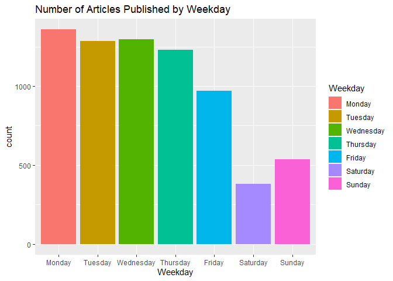
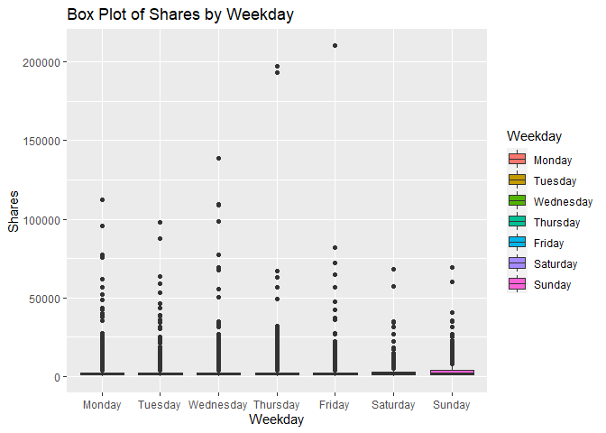
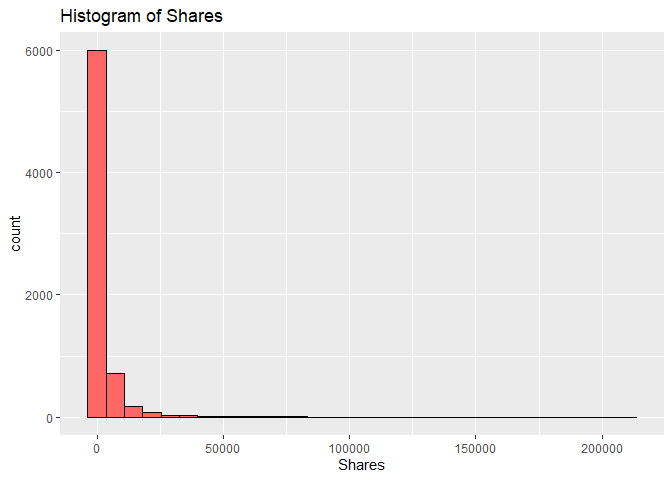
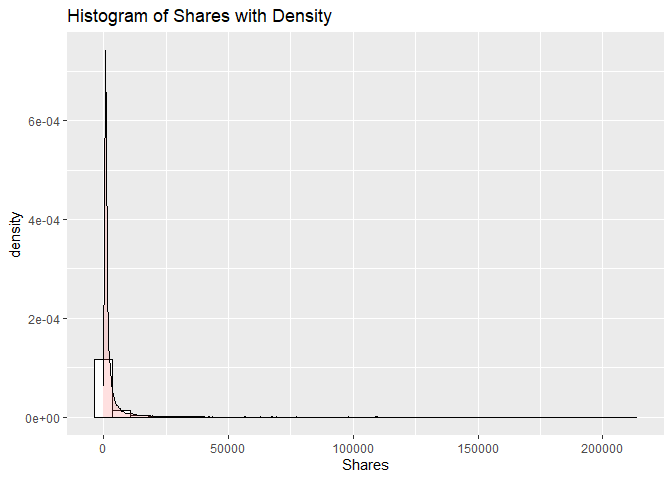
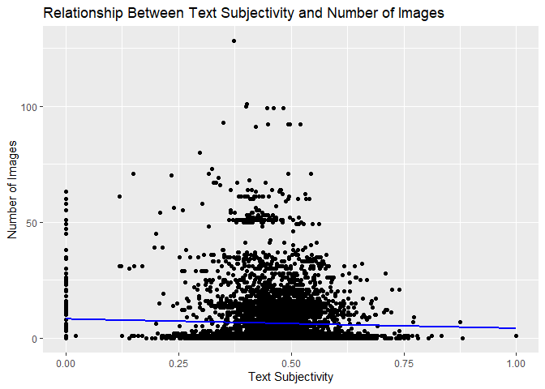
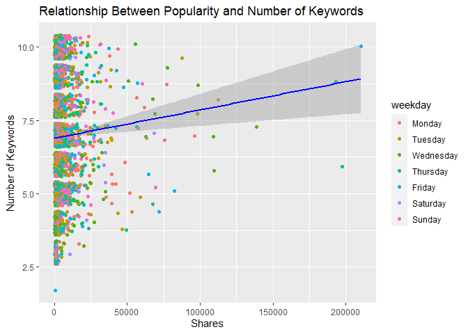
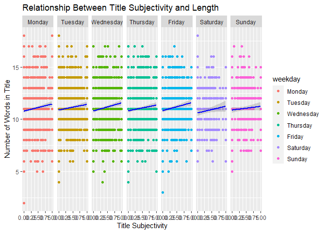

ST 558 Project 3
================
Melanie Kahn & Rachel Hardy
2022-11-14

-   <a href="#required-libraries" id="toc-required-libraries">Required
    Libraries</a>
-   <a href="#introduction-to-the-data"
    id="toc-introduction-to-the-data">Introduction to the Data</a>
-   <a href="#data" id="toc-data">Data</a>
    -   <a href="#reading-in-the-data" id="toc-reading-in-the-data">Reading in
        the Data</a>
    -   <a href="#modifying-the-data" id="toc-modifying-the-data">Modifying the
        Data</a>
    -   <a href="#splitting-the-data" id="toc-splitting-the-data">Splitting the
        Data</a>
-   <a href="#summarizations" id="toc-summarizations">Summarizations</a>
    -   <a href="#summary-statistics" id="toc-summary-statistics">Summary
        Statistics</a>
    -   <a href="#contingency-tables" id="toc-contingency-tables">Contingency
        Tables</a>
    -   <a href="#graphical-summaries" id="toc-graphical-summaries">Graphical
        Summaries</a>
        -   <a href="#bar-plot" id="toc-bar-plot">Bar Plot</a>
        -   <a href="#box-plot" id="toc-box-plot">Box Plot</a>
        -   <a href="#histograms" id="toc-histograms">Histograms</a>
        -   <a href="#scatter-plots" id="toc-scatter-plots">Scatter Plots</a>
-   <a href="#modeling" id="toc-modeling">Modeling</a>
    -   <a href="#linear-regression" id="toc-linear-regression">Linear
        Regression</a>
    -   <a href="#random-forest" id="toc-random-forest">Random Forest</a>
    -   <a href="#boosted-tree" id="toc-boosted-tree">Boosted Tree</a>
-   <a href="#comparison" id="toc-comparison">Comparison</a>

# Required Libraries

Running the code chunk below loads the `tidyverse`, `readr`, `ggplot2`,
`shiny`, `caret`, and `rmarkdown` packages.

``` r
library(tidyverse)
library(readr)
library(ggplot2)
library(shiny)
library(caret)
library(rmarkdown)
```

# Introduction to the Data

The online news popularity data used for this project summarizes a
diverse set of features about articles published by
[Mashable](http://www.mashable.com) over a two year period with the goal
of predicting the number of shares in social networks - a proxy for
popularity.

The original online news popularity data set included 58 predictive
variables, 2 non-predictive variables, 1 target variable. For the
purposes of this project, we are only using 14 non-predictive variables,
keeping the same target variable.

The variables present for each observation in this subset of the online
news popularity data set are as follows:

Non-Predictive Variables:

-   `url` - URL of the article  
-   `timedelta` - The number of days between the article publication and
    the data set acquisition

Predictive Variables:

-   `data_channel_is_*` - Binary variable indicating the type of data
    channel
    -   `lifestyle` - Lifestyle  
    -   `entertainment` - Entertainment  
    -   `bus` - Business  
    -   `socmed` - Social Media  
    -   `tech` - Tech  
    -   `world` - World  
-   `is_weekend` - Binary variable indicating if the article published
    on the weekend  
-   `weekday` - What day of the week the article was published (factor
    variable with seven levels)  
-   `num_imgs` - The number of images in the article  
-   `num_keywords` - The number of keywords in the metadata  
-   `n_tokens_title` - The number of words in the title  
-   `title_subjectivity` - Score of 0 - 1 indicating how subjective the
    title of the article is  
-   `global_subjectivity` - Score of 0 - 1 indicating how subjective the
    text of the article is

Target Variable:

-   `shares` - Number of shares

The purpose of the following analysis is to create predictive models for
this data set and find which one performs the best. After splitting the
data into a training and test set, the performance of a simple linear
regression model, a multiple regression model, a random forest model,
and a boosted tree model will be compared based on the root-mean-square
error (RMSE) calculation. The best model will have the smallest RMSE
from the test set. This process will be done across each data channel
(lifestyle,entertainment, business, social media, tech, and world) using
automated RMarkdown reports.

# Data

## Reading in the Data

Running the code chunk below reads in the online news popularity data
set using `read_csv()`.

``` r
newsOriginal <- read_csv(file = "./OnlineNewsPopularity.csv")
newsOriginal
```

    ## # A tibble: 39,644 × 61
    ##    url      timed…¹ n_tok…² n_tok…³ n_uni…⁴ n_non…⁵ n_non…⁶ num_h…⁷ num_s…⁸ num_i…⁹ num_v…˟ avera…˟ num_k…˟ data_…˟ data_…˟ data_…˟ data_…˟ data_…˟
    ##    <chr>      <dbl>   <dbl>   <dbl>   <dbl>   <dbl>   <dbl>   <dbl>   <dbl>   <dbl>   <dbl>   <dbl>   <dbl>   <dbl>   <dbl>   <dbl>   <dbl>   <dbl>
    ##  1 http://…     731      12     219   0.664    1.00   0.815       4       2       1       0    4.68       5       0       1       0       0       0
    ##  2 http://…     731       9     255   0.605    1.00   0.792       3       1       1       0    4.91       4       0       0       1       0       0
    ##  3 http://…     731       9     211   0.575    1.00   0.664       3       1       1       0    4.39       6       0       0       1       0       0
    ##  4 http://…     731       9     531   0.504    1.00   0.666       9       0       1       0    4.40       7       0       1       0       0       0
    ##  5 http://…     731      13    1072   0.416    1.00   0.541      19      19      20       0    4.68       7       0       0       0       0       1
    ##  6 http://…     731      10     370   0.560    1.00   0.698       2       2       0       0    4.36       9       0       0       0       0       1
    ##  7 http://…     731       8     960   0.418    1.00   0.550      21      20      20       0    4.65      10       1       0       0       0       0
    ##  8 http://…     731      12     989   0.434    1.00   0.572      20      20      20       0    4.62       9       0       0       0       0       1
    ##  9 http://…     731      11      97   0.670    1.00   0.837       2       0       0       0    4.86       7       0       0       0       0       1
    ## 10 http://…     731      10     231   0.636    1.00   0.797       4       1       1       1    5.09       5       0       0       0       0       0
    ## # … with 39,634 more rows, 43 more variables: data_channel_is_world <dbl>, kw_min_min <dbl>, kw_max_min <dbl>, kw_avg_min <dbl>, kw_min_max <dbl>,
    ## #   kw_max_max <dbl>, kw_avg_max <dbl>, kw_min_avg <dbl>, kw_max_avg <dbl>, kw_avg_avg <dbl>, self_reference_min_shares <dbl>,
    ## #   self_reference_max_shares <dbl>, self_reference_avg_sharess <dbl>, weekday_is_monday <dbl>, weekday_is_tuesday <dbl>,
    ## #   weekday_is_wednesday <dbl>, weekday_is_thursday <dbl>, weekday_is_friday <dbl>, weekday_is_saturday <dbl>, weekday_is_sunday <dbl>,
    ## #   is_weekend <dbl>, LDA_00 <dbl>, LDA_01 <dbl>, LDA_02 <dbl>, LDA_03 <dbl>, LDA_04 <dbl>, global_subjectivity <dbl>,
    ## #   global_sentiment_polarity <dbl>, global_rate_positive_words <dbl>, global_rate_negative_words <dbl>, rate_positive_words <dbl>,
    ## #   rate_negative_words <dbl>, avg_positive_polarity <dbl>, min_positive_polarity <dbl>, max_positive_polarity <dbl>, …

## Modifying the Data

Running the code chunk below subsets the data to only include
observations for the data channel we’re interested in.

``` r
news <- newsOriginal %>% filter(get(params$dataChannel) == 1)
news
```

    ## # A tibble: 7,057 × 61
    ##    url      timed…¹ n_tok…² n_tok…³ n_uni…⁴ n_non…⁵ n_non…⁶ num_h…⁷ num_s…⁸ num_i…⁹ num_v…˟ avera…˟ num_k…˟ data_…˟ data_…˟ data_…˟ data_…˟ data_…˟
    ##    <chr>      <dbl>   <dbl>   <dbl>   <dbl>   <dbl>   <dbl>   <dbl>   <dbl>   <dbl>   <dbl>   <dbl>   <dbl>   <dbl>   <dbl>   <dbl>   <dbl>   <dbl>
    ##  1 http://…     731      12     219   0.664    1.00   0.815       4       2       1       0    4.68       5       0       1       0       0       0
    ##  2 http://…     731       9     531   0.504    1.00   0.666       9       0       1       0    4.40       7       0       1       0       0       0
    ##  3 http://…     731      14     194   0.765    1.00   0.840       4       4       0       1    4.52       6       0       1       0       0       0
    ##  4 http://…     731      12     161   0.669    1.00   0.752       5       4       0       6    4.45      10       0       1       0       0       0
    ##  5 http://…     731      11     454   0.566    1.00   0.755       5       3       1       0    4.89       6       0       1       0       0       0
    ##  6 http://…     731      12     177   0.741    1.00   0.823       4       3       1       0    5.06       9       0       1       0       0       0
    ##  7 http://…     731       5     356   0.618    1.00   0.766       3       3      12       1    4.47      10       0       1       0       0       0
    ##  8 http://…     730      11     281   0.611    1.00   0.766       5       4       1       0    4.61       4       0       1       0       0       0
    ##  9 http://…     730      10     909   0.450    1.00   0.670       3       2       1       1    4.34       5       0       1       0       0       0
    ## 10 http://…     729      10     413   0.606    1.00   0.729       6       1      13       0    4.70       6       0       1       0       0       0
    ## # … with 7,047 more rows, 43 more variables: data_channel_is_world <dbl>, kw_min_min <dbl>, kw_max_min <dbl>, kw_avg_min <dbl>, kw_min_max <dbl>,
    ## #   kw_max_max <dbl>, kw_avg_max <dbl>, kw_min_avg <dbl>, kw_max_avg <dbl>, kw_avg_avg <dbl>, self_reference_min_shares <dbl>,
    ## #   self_reference_max_shares <dbl>, self_reference_avg_sharess <dbl>, weekday_is_monday <dbl>, weekday_is_tuesday <dbl>,
    ## #   weekday_is_wednesday <dbl>, weekday_is_thursday <dbl>, weekday_is_friday <dbl>, weekday_is_saturday <dbl>, weekday_is_sunday <dbl>,
    ## #   is_weekend <dbl>, LDA_00 <dbl>, LDA_01 <dbl>, LDA_02 <dbl>, LDA_03 <dbl>, LDA_04 <dbl>, global_subjectivity <dbl>,
    ## #   global_sentiment_polarity <dbl>, global_rate_positive_words <dbl>, global_rate_negative_words <dbl>, rate_positive_words <dbl>,
    ## #   rate_negative_words <dbl>, avg_positive_polarity <dbl>, min_positive_polarity <dbl>, max_positive_polarity <dbl>, …

Running the code chunk below creates the categorical variable `weekday`
to the data set that tells us what day of the week the article was
published.

``` r
news <- news %>% mutate(weekday = if_else((weekday_is_monday == 1), "Monday",
                                  if_else((weekday_is_tuesday == 1), "Tuesday", 
                                  if_else((weekday_is_wednesday == 1), "Wednesday", 
                                  if_else((weekday_is_thursday == 1), "Thursday", 
                                  if_else((weekday_is_friday == 1), "Friday",
                                  if_else((weekday_is_saturday == 1), "Saturday", 
                                  if_else((weekday_is_sunday == 1), "Sunday", " ")))))))) %>%
                 select(url, shares, weekday, everything())

news$weekday <- factor(news$weekday, levels=c("Monday", "Tuesday", "Wednesday",
                                              "Thursday", "Friday", "Saturday", "Sunday"))
levels(news$weekday)
```

    ## [1] "Monday"    "Tuesday"   "Wednesday" "Thursday"  "Friday"    "Saturday"  "Sunday"

``` r
news
```

    ## # A tibble: 7,057 × 62
    ##    url       shares weekday timed…¹ n_tok…² n_tok…³ n_uni…⁴ n_non…⁵ n_non…⁶ num_h…⁷ num_s…⁸ num_i…⁹ num_v…˟ avera…˟ num_k…˟ data_…˟ data_…˟ data_…˟
    ##    <chr>      <dbl> <fct>     <dbl>   <dbl>   <dbl>   <dbl>   <dbl>   <dbl>   <dbl>   <dbl>   <dbl>   <dbl>   <dbl>   <dbl>   <dbl>   <dbl>   <dbl>
    ##  1 http://m…    593 Monday      731      12     219   0.664    1.00   0.815       4       2       1       0    4.68       5       0       1       0
    ##  2 http://m…   1200 Monday      731       9     531   0.504    1.00   0.666       9       0       1       0    4.40       7       0       1       0
    ##  3 http://m…   2100 Monday      731      14     194   0.765    1.00   0.840       4       4       0       1    4.52       6       0       1       0
    ##  4 http://m…   1200 Monday      731      12     161   0.669    1.00   0.752       5       4       0       6    4.45      10       0       1       0
    ##  5 http://m…   4600 Monday      731      11     454   0.566    1.00   0.755       5       3       1       0    4.89       6       0       1       0
    ##  6 http://m…   1200 Monday      731      12     177   0.741    1.00   0.823       4       3       1       0    5.06       9       0       1       0
    ##  7 http://m…    631 Monday      731       5     356   0.618    1.00   0.766       3       3      12       1    4.47      10       0       1       0
    ##  8 http://m…   1300 Tuesday     730      11     281   0.611    1.00   0.766       5       4       1       0    4.61       4       0       1       0
    ##  9 http://m…   1700 Tuesday     730      10     909   0.450    1.00   0.670       3       2       1       1    4.34       5       0       1       0
    ## 10 http://m…    455 Wednes…     729      10     413   0.606    1.00   0.729       6       1      13       0    4.70       6       0       1       0
    ## # … with 7,047 more rows, 44 more variables: data_channel_is_socmed <dbl>, data_channel_is_tech <dbl>, data_channel_is_world <dbl>,
    ## #   kw_min_min <dbl>, kw_max_min <dbl>, kw_avg_min <dbl>, kw_min_max <dbl>, kw_max_max <dbl>, kw_avg_max <dbl>, kw_min_avg <dbl>,
    ## #   kw_max_avg <dbl>, kw_avg_avg <dbl>, self_reference_min_shares <dbl>, self_reference_max_shares <dbl>, self_reference_avg_sharess <dbl>,
    ## #   weekday_is_monday <dbl>, weekday_is_tuesday <dbl>, weekday_is_wednesday <dbl>, weekday_is_thursday <dbl>, weekday_is_friday <dbl>,
    ## #   weekday_is_saturday <dbl>, weekday_is_sunday <dbl>, is_weekend <dbl>, LDA_00 <dbl>, LDA_01 <dbl>, LDA_02 <dbl>, LDA_03 <dbl>, LDA_04 <dbl>,
    ## #   global_subjectivity <dbl>, global_sentiment_polarity <dbl>, global_rate_positive_words <dbl>, global_rate_negative_words <dbl>,
    ## #   rate_positive_words <dbl>, rate_negative_words <dbl>, avg_positive_polarity <dbl>, min_positive_polarity <dbl>, max_positive_polarity <dbl>, …

## Splitting the Data

Running the code chunk below splits the modified `news` data set into a
training and testing set using `createDataPartition()`. First the seed
is set to make sure the random sampling will be reproducible.
`createDataPartition()` then creates an indexing vector (`trainIndex`)
with a subset of the `shares` variable where the training subset
(`newsTrain`) will result in a vector (`list = FALSE`) that has
approximately 70% (`p = 0.7`) of the observations from the updated
`news` data set. This training vector is then used to create the
training set (`newsTrain`) with approximately 70% of the observations
from the updated `news` data set, and the test set (`newsTest`) with the
remaining 30% of the observations.

``` r
set.seed(100)
newsIndex <- createDataPartition(news$shares, p = 0.7, list = FALSE)

newsTrain <- news[newsIndex, ]
newsTest <- news[-newsIndex, ]

newsTrain
```

    ## # A tibble: 4,941 × 62
    ##    url       shares weekday timed…¹ n_tok…² n_tok…³ n_uni…⁴ n_non…⁵ n_non…⁶ num_h…⁷ num_s…⁸ num_i…⁹ num_v…˟ avera…˟ num_k…˟ data_…˟ data_…˟ data_…˟
    ##    <chr>      <dbl> <fct>     <dbl>   <dbl>   <dbl>   <dbl>   <dbl>   <dbl>   <dbl>   <dbl>   <dbl>   <dbl>   <dbl>   <dbl>   <dbl>   <dbl>   <dbl>
    ##  1 http://m…    593 Monday      731      12     219   0.664    1.00   0.815       4       2       1       0    4.68       5       0       1       0
    ##  2 http://m…   1200 Monday      731       9     531   0.504    1.00   0.666       9       0       1       0    4.40       7       0       1       0
    ##  3 http://m…   1200 Monday      731      12     161   0.669    1.00   0.752       5       4       0       6    4.45      10       0       1       0
    ##  4 http://m…   4600 Monday      731      11     454   0.566    1.00   0.755       5       3       1       0    4.89       6       0       1       0
    ##  5 http://m…   1200 Monday      731      12     177   0.741    1.00   0.823       4       3       1       0    5.06       9       0       1       0
    ##  6 http://m…    631 Monday      731       5     356   0.618    1.00   0.766       3       3      12       1    4.47      10       0       1       0
    ##  7 http://m…   1300 Tuesday     730      11     281   0.611    1.00   0.766       5       4       1       0    4.61       4       0       1       0
    ##  8 http://m…   1700 Tuesday     730      10     909   0.450    1.00   0.670       3       2       1       1    4.34       5       0       1       0
    ##  9 http://m…    455 Wednes…     729      10     413   0.606    1.00   0.729       6       1      13       0    4.70       6       0       1       0
    ## 10 http://m…   1900 Wednes…     729       7     376   0.569    1.00   0.687       3       2       0      11    4.46       9       0       1       0
    ## # … with 4,931 more rows, 44 more variables: data_channel_is_socmed <dbl>, data_channel_is_tech <dbl>, data_channel_is_world <dbl>,
    ## #   kw_min_min <dbl>, kw_max_min <dbl>, kw_avg_min <dbl>, kw_min_max <dbl>, kw_max_max <dbl>, kw_avg_max <dbl>, kw_min_avg <dbl>,
    ## #   kw_max_avg <dbl>, kw_avg_avg <dbl>, self_reference_min_shares <dbl>, self_reference_max_shares <dbl>, self_reference_avg_sharess <dbl>,
    ## #   weekday_is_monday <dbl>, weekday_is_tuesday <dbl>, weekday_is_wednesday <dbl>, weekday_is_thursday <dbl>, weekday_is_friday <dbl>,
    ## #   weekday_is_saturday <dbl>, weekday_is_sunday <dbl>, is_weekend <dbl>, LDA_00 <dbl>, LDA_01 <dbl>, LDA_02 <dbl>, LDA_03 <dbl>, LDA_04 <dbl>,
    ## #   global_subjectivity <dbl>, global_sentiment_polarity <dbl>, global_rate_positive_words <dbl>, global_rate_negative_words <dbl>,
    ## #   rate_positive_words <dbl>, rate_negative_words <dbl>, avg_positive_polarity <dbl>, min_positive_polarity <dbl>, max_positive_polarity <dbl>, …

``` r
newsTest
```

    ## # A tibble: 2,116 × 62
    ##    url       shares weekday timed…¹ n_tok…² n_tok…³ n_uni…⁴ n_non…⁵ n_non…⁶ num_h…⁷ num_s…⁸ num_i…⁹ num_v…˟ avera…˟ num_k…˟ data_…˟ data_…˟ data_…˟
    ##    <chr>      <dbl> <fct>     <dbl>   <dbl>   <dbl>   <dbl>   <dbl>   <dbl>   <dbl>   <dbl>   <dbl>   <dbl>   <dbl>   <dbl>   <dbl>   <dbl>   <dbl>
    ##  1 http://m…   2100 Monday      731      14     194   0.765    1.00   0.840       4       4       0       1    4.52       6       0       1       0
    ##  2 http://m…   6400 Wednes…     729       6     241   0.660    1.00   0.815       5       5       1       0    4.85       5       0       1       0
    ##  3 http://m…   1000 Wednes…     729      12     855   0.439    1.00   0.653       5       0       1       0    4.30       8       0       1       0
    ##  4 http://m…   1700 Wednes…     729       8     270   0.601    1.00   0.741       5       4       1      11    4.26      10       0       1       0
    ##  5 http://m…   4500 Thursd…     728      13     204   0.646    1.00   0.793       2       1       1       0    4.42       5       0       1       0
    ##  6 http://m…    427 Thursd…     728      12     246   0.702    1.00   0.850       8       3       1       0    4.44       6       0       1       0
    ##  7 http://m…    676 Thursd…     728      11     848   0.449    1.00   0.714       4       4       1       3    4.19       5       0       1       0
    ##  8 http://m…    484 Thursd…     728      13     577   0.412    1.00   0.553      16       7      11       0    4.45      10       0       1       0
    ##  9 http://m…    762 Thursd…     728      13     243   0.654    1.00   0.850       4       2       0       1    4.20       7       0       1       0
    ## 10 http://m…   1200 Thursd…     728       8    1015   0.484    1.00   0.647      38       7      11       3    4.95       9       0       1       0
    ## # … with 2,106 more rows, 44 more variables: data_channel_is_socmed <dbl>, data_channel_is_tech <dbl>, data_channel_is_world <dbl>,
    ## #   kw_min_min <dbl>, kw_max_min <dbl>, kw_avg_min <dbl>, kw_min_max <dbl>, kw_max_max <dbl>, kw_avg_max <dbl>, kw_min_avg <dbl>,
    ## #   kw_max_avg <dbl>, kw_avg_avg <dbl>, self_reference_min_shares <dbl>, self_reference_max_shares <dbl>, self_reference_avg_sharess <dbl>,
    ## #   weekday_is_monday <dbl>, weekday_is_tuesday <dbl>, weekday_is_wednesday <dbl>, weekday_is_thursday <dbl>, weekday_is_friday <dbl>,
    ## #   weekday_is_saturday <dbl>, weekday_is_sunday <dbl>, is_weekend <dbl>, LDA_00 <dbl>, LDA_01 <dbl>, LDA_02 <dbl>, LDA_03 <dbl>, LDA_04 <dbl>,
    ## #   global_subjectivity <dbl>, global_sentiment_polarity <dbl>, global_rate_positive_words <dbl>, global_rate_negative_words <dbl>,
    ## #   rate_positive_words <dbl>, rate_negative_words <dbl>, avg_positive_polarity <dbl>, min_positive_polarity <dbl>, max_positive_polarity <dbl>, …

# Summarizations

## Summary Statistics

Running the code chunk below provides the mean and standard deviation
for the number of times articles in the `news` data set were shared
(`shares`).

``` r
mean(news$shares)
```

    ## [1] 2970.487

``` r
sd(news$shares)
```

    ## [1] 7858.134

Running the code chunk below provides the mean and standard deviation
for the number of images per article (`num_imgs`) in the `news` data
set.

``` r
mean(news$num_imgs)
```

    ## [1] 6.317699

``` r
sd(news$num_imgs)
```

    ## [1] 11.62707

Running the code chunk below provides the mean and standard deviation
for the number of keywords per article (`num_keywords`) in the `news`
data set.

``` r
mean(news$num_keywords)
```

    ## [1] 6.924897

``` r
sd(news$num_keywords)
```

    ## [1] 1.900225

## Contingency Tables

Running the code chunk below creates a contingency table showing the
number of articles in the online `news` popularity data set that were
published on the weekend (`is_weekend`).

``` r
tableWeekend <- table(news$is_weekend)
tableWeekend
```

    ## 
    ##    0    1 
    ## 6141  916

From the table **above**, we can see that 916 articles were published on
the weekend, and 6141 articles were published during the week.

Running the code chunk below creates a contingency table showing the
number of articles in the online `news` popularity data set that were
published on certain days of the week (`weekday`).

``` r
tableWeekday <- table(news$weekday)
tableWeekday
```

    ## 
    ##    Monday   Tuesday Wednesday  Thursday    Friday  Saturday    Sunday 
    ##      1358      1285      1295      1231       972       380       536

From the table **above**, we can see that 1358 articles were published
on Monday, 916 were published on Tuesday, NA on Wednesday, NA on
Thursday, NA on Friday, NA on Saturday, NA articles were published on
Sunday.

## Graphical Summaries

### Bar Plot

Running the code chunk below creates a bar plot to visualize the number
of articles published per each `weekday`. Using the aesthetics option
`aes(fill = weekday)` inside the `geom_bar()` function gives us a nicely
colored graph.

``` r
g <- ggplot(news, aes(x = weekday))

g + geom_bar(aes(fill = weekday)) + 
  labs(title = "Number of Articles Published by Weekday", x = "Weekday") +
  scale_fill_discrete(name = "Weekday")
```

<!-- -->

### Box Plot

Running the code chunk below creates a box plot of number of `shares`
for each `weekday`. Using the aesthetics option ‘fill = weekday’ gives
us a nicely colored graph.

``` r
g <- ggplot(news, aes(x = weekday, y = shares))

g + geom_boxplot(aes(fill = weekday)) + 
  labs(title = "Box Plot of Shares by Weekday", x = "Weekday", y = "Shares") +
  scale_fill_discrete(name = "Weekday")
```

<!-- -->

### Histograms

Running the code chunk below creates two histograms of the number of
`shares` that show us the distribution of the variable. The second
histogram has an added density layer to give us a better idea of how the
data is spread out.

``` r
g <- ggplot(news, aes(x = shares))

g + geom_histogram(color = "black", fill = "#FF6666") + labs(title = "Histogram of Shares") +
  labs(title = "Histogram of Shares", x = "Shares")
```

<!-- -->

``` r
g + geom_histogram(aes(y=..density..), colour="black", fill="white") + 
  geom_density(alpha=.2, fill="#FF6666") + 
  labs(title = "Histogram of Shares with Density", x = "Shares")
```

<!-- -->

### Scatter Plots

Running the code chunk below creates a scatter plot to visualize the
correlation between the text subjectivity (`global_subjectivity`) and
the number of images (`num_imgs`) articles have. The `geom_point()`
function plots the data points while the `geom_smooth()` function plots
the regression line using method `lm` for linear model.

Using this linear regression line on the scatter plot *below* helps
quantify the direction and strength of the relationship between the text
subjectivity on the x-axis and the number of images on the y-axis.
Results showing a regression line starting lower on the y-axis than it
ends (a *positive* slope) represents a *positive* linear correlation
between an article’s overall subjectivity and the number of images
used - if one increases, so does the other. Results showing a regression
line starting higher on the y-axis than it ends (a *negative* slope)
represents a *negative* linear correlation between the two, meaning the
trend in the data shows a higher number of images reduces subjectivity
in an article. The steepness of the slope associated with this
regression line indicates the strength of the variable relationship. The
closer a regression line gets to horizontal, the weaker the correlation
between the subjectivity and images; and vice versa.

``` r
g <- ggplot(news, aes(x = global_subjectivity, y = num_imgs))
g + geom_point() +
  geom_smooth(method = lm, col = "Blue", se = FALSE) +
  labs(title = "Relationship Between Text Subjectivity and Number of Images",
       x = "Text Subjectivity",
       y = "Number of Images")
```

<!-- -->

Running the code chunk below creates a scatter plot to visualize the
correlation between the number of `shares` and the number of keywords
(`num_keywords`) articles have. `geom_jitter` is used instead of
`geom_point()` to plot the data points in a manner where the `weekday`
component can be better visualized. The `geom_smooth()` function plots
the regression line using method `lm` for linear model.

Using this linear regression line on the scatter plot *below* helps
quantify the direction and strength of the relationship between the
number of shares on the x-axis and the number of keywords on the y-axis.
Results showing a regression line starting lower on the y-axis than it
ends (a *positive* slope) represents a *positive* linear correlation
between an article’s number of shares and the number of keywords used -
if one increases, so does the other. Results showing a regression line
starting higher on the y-axis than it ends (a *negative* slope)
represents a *negative* linear correlation between the two, meaning the
trend in the data shows a higher number of keywords reduces the number
of times an article is shared. The steepness of the slope associated
with this regression line indicates the strength of the variable
relationship. The closer a regression line gets to horizontal, the
weaker the correlation between the popularity and keywords; and vice
versa. As one of the default arguments for the `geom_smooth` function is
`se = TRUE`, a 95% confidence interval can also be seen. Wider
confidence intervals indicate increased uncertainty of the effect the
variables have on each other.

``` r
g <- ggplot(news, aes(x = shares, y = num_keywords))
g + geom_jitter(aes(color = weekday)) +
  geom_smooth(method = lm, col = "Blue") +
  labs(title = "Relationship Between Popularity and Number of Keywords",
       x = "Shares",
       y = "Number of Keywords")
```

<!-- -->

Running the code chunk below creates a facet grid scatter plot to
visualize the correlation between the number of words in the article’s
title (`n_tokens_title`) and title’s subjectivity score
(`title_subjectivity`) according to the day the article was published
(`weekday`). The `geom_point()` function plots the data points while the
`geom_smooth()` function plots the regression line using method `lm` for
linear model.

Using this linear regression line on the scatter plot *below* helps
quantify the direction and strength of the relationship between the
title subjectivity on the x-axis and the number of words in the title on
the y-axis. Results showing a regression line starting lower on the
y-axis than it ends (a *positive* slope) represents a *positive* linear
correlation between a title’s subjectivity and length - if one
increases, so does the other. Results showing a regression line starting
higher on the y-axis than it ends (a *negative* slope) represents a
*negative* linear correlation between the two, meaning the trend in the
data shows a higher number of words reduces title subjectivity. The
steepness of the slope associated with this regression line indicates
the strength of the variable relationship. The closer a regression line
gets to horizontal, the weaker the correlation between the title
subjectivity and length; and vice versa. The 95% confidence intervals
may be harder to see due to the faceted nature of these plots, but wider
confidence intervals still indicate increased uncertainty of the effect
the variables have on each other.

``` r
g <- ggplot(news, aes(x = title_subjectivity, y = n_tokens_title))
g + geom_point(aes(color = weekday)) +
  facet_grid(~ weekday) +
  geom_smooth(method = lm, col = "Blue") +
  labs(title = "Relationship Between Title Subjectivity and Length",
       x = "Title Subjectivity",
       y = "Number of Words in Title")
```

<!-- -->

# Modeling

## Linear Regression

Linear regression attempts to model the (linear) relationship between a
response variable and one or more predictor variables by fitting a
linear equation to the data. The simplest form of the linear equation is
`Y = a + bX`, where `Y` is the response variable, `a` is the intercept,
`b` is the slope, and `X` is the predictor (or explanatory) variable.
The most common method for fitting a regression model is least-squares
regression, where the best-fitting line is calculated by minimizing the
sum of the squared residuals.

For linear regression, it is usually important to understand which
variables are related and which variables scientifically should be in
the model. It is also important to split the data into a training set
and a testing set so the model does not become over-fit.

Running the code chunk below creates a multiple linear regression model
where `shares` is the response variable and the predictor variables are
`weekday`, `title_subjectivity`, `num_imgs`, `title_subjectivity^2`, and
`num_imgs^2`.

By using the `summary()` function, we can see the values for the
residuals and coefficients, as well as the performance criteria values
such as multiple R-squared.

``` r
set.seed(100)
firstLinearModel <- train(shares ~ weekday + title_subjectivity + num_imgs + I(title_subjectivity^2) + I(num_imgs^2), 
                        data = newsTrain,
                        method = "lm",
                        preProcess = c("center", "scale"),
                        trControl = trainControl(method = "cv"))
firstLinearModel
```

    ## Linear Regression 
    ## 
    ## 4941 samples
    ##    3 predictor
    ## 
    ## Pre-processing: centered (10), scaled (10) 
    ## Resampling: Cross-Validated (10 fold) 
    ## Summary of sample sizes: 4446, 4447, 4447, 4447, 4448, 4447, ... 
    ## Resampling results:
    ## 
    ##   RMSE      Rsquared     MAE     
    ##   7608.875  0.001671743  2900.496
    ## 
    ## Tuning parameter 'intercept' was held constant at a value of TRUE

``` r
summary(firstLinearModel)
```

    ## 
    ## Call:
    ## lm(formula = .outcome ~ ., data = dat)
    ## 
    ## Residuals:
    ##    Min     1Q Median     3Q    Max 
    ##  -4049  -2084  -1624   -809 207500 
    ## 
    ## Coefficients:
    ##                           Estimate Std. Error t value Pr(>|t|)    
    ## (Intercept)               2937.612    114.027  25.763  < 2e-16 ***
    ## weekdayTuesday            -171.844    144.122  -1.192  0.23318    
    ## weekdayWednesday           -86.564    143.922  -0.601  0.54756    
    ## weekdayThursday             14.504    144.039   0.101  0.91980    
    ## weekdayFriday               56.224    138.745   0.405  0.68532    
    ## weekdaySaturday             58.521    125.782   0.465  0.64177    
    ## weekdaySunday              213.608    130.193   1.641  0.10092    
    ## title_subjectivity           2.003    340.426   0.006  0.99531    
    ## num_imgs                   754.449    258.164   2.922  0.00349 ** 
    ## `I(title_subjectivity^2)`  225.190    340.579   0.661  0.50852    
    ## `I(num_imgs^2)`           -646.172    258.243  -2.502  0.01237 *  
    ## ---
    ## Signif. codes:  0 '***' 0.001 '**' 0.01 '*' 0.05 '.' 0.1 ' ' 1
    ## 
    ## Residual standard error: 8015 on 4930 degrees of freedom
    ## Multiple R-squared:  0.004213,   Adjusted R-squared:  0.002193 
    ## F-statistic: 2.086 on 10 and 4930 DF,  p-value: 0.02229

Now that the multiple linear regression model has been trained
(`firstLinearModel`), running the code chunk below will check how well
the model does on the test set `newsTest` using the `postResample()`
function. The RMSE from the `postResample` output is then stored in an
object `firstLinearRMSE` for later use in our comparison functions.

``` r
firstLinearPredict <- predict(firstLinearModel, newdata = newsTest)

firstLinearPerformance <- postResample(firstLinearPredict, newsTest$shares)
firstLinearPerformance
```

    ##         RMSE     Rsquared          MAE 
    ## 7.447730e+03 2.913729e-03 2.991073e+03

``` r
attributes(firstLinearPerformance)
```

    ## $names
    ## [1] "RMSE"     "Rsquared" "MAE"

``` r
firstLinearRMSE <- firstLinearPerformance[1]
firstLinearRMSE
```

    ##    RMSE 
    ## 7447.73

Running the code chunk below creates a simple linear regression model
where `shares` is the response variable and the predictor variables are
`weekday`, `num_imgs`, `num_keywords`, `n_tokens_title`,
`title_subjectivity`, and `global_subjectivity`. The `summary()`
function is used to examine the values for the residuals and
coefficients, as well as the performance criteria values such as
multiple R-squared.

``` r
set.seed(100)
secondLinearModel <- train(shares ~ weekday + num_imgs + num_keywords + n_tokens_title + title_subjectivity + global_subjectivity, 
                        data = newsTrain,
                        method = "lm",
                        preProcess = c("center", "scale"),
                        trControl = trainControl(method = "cv"))
secondLinearModel
```

    ## Linear Regression 
    ## 
    ## 4941 samples
    ##    6 predictor
    ## 
    ## Pre-processing: centered (11), scaled (11) 
    ## Resampling: Cross-Validated (10 fold) 
    ## Summary of sample sizes: 4446, 4447, 4447, 4447, 4448, 4447, ... 
    ## Resampling results:
    ## 
    ##   RMSE     Rsquared     MAE     
    ##   7601.48  0.003924389  2880.103
    ## 
    ## Tuning parameter 'intercept' was held constant at a value of TRUE

``` r
summary(secondLinearModel)
```

    ## 
    ## Call:
    ## lm(formula = .outcome ~ ., data = dat)
    ## 
    ## Residuals:
    ##    Min     1Q Median     3Q    Max 
    ##  -4645  -2144  -1567   -636 206672 
    ## 
    ## Coefficients:
    ##                     Estimate Std. Error t value Pr(>|t|)    
    ## (Intercept)         2937.612    113.900  25.791  < 2e-16 ***
    ## weekdayTuesday      -158.564    143.888  -1.102  0.27052    
    ## weekdayWednesday     -86.529    143.744  -0.602  0.54722    
    ## weekdayThursday        9.846    143.844   0.068  0.94543    
    ## weekdayFriday         44.109    138.523   0.318  0.75018    
    ## weekdaySaturday       45.318    125.682   0.361  0.71843    
    ## weekdaySunday        185.455    130.413   1.422  0.15507    
    ## num_imgs             176.579    114.319   1.545  0.12250    
    ## num_keywords         370.893    114.649   3.235  0.00122 ** 
    ## n_tokens_title        23.767    114.799   0.207  0.83599    
    ## title_subjectivity   179.836    115.486   1.557  0.11948    
    ## global_subjectivity  352.326    115.041   3.063  0.00221 ** 
    ## ---
    ## Signif. codes:  0 '***' 0.001 '**' 0.01 '*' 0.05 '.' 0.1 ' ' 1
    ## 
    ## Residual standard error: 8006 on 4929 degrees of freedom
    ## Multiple R-squared:  0.006616,   Adjusted R-squared:  0.004399 
    ## F-statistic: 2.984 on 11 and 4929 DF,  p-value: 0.0005783

Now that the simple linear regression model has been trained
(`secondLinearModel`), running the code chunk below will check how well
the model does on the test set `newsTest` using the `postResample()`
function. The RMSE from the `postResample` output is then stored in an
object `secondLinearRMSE` for later use in our comparison functions.

``` r
secondLinearPredict <- predict(secondLinearModel, newdata = newsTest)

secondLinearPerformance <- postResample(secondLinearPredict, newsTest$shares)
secondLinearPerformance
```

    ##         RMSE     Rsquared          MAE 
    ## 7.446598e+03 3.489167e-03 2.977739e+03

``` r
attributes(secondLinearPerformance)
```

    ## $names
    ## [1] "RMSE"     "Rsquared" "MAE"

``` r
secondLinearRMSE <- secondLinearPerformance[1]
secondLinearRMSE
```

    ##     RMSE 
    ## 7446.598

## Random Forest

To understand random forests, it is first important to understand bagged
trees which are created using bootstrap aggregation. For bagged trees,
the sample is treated as the population and re-sampling is done with
replacement. The process of creating a bagged tree is below:

-   Step 1: Create a bootstrap sample using `sample()`  
-   Step 2: Train the tree on this sample (no pruning necessary)  
-   Step 3: Repeat B = 1000 times (no set mark)  
-   Step 4: Final prediction is average of these predictions (for
    regression trees) **OR** use majority vote as final classification
    prediction (classification trees)

Random forests are essentially bagged trees, except not all the
predictors are used for each model. A random subset of predictors is
used for each tree model (bootstrap sample). The purpose of doing this
is to prevent one or two strong predictors from dominating all tree
models and creating unwanted correlation between models.

Running the code chunk below trains the random forest model. The formula
notation used in the `train()` function models the `shares` variable
using the following predictor/explanatory variables: `weekday`,
`num_imgs`, and `num_keywords`. To use the random forest model, the
`method` argument was specified as `"rf"`. The data was pre-processed by
centering and scaling. Cross validation was used five-fold and repeated
three (3) times. The argument `tuneGrid` was then used to replicate the
random forest model a total of five (5) times. The best model is then
chosen based on the performance criteria.

``` r
set.seed(100)
randomForestCtrl <- trainControl(method = "repeatedcv", number = 5, repeats = 3)
randomForestFit <- train(shares ~ weekday + num_imgs + num_keywords, 
                         data = newsTrain, method = "rf", 
                         trControl = randomForestCtrl,
                         preProcess = c("center","scale"), 
                         tuneGrid = data.frame(mtry = 1:5))

randomForestFit
```

    ## Random Forest 
    ## 
    ## 4941 samples
    ##    3 predictor
    ## 
    ## Pre-processing: centered (8), scaled (8) 
    ## Resampling: Cross-Validated (5 fold, repeated 3 times) 
    ## Summary of sample sizes: 3953, 3953, 3952, 3953, 3953, 3952, ... 
    ## Resampling results across tuning parameters:
    ## 
    ##   mtry  RMSE      Rsquared     MAE     
    ##   1     7870.168  0.004040502  2880.389
    ##   2     7889.880  0.002594557  2884.307
    ##   3     7962.226  0.001593377  2923.763
    ##   4     8059.699  0.001260653  2970.880
    ##   5     8142.117  0.001158320  3012.932
    ## 
    ## RMSE was used to select the optimal model using the smallest value.
    ## The final value used for the model was mtry = 1.

Now that the random forest model has been trained (`randomForestFit`),
running the code chunk below will check how well the model does on the
test set `newsTest` using the `postResample()` function. The RMSE from
the `postResample` output is then stored in an object `rfRMSE` for later
use in our comparison functions.

``` r
randomForestPredict <- predict(randomForestFit, newdata = newsTest)

randomForestPerformance <- postResample(randomForestPredict, newsTest$shares)
randomForestPerformance
```

    ##         RMSE     Rsquared          MAE 
    ## 7.440687e+03 5.261770e-03 2.976039e+03

``` r
attributes(randomForestPerformance)
```

    ## $names
    ## [1] "RMSE"     "Rsquared" "MAE"

``` r
rfRMSE <- randomForestPerformance[1]
rfRMSE
```

    ##     RMSE 
    ## 7440.687

## Boosted Tree

Boosted trees are another enhancement to the single tree methods.
However, unlike bagged and random forest models, boosted trees do not
use bootstrapping. Boosting is a general method to slowly train your
tree so you don’t overfit your model. The trees are grown in a
sequential manner where each subsequent tree is based off a modified
version of the original data, updating the predictions as the tree is
grown. The process is described below:

-   Step 1: Initialize predictions as 0  
-   Step 2: Find the residuals for every observation
    -   Residuals in first tree fit will be original data values
        (observed - 0 = observed)  
-   Step 3: Fit a regression tree with `d` splits where the residuals
    are the response  
-   Step 4: Update predictions using the new predictions from step 3
    multiplied by the growth rate (Lambda tuning parameter)  
-   Step 5: Continue to update residuals for new predictions (steps 2
    -4) `B` times

Running the code chunk below trains the boosted tree model. The formula
notation used in the `train()` function models the `shares` variable
using the following predictor/explanatory variables: `weekday`,
`num_imgs`, `num_keywords`, `n_tokens_title`, and `title_subjectivity`.
To use the boosted tree model, the `method` argument was specified as
`"gbm"`. The data was pre-processed by centering and scaling. `tuneGrid`
was then used to consider values of `n.trees` = 50, `interaction.depth`
= 1, `shrinkage` = 0.1, and `n.minobsinnode` = 10. Lastly,
`trainControl()` was used within the `trControl` argument to do 10 fold
cross-validation using the `"cv"` `method`.

``` r
boostTreeFit <- train(shares ~ weekday + num_imgs + num_keywords + n_tokens_title + title_subjectivity
                        + global_subjectivity, data = newsTrain,
                        method = "gbm",
                        preProcess = c("center", "scale"),
                        tuneGrid = data.frame(n.trees = 50, interaction.depth = 1, shrinkage = 0.1, n.minobsinnode = 10),
                        trControl = trainControl(method = "cv", number = 10))
```

    ## Iter   TrainDeviance   ValidDeviance   StepSize   Improve
    ##      1 66904893.6620             nan     0.1000 23158.1745
    ##      2 66839435.9185             nan     0.1000 22597.9563
    ##      3 66773208.2679             nan     0.1000 49860.7427
    ##      4 66754561.3758             nan     0.1000 -2693.6494
    ##      5 66725705.7315             nan     0.1000 8868.0525
    ##      6 66689177.5068             nan     0.1000 15469.9135
    ##      7 66660714.6269             nan     0.1000 17870.5168
    ##      8 66614721.0466             nan     0.1000 16223.6260
    ##      9 66591238.1676             nan     0.1000  951.2925
    ##     10 66577510.9351             nan     0.1000 -36365.6295
    ##     20 66326341.3473             nan     0.1000 -8656.1779
    ##     40 66083775.2264             nan     0.1000 -17317.7461
    ##     50 65993514.1392             nan     0.1000 -7607.8779
    ## 
    ## Iter   TrainDeviance   ValidDeviance   StepSize   Improve
    ##      1 68794573.8048             nan     0.1000 5303.4287
    ##      2 68761393.2739             nan     0.1000 9169.1619
    ##      3 68709569.7853             nan     0.1000 31243.6494
    ##      4 68683817.8814             nan     0.1000 -20910.9204
    ##      5 68614137.8997             nan     0.1000 -44685.3346
    ##      6 68556861.1399             nan     0.1000 70942.1313
    ##      7 68531178.0376             nan     0.1000 16871.3401
    ##      8 68488595.6705             nan     0.1000 -16312.8226
    ##      9 68434980.8594             nan     0.1000 -3379.4218
    ##     10 68413755.1096             nan     0.1000 11543.5977
    ##     20 68110960.8856             nan     0.1000 -20895.8017
    ##     40 67899607.4217             nan     0.1000 -3847.6851
    ##     50 67825621.2754             nan     0.1000 -13246.9596
    ## 
    ## Iter   TrainDeviance   ValidDeviance   StepSize   Improve
    ##      1 49576013.9595             nan     0.1000 -6617.0374
    ##      2 49536354.5672             nan     0.1000 14722.2833
    ##      3 49496946.1056             nan     0.1000 20910.7073
    ##      4 49469479.8140             nan     0.1000 -13158.4629
    ##      5 49442334.1917             nan     0.1000 14669.8504
    ##      6 49410478.1071             nan     0.1000 7696.8229
    ##      7 49395466.3385             nan     0.1000 -9406.1178
    ##      8 49380631.3188             nan     0.1000 -1628.1806
    ##      9 49364998.5465             nan     0.1000  516.1553
    ##     10 49326613.3927             nan     0.1000 1802.9930
    ##     20 49179654.7070             nan     0.1000 -7982.0800
    ##     40 48972024.9249             nan     0.1000 1791.2975
    ##     50 48882622.9382             nan     0.1000 -3179.7032
    ## 
    ## Iter   TrainDeviance   ValidDeviance   StepSize   Improve
    ##      1 58132233.6182             nan     0.1000 35175.8889
    ##      2 58101947.7223             nan     0.1000 23777.4692
    ##      3 58033384.4040             nan     0.1000 56844.1129
    ##      4 57956234.8487             nan     0.1000 41586.4379
    ##      5 57899580.9112             nan     0.1000 19973.8491
    ##      6 57864527.5072             nan     0.1000 27923.0479
    ##      7 57819620.6948             nan     0.1000 10094.1572
    ##      8 57779168.1613             nan     0.1000 12767.3996
    ##      9 57742971.9993             nan     0.1000 8780.6314
    ##     10 57713955.8396             nan     0.1000 11216.9085
    ##     20 57512761.0541             nan     0.1000 2116.6132
    ##     40 57278347.7488             nan     0.1000 -18057.6105
    ##     50 57178408.8277             nan     0.1000 -9212.6518
    ## 
    ## Iter   TrainDeviance   ValidDeviance   StepSize   Improve
    ##      1 68922353.0026             nan     0.1000 48702.6316
    ##      2 68853152.5748             nan     0.1000 26910.5173
    ##      3 68800004.7985             nan     0.1000 21199.8278
    ##      4 68769657.1284             nan     0.1000 -532.3138
    ##      5 68708550.0230             nan     0.1000 19585.6195
    ##      6 68681441.6812             nan     0.1000 4383.3264
    ##      7 68644026.1331             nan     0.1000 -14034.5771
    ##      8 68611579.4498             nan     0.1000 16061.6590
    ##      9 68590679.0176             nan     0.1000 -31274.0091
    ##     10 68564715.9750             nan     0.1000 13173.1495
    ##     20 68380530.2635             nan     0.1000 -15963.2020
    ##     40 68170314.5943             nan     0.1000 -23288.8859
    ##     50 68108594.6740             nan     0.1000 -27946.3111
    ## 
    ## Iter   TrainDeviance   ValidDeviance   StepSize   Improve
    ##      1 64623120.0743             nan     0.1000 3777.2135
    ##      2 64589085.3063             nan     0.1000 -28912.8474
    ##      3 64539895.7107             nan     0.1000 44421.7532
    ##      4 64489791.2057             nan     0.1000 9574.9056
    ##      5 64467717.1947             nan     0.1000 -22722.2491
    ##      6 64428355.1479             nan     0.1000 26771.7683
    ##      7 64405825.6580             nan     0.1000 -2164.7407
    ##      8 64315729.8068             nan     0.1000 19454.4915
    ##      9 64276735.8361             nan     0.1000  -92.9892
    ##     10 64219129.3729             nan     0.1000 25495.4829
    ##     20 63995502.9487             nan     0.1000 -16289.0091
    ##     40 63725985.1541             nan     0.1000 -37594.4470
    ##     50 63641368.6531             nan     0.1000 -18447.7716
    ## 
    ## Iter   TrainDeviance   ValidDeviance   StepSize   Improve
    ##      1 64674141.2094             nan     0.1000 45010.9598
    ##      2 64600361.2883             nan     0.1000 37117.2696
    ##      3 64576922.2704             nan     0.1000 19280.3119
    ##      4 64523274.0645             nan     0.1000 54271.8435
    ##      5 64512523.8275             nan     0.1000 -15337.3695
    ##      6 64489662.4387             nan     0.1000 2897.4691
    ##      7 64460622.5237             nan     0.1000 10210.0077
    ##      8 64400112.4001             nan     0.1000 35114.3241
    ##      9 64355968.3629             nan     0.1000 30361.7474
    ##     10 64326472.5916             nan     0.1000 13860.8413
    ##     20 64071358.2303             nan     0.1000 -553.1407
    ##     40 63862498.5620             nan     0.1000 -10559.4990
    ##     50 63799557.9539             nan     0.1000 -31901.9898
    ## 
    ## Iter   TrainDeviance   ValidDeviance   StepSize   Improve
    ##      1 65071229.4218             nan     0.1000 -776.9925
    ##      2 65047861.3865             nan     0.1000 -17466.9218
    ##      3 65012237.5184             nan     0.1000 -2854.4102
    ##      4 64962024.4387             nan     0.1000 52374.0676
    ##      5 64900716.4806             nan     0.1000 38147.9742
    ##      6 64860703.1984             nan     0.1000 16791.0856
    ##      7 64807343.0948             nan     0.1000 4706.7708
    ##      8 64759467.5127             nan     0.1000 4447.7510
    ##      9 64725004.4404             nan     0.1000 -11442.2764
    ##     10 64710763.5214             nan     0.1000 -982.1445
    ##     20 64511091.3437             nan     0.1000 6442.1383
    ##     40 64240345.5020             nan     0.1000 -15014.0029
    ##     50 64164632.6640             nan     0.1000 -30025.9752
    ## 
    ## Iter   TrainDeviance   ValidDeviance   StepSize   Improve
    ##      1 69322442.5674             nan     0.1000 47121.2222
    ##      2 69301541.4995             nan     0.1000 -3550.5768
    ##      3 69268258.9490             nan     0.1000 24327.0053
    ##      4 69212069.8455             nan     0.1000 33753.2330
    ##      5 69153191.3989             nan     0.1000 34410.3982
    ##      6 69086706.7300             nan     0.1000 41528.2398
    ##      7 69041019.6042             nan     0.1000 3250.2933
    ##      8 69002742.9107             nan     0.1000 -52692.9000
    ##      9 68961402.0246             nan     0.1000 8487.1182
    ##     10 68933347.4804             nan     0.1000 -10687.0712
    ##     20 68709377.0275             nan     0.1000 -44188.6533
    ##     40 68444242.1553             nan     0.1000 -4750.9710
    ##     50 68358819.5159             nan     0.1000 -26200.2169
    ## 
    ## Iter   TrainDeviance   ValidDeviance   StepSize   Improve
    ##      1 67149334.4913             nan     0.1000 39895.7923
    ##      2 67102929.7116             nan     0.1000 14621.5015
    ##      3 67000030.1717             nan     0.1000 36267.4328
    ##      4 66967011.0693             nan     0.1000 12634.6193
    ##      5 66933203.2196             nan     0.1000 7400.1489
    ##      6 66867491.2146             nan     0.1000 39008.7681
    ##      7 66805792.2008             nan     0.1000 -1214.4968
    ##      8 66754842.0615             nan     0.1000 25908.6244
    ##      9 66734586.3383             nan     0.1000 4299.3677
    ##     10 66689086.6793             nan     0.1000 -14819.6357
    ##     20 66481969.8752             nan     0.1000 -5179.5904
    ##     40 66225567.0427             nan     0.1000 -30913.8883
    ##     50 66102327.4607             nan     0.1000 2084.9913
    ## 
    ## Iter   TrainDeviance   ValidDeviance   StepSize   Improve
    ##      1 64260413.8313             nan     0.1000 1130.9025
    ##      2 64217550.8410             nan     0.1000 -11179.1270
    ##      3 64173685.3711             nan     0.1000 -5371.2686
    ##      4 64140879.4849             nan     0.1000 19516.4331
    ##      5 64100763.1596             nan     0.1000 20839.4534
    ##      6 64075933.2463             nan     0.1000 -616.0560
    ##      7 64037323.7963             nan     0.1000 33385.3229
    ##      8 64000465.1522             nan     0.1000 2485.8399
    ##      9 63981725.7388             nan     0.1000 -14869.9631
    ##     10 63955161.1982             nan     0.1000 18636.7691
    ##     20 63748947.0585             nan     0.1000 2225.7437
    ##     40 63515979.1278             nan     0.1000 -36452.9655
    ##     50 63433536.1060             nan     0.1000 -31107.0062

``` r
boostTreeFit
```

    ## Stochastic Gradient Boosting 
    ## 
    ## 4941 samples
    ##    6 predictor
    ## 
    ## Pre-processing: centered (11), scaled (11) 
    ## Resampling: Cross-Validated (10 fold) 
    ## Summary of sample sizes: 4447, 4448, 4448, 4446, 4447, 4448, ... 
    ## Resampling results:
    ## 
    ##   RMSE      Rsquared    MAE     
    ##   7475.573  0.01011422  2864.988
    ## 
    ## Tuning parameter 'n.trees' was held constant at a value of 50
    ## Tuning parameter 'interaction.depth' was held constant at a value of 1
    ## 
    ## Tuning parameter 'shrinkage' was held constant at a value of 0.1
    ## Tuning parameter 'n.minobsinnode' was held constant at a value of 10

Now that the boosted tree model has been trained (`boostTreeFit`),
running the code chunk below will check how well the model does on the
test set `newsTest` using the `postResample()` function. The RMSE from
the `postResample` output is then stored in an object `boostRMSE` for
later use in our comparison functions.

``` r
boostingPredict <- predict(boostTreeFit, newdata = newsTest)

boostTreePerformance <- postResample(boostingPredict, newsTest$shares)
boostTreePerformance
```

    ##         RMSE     Rsquared          MAE 
    ## 7.436595e+03 5.828803e-03 2.988588e+03

``` r
attributes(boostTreePerformance)
```

    ## $names
    ## [1] "RMSE"     "Rsquared" "MAE"

``` r
boostRMSE <- boostTreePerformance[1]
boostRMSE
```

    ##     RMSE 
    ## 7436.595

# Comparison

Running the code chunk below writes two functions:

-   `bestRMSE()` - This function takes in all four (4) RMSE values and
    chooses the lowest one.
-   `bestModel()` - This function takes in all four (4) RMSE values and
    shows which model corresponds to the lowest RMSE value.

``` r
bestRMSE <- function(linear1, linear2, rf, boost){
  vec <- c(linear1, linear2, rf, boost)
  bestRMSE <- min(vec)
  
  return(bestRMSE)
}

bestModel <- function(linear1, linear2, rf, boost){
  vec <- c(linear1, linear2, rf, boost)
  bestRMSE <- min(vec)
  
  model <- if_else((bestRMSE == linear1), "First Linear Model", 
            if_else((bestRMSE == linear2), "Second Linear Model", 
             if_else((bestRMSE == rf), "Random Forest",
              if_else((bestRMSE == boost), "Boosted Tree", 
               "Error"))))
  
  return(model)
}

bestRMSE <- bestRMSE(firstLinearRMSE, secondLinearRMSE, rfRMSE, boostRMSE)
bestModel <- bestModel(firstLinearRMSE, secondLinearRMSE, rfRMSE, boostRMSE)

bestRMSE; bestModel
```

    ## [1] 7436.595

    ## [1] "Boosted Tree"

The best model is Boosted Tree with a corresponding RMSE value of
7436.5950496.
