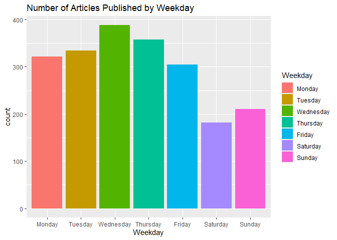
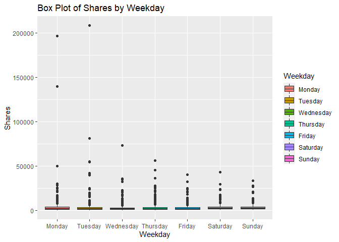
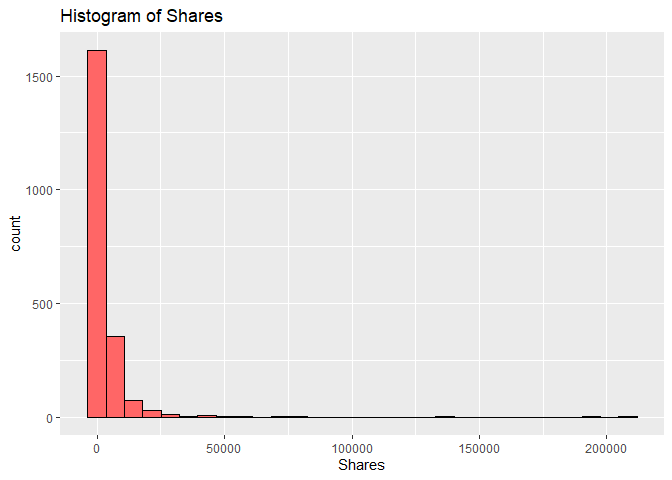
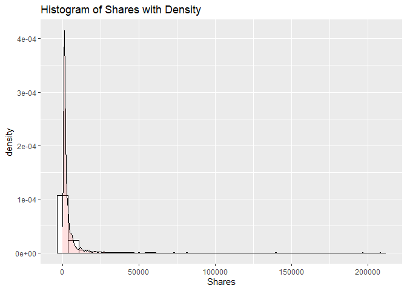
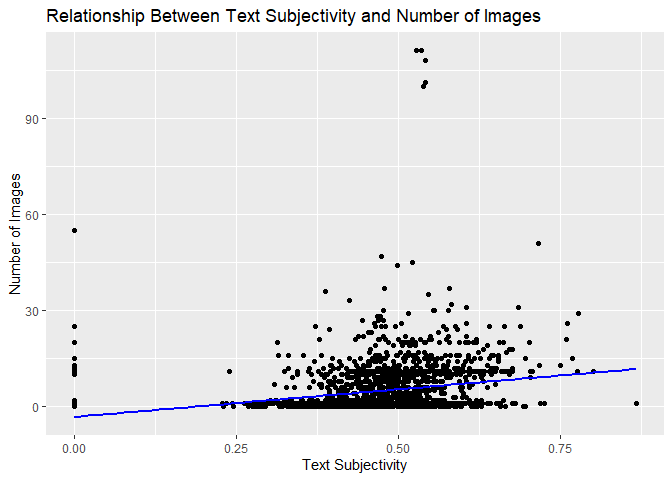
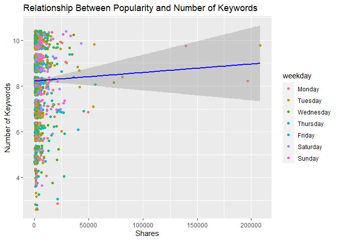
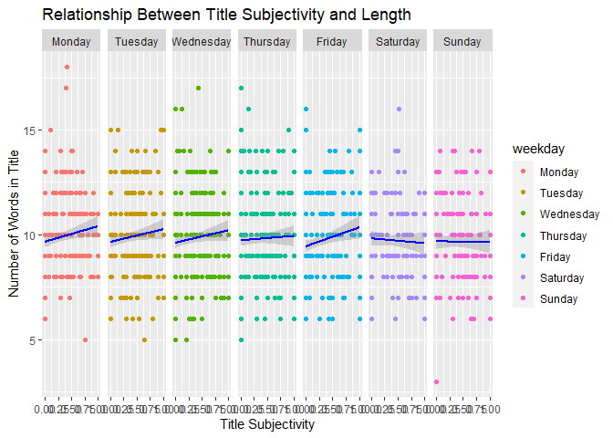

ST 558 Project 3
================
Melanie Kahn & Rachel Hardy
2022-11-14

-   <a href="#required-libraries" id="toc-required-libraries">Required
    Libraries</a>
-   <a href="#introduction-to-the-data"
    id="toc-introduction-to-the-data">Introduction to the Data</a>
-   <a href="#data" id="toc-data">Data</a>
    -   <a href="#reading-in-the-data" id="toc-reading-in-the-data">Reading in
        the Data</a>
    -   <a href="#modifying-the-data" id="toc-modifying-the-data">Modifying the
        Data</a>
    -   <a href="#splitting-the-data" id="toc-splitting-the-data">Splitting the
        Data</a>
-   <a href="#summarizations" id="toc-summarizations">Summarizations</a>
    -   <a href="#summary-statistics" id="toc-summary-statistics">Summary
        Statistics</a>
    -   <a href="#contingency-tables" id="toc-contingency-tables">Contingency
        Tables</a>
    -   <a href="#graphical-summaries" id="toc-graphical-summaries">Graphical
        Summaries</a>
        -   <a href="#bar-plot" id="toc-bar-plot">Bar Plot</a>
        -   <a href="#box-plot" id="toc-box-plot">Box Plot</a>
        -   <a href="#histograms" id="toc-histograms">Histograms</a>
        -   <a href="#scatter-plots" id="toc-scatter-plots">Scatter Plots</a>
-   <a href="#modeling" id="toc-modeling">Modeling</a>
    -   <a href="#linear-regression" id="toc-linear-regression">Linear
        Regression</a>
    -   <a href="#random-forest" id="toc-random-forest">Random Forest</a>
    -   <a href="#boosted-tree" id="toc-boosted-tree">Boosted Tree</a>
-   <a href="#comparison" id="toc-comparison">Comparison</a>

# Required Libraries

Running the code chunk below loads the `tidyverse`, `readr`, `ggplot2`,
`shiny`, `caret`, and `rmarkdown` packages.

``` r
library(tidyverse)
library(readr)
library(ggplot2)
library(shiny)
library(caret)
library(rmarkdown)
```

# Introduction to the Data

The online news popularity data used for this project summarizes a
diverse set of features about articles published by
[Mashable](http://www.mashable.com) over a two year period with the goal
of predicting the number of shares in social networks - a proxy for
popularity.

The original online news popularity data set included 58 predictive
variables, 2 non-predictive variables, 1 target variable. For the
purposes of this project, we are only using 14 non-predictive variables,
keeping the same target variable.

The variables present for each observation in this subset of the online
news popularity data set are as follows:

Non-Predictive Variables:

-   `url` - URL of the article  
-   `timedelta` - The number of days between the article publication and
    the data set acquisition

Predictive Variables:

-   `data_channel_is_*` - Binary variable indicating the type of data
    channel
    -   `lifestyle` - Lifestyle  
    -   `entertainment` - Entertainment  
    -   `bus` - Business  
    -   `socmed` - Social Media  
    -   `tech` - Tech  
    -   `world` - World  
-   `is_weekend` - Binary variable indicating if the article published
    on the weekend  
-   `weekday` - What day of the week the article was published (factor
    variable with seven levels)  
-   `num_imgs` - The number of images in the article  
-   `num_keywords` - The number of keywords in the metadata  
-   `n_tokens_title` - The number of words in the title  
-   `title_subjectivity` - Score of 0 - 1 indicating how subjective the
    title of the article is  
-   `global_subjectivity` - Score of 0 - 1 indicating how subjective the
    text of the article is

Target Variable:

-   `shares` - Number of shares

The purpose of the following analysis is to create predictive models for
this data set and find which one performs the best. After splitting the
data into a training and test set, the performance of a simple linear
regression model, a multiple regression model, a random forest model,
and a boosted tree model will be compared based on the root-mean-square
error (RMSE) calculation. The best model will have the smallest RMSE
from the test set. This process will be done across each data channel
(lifestyle,entertainment, business, social media, tech, and world) using
automated RMarkdown reports.

# Data

## Reading in the Data

Running the code chunk below reads in the online news popularity data
set using `read_csv()`.

``` r
newsOriginal <- read_csv(file = "./OnlineNewsPopularity.csv")
newsOriginal
```

    ## # A tibble: 39,644 × 61
    ##    url      timed…¹ n_tok…² n_tok…³ n_uni…⁴ n_non…⁵ n_non…⁶ num_h…⁷ num_s…⁸ num_i…⁹ num_v…˟ avera…˟ num_k…˟ data_…˟ data_…˟ data_…˟ data_…˟ data_…˟
    ##    <chr>      <dbl>   <dbl>   <dbl>   <dbl>   <dbl>   <dbl>   <dbl>   <dbl>   <dbl>   <dbl>   <dbl>   <dbl>   <dbl>   <dbl>   <dbl>   <dbl>   <dbl>
    ##  1 http://…     731      12     219   0.664    1.00   0.815       4       2       1       0    4.68       5       0       1       0       0       0
    ##  2 http://…     731       9     255   0.605    1.00   0.792       3       1       1       0    4.91       4       0       0       1       0       0
    ##  3 http://…     731       9     211   0.575    1.00   0.664       3       1       1       0    4.39       6       0       0       1       0       0
    ##  4 http://…     731       9     531   0.504    1.00   0.666       9       0       1       0    4.40       7       0       1       0       0       0
    ##  5 http://…     731      13    1072   0.416    1.00   0.541      19      19      20       0    4.68       7       0       0       0       0       1
    ##  6 http://…     731      10     370   0.560    1.00   0.698       2       2       0       0    4.36       9       0       0       0       0       1
    ##  7 http://…     731       8     960   0.418    1.00   0.550      21      20      20       0    4.65      10       1       0       0       0       0
    ##  8 http://…     731      12     989   0.434    1.00   0.572      20      20      20       0    4.62       9       0       0       0       0       1
    ##  9 http://…     731      11      97   0.670    1.00   0.837       2       0       0       0    4.86       7       0       0       0       0       1
    ## 10 http://…     731      10     231   0.636    1.00   0.797       4       1       1       1    5.09       5       0       0       0       0       0
    ## # … with 39,634 more rows, 43 more variables: data_channel_is_world <dbl>, kw_min_min <dbl>, kw_max_min <dbl>, kw_avg_min <dbl>, kw_min_max <dbl>,
    ## #   kw_max_max <dbl>, kw_avg_max <dbl>, kw_min_avg <dbl>, kw_max_avg <dbl>, kw_avg_avg <dbl>, self_reference_min_shares <dbl>,
    ## #   self_reference_max_shares <dbl>, self_reference_avg_sharess <dbl>, weekday_is_monday <dbl>, weekday_is_tuesday <dbl>,
    ## #   weekday_is_wednesday <dbl>, weekday_is_thursday <dbl>, weekday_is_friday <dbl>, weekday_is_saturday <dbl>, weekday_is_sunday <dbl>,
    ## #   is_weekend <dbl>, LDA_00 <dbl>, LDA_01 <dbl>, LDA_02 <dbl>, LDA_03 <dbl>, LDA_04 <dbl>, global_subjectivity <dbl>,
    ## #   global_sentiment_polarity <dbl>, global_rate_positive_words <dbl>, global_rate_negative_words <dbl>, rate_positive_words <dbl>,
    ## #   rate_negative_words <dbl>, avg_positive_polarity <dbl>, min_positive_polarity <dbl>, max_positive_polarity <dbl>, …

## Modifying the Data

Running the code chunk below subsets the data to only include
observations for the data channel we’re interested in.

``` r
news <- newsOriginal %>% filter(get(params$dataChannel) == 1)
news
```

    ## # A tibble: 2,099 × 61
    ##    url      timed…¹ n_tok…² n_tok…³ n_uni…⁴ n_non…⁵ n_non…⁶ num_h…⁷ num_s…⁸ num_i…⁹ num_v…˟ avera…˟ num_k…˟ data_…˟ data_…˟ data_…˟ data_…˟ data_…˟
    ##    <chr>      <dbl>   <dbl>   <dbl>   <dbl>   <dbl>   <dbl>   <dbl>   <dbl>   <dbl>   <dbl>   <dbl>   <dbl>   <dbl>   <dbl>   <dbl>   <dbl>   <dbl>
    ##  1 http://…     731       8     960   0.418    1.00   0.550      21      20      20       0    4.65      10       1       0       0       0       0
    ##  2 http://…     731      10     187   0.667    1.00   0.800       7       0       1       0    4.66       7       1       0       0       0       0
    ##  3 http://…     731      11     103   0.689    1.00   0.806       3       1       1       0    4.84       6       1       0       0       0       0
    ##  4 http://…     731      10     243   0.619    1.00   0.824       1       1       0       0    4.38      10       1       0       0       0       0
    ##  5 http://…     731       8     204   0.586    1.00   0.698       7       2       1       0    4.67       8       1       0       0       0       0
    ##  6 http://…     731      11     315   0.551    1.00   0.702       4       4       1       0    4.38      10       1       0       0       0       0
    ##  7 http://…     731      10    1190   0.409    1.00   0.561      25      24      20       0    4.62       8       1       0       0       0       0
    ##  8 http://…     731       6     374   0.641    1.00   0.828       7       0       1       0    4.91       8       1       0       0       0       0
    ##  9 http://…     730      12     499   0.513    1.00   0.662      14       1       1       0    5.08      10       1       0       0       0       0
    ## 10 http://…     729      11     223   0.662    1.00   0.826       5       3       0       0    4.55       6       1       0       0       0       0
    ## # … with 2,089 more rows, 43 more variables: data_channel_is_world <dbl>, kw_min_min <dbl>, kw_max_min <dbl>, kw_avg_min <dbl>, kw_min_max <dbl>,
    ## #   kw_max_max <dbl>, kw_avg_max <dbl>, kw_min_avg <dbl>, kw_max_avg <dbl>, kw_avg_avg <dbl>, self_reference_min_shares <dbl>,
    ## #   self_reference_max_shares <dbl>, self_reference_avg_sharess <dbl>, weekday_is_monday <dbl>, weekday_is_tuesday <dbl>,
    ## #   weekday_is_wednesday <dbl>, weekday_is_thursday <dbl>, weekday_is_friday <dbl>, weekday_is_saturday <dbl>, weekday_is_sunday <dbl>,
    ## #   is_weekend <dbl>, LDA_00 <dbl>, LDA_01 <dbl>, LDA_02 <dbl>, LDA_03 <dbl>, LDA_04 <dbl>, global_subjectivity <dbl>,
    ## #   global_sentiment_polarity <dbl>, global_rate_positive_words <dbl>, global_rate_negative_words <dbl>, rate_positive_words <dbl>,
    ## #   rate_negative_words <dbl>, avg_positive_polarity <dbl>, min_positive_polarity <dbl>, max_positive_polarity <dbl>, …

Running the code chunk below creates the categorical variable `weekday`
to the data set that tells us what day of the week the article was
published.

``` r
news <- news %>% mutate(weekday = if_else((weekday_is_monday == 1), "Monday",
                                  if_else((weekday_is_tuesday == 1), "Tuesday", 
                                  if_else((weekday_is_wednesday == 1), "Wednesday", 
                                  if_else((weekday_is_thursday == 1), "Thursday", 
                                  if_else((weekday_is_friday == 1), "Friday",
                                  if_else((weekday_is_saturday == 1), "Saturday", 
                                  if_else((weekday_is_sunday == 1), "Sunday", " ")))))))) %>%
                 select(url, shares, weekday, everything())

news$weekday <- factor(news$weekday, levels=c("Monday", "Tuesday", "Wednesday",
                                              "Thursday", "Friday", "Saturday", "Sunday"))
levels(news$weekday)
```

    ## [1] "Monday"    "Tuesday"   "Wednesday" "Thursday"  "Friday"    "Saturday"  "Sunday"

``` r
news
```

    ## # A tibble: 2,099 × 62
    ##    url       shares weekday timed…¹ n_tok…² n_tok…³ n_uni…⁴ n_non…⁵ n_non…⁶ num_h…⁷ num_s…⁸ num_i…⁹ num_v…˟ avera…˟ num_k…˟ data_…˟ data_…˟ data_…˟
    ##    <chr>      <dbl> <fct>     <dbl>   <dbl>   <dbl>   <dbl>   <dbl>   <dbl>   <dbl>   <dbl>   <dbl>   <dbl>   <dbl>   <dbl>   <dbl>   <dbl>   <dbl>
    ##  1 http://m…    556 Monday      731       8     960   0.418    1.00   0.550      21      20      20       0    4.65      10       1       0       0
    ##  2 http://m…   1900 Monday      731      10     187   0.667    1.00   0.800       7       0       1       0    4.66       7       1       0       0
    ##  3 http://m…   5700 Monday      731      11     103   0.689    1.00   0.806       3       1       1       0    4.84       6       1       0       0
    ##  4 http://m…    462 Monday      731      10     243   0.619    1.00   0.824       1       1       0       0    4.38      10       1       0       0
    ##  5 http://m…   3600 Monday      731       8     204   0.586    1.00   0.698       7       2       1       0    4.67       8       1       0       0
    ##  6 http://m…    343 Monday      731      11     315   0.551    1.00   0.702       4       4       1       0    4.38      10       1       0       0
    ##  7 http://m…    507 Monday      731      10    1190   0.409    1.00   0.561      25      24      20       0    4.62       8       1       0       0
    ##  8 http://m…    552 Monday      731       6     374   0.641    1.00   0.828       7       0       1       0    4.91       8       1       0       0
    ##  9 http://m…   1200 Tuesday     730      12     499   0.513    1.00   0.662      14       1       1       0    5.08      10       1       0       0
    ## 10 http://m…   1900 Wednes…     729      11     223   0.662    1.00   0.826       5       3       0       0    4.55       6       1       0       0
    ## # … with 2,089 more rows, 44 more variables: data_channel_is_socmed <dbl>, data_channel_is_tech <dbl>, data_channel_is_world <dbl>,
    ## #   kw_min_min <dbl>, kw_max_min <dbl>, kw_avg_min <dbl>, kw_min_max <dbl>, kw_max_max <dbl>, kw_avg_max <dbl>, kw_min_avg <dbl>,
    ## #   kw_max_avg <dbl>, kw_avg_avg <dbl>, self_reference_min_shares <dbl>, self_reference_max_shares <dbl>, self_reference_avg_sharess <dbl>,
    ## #   weekday_is_monday <dbl>, weekday_is_tuesday <dbl>, weekday_is_wednesday <dbl>, weekday_is_thursday <dbl>, weekday_is_friday <dbl>,
    ## #   weekday_is_saturday <dbl>, weekday_is_sunday <dbl>, is_weekend <dbl>, LDA_00 <dbl>, LDA_01 <dbl>, LDA_02 <dbl>, LDA_03 <dbl>, LDA_04 <dbl>,
    ## #   global_subjectivity <dbl>, global_sentiment_polarity <dbl>, global_rate_positive_words <dbl>, global_rate_negative_words <dbl>,
    ## #   rate_positive_words <dbl>, rate_negative_words <dbl>, avg_positive_polarity <dbl>, min_positive_polarity <dbl>, max_positive_polarity <dbl>, …

## Splitting the Data

Running the code chunk below splits the modified `news` data set into a
training and testing set using `createDataPartition()`. First the seed
is set to make sure the random sampling will be reproducible.
`createDataPartition()` then creates an indexing vector (`trainIndex`)
with a subset of the `shares` variable where the training subset
(`newsTrain`) will result in a vector (`list = FALSE`) that has
approximately 70% (`p = 0.7`) of the observations from the updated
`news` data set. This training vector is then used to create the
training set (`newsTrain`) with approximately 70% of the observations
from the updated `news` data set, and the test set (`newsTest`) with the
remaining 30% of the observations.

``` r
set.seed(100)
newsIndex <- createDataPartition(news$shares, p = 0.7, list = FALSE)

newsTrain <- news[newsIndex, ]
newsTest <- news[-newsIndex, ]

newsTrain
```

    ## # A tibble: 1,472 × 62
    ##    url       shares weekday timed…¹ n_tok…² n_tok…³ n_uni…⁴ n_non…⁵ n_non…⁶ num_h…⁷ num_s…⁸ num_i…⁹ num_v…˟ avera…˟ num_k…˟ data_…˟ data_…˟ data_…˟
    ##    <chr>      <dbl> <fct>     <dbl>   <dbl>   <dbl>   <dbl>   <dbl>   <dbl>   <dbl>   <dbl>   <dbl>   <dbl>   <dbl>   <dbl>   <dbl>   <dbl>   <dbl>
    ##  1 http://m…    556 Monday      731       8     960   0.418    1.00   0.550      21      20      20       0    4.65      10       1       0       0
    ##  2 http://m…   1900 Monday      731      10     187   0.667    1.00   0.800       7       0       1       0    4.66       7       1       0       0
    ##  3 http://m…   5700 Monday      731      11     103   0.689    1.00   0.806       3       1       1       0    4.84       6       1       0       0
    ##  4 http://m…    462 Monday      731      10     243   0.619    1.00   0.824       1       1       0       0    4.38      10       1       0       0
    ##  5 http://m…   3600 Monday      731       8     204   0.586    1.00   0.698       7       2       1       0    4.67       8       1       0       0
    ##  6 http://m…    343 Monday      731      11     315   0.551    1.00   0.702       4       4       1       0    4.38      10       1       0       0
    ##  7 http://m…    507 Monday      731      10    1190   0.409    1.00   0.561      25      24      20       0    4.62       8       1       0       0
    ##  8 http://m…   1900 Wednes…     729      11     223   0.662    1.00   0.826       5       3       0       0    4.55       6       1       0       0
    ##  9 http://m…   1100 Wednes…     729       7    1007   0.438    1.00   0.565      24      23      20       0    4.79      10       1       0       0
    ## 10 http://m…   2300 Wednes…     729       9     455   0.496    1.00   0.659      10       5       1       0    4.69       9       1       0       0
    ## # … with 1,462 more rows, 44 more variables: data_channel_is_socmed <dbl>, data_channel_is_tech <dbl>, data_channel_is_world <dbl>,
    ## #   kw_min_min <dbl>, kw_max_min <dbl>, kw_avg_min <dbl>, kw_min_max <dbl>, kw_max_max <dbl>, kw_avg_max <dbl>, kw_min_avg <dbl>,
    ## #   kw_max_avg <dbl>, kw_avg_avg <dbl>, self_reference_min_shares <dbl>, self_reference_max_shares <dbl>, self_reference_avg_sharess <dbl>,
    ## #   weekday_is_monday <dbl>, weekday_is_tuesday <dbl>, weekday_is_wednesday <dbl>, weekday_is_thursday <dbl>, weekday_is_friday <dbl>,
    ## #   weekday_is_saturday <dbl>, weekday_is_sunday <dbl>, is_weekend <dbl>, LDA_00 <dbl>, LDA_01 <dbl>, LDA_02 <dbl>, LDA_03 <dbl>, LDA_04 <dbl>,
    ## #   global_subjectivity <dbl>, global_sentiment_polarity <dbl>, global_rate_positive_words <dbl>, global_rate_negative_words <dbl>,
    ## #   rate_positive_words <dbl>, rate_negative_words <dbl>, avg_positive_polarity <dbl>, min_positive_polarity <dbl>, max_positive_polarity <dbl>, …

``` r
newsTest
```

    ## # A tibble: 627 × 62
    ##    url       shares weekday timed…¹ n_tok…² n_tok…³ n_uni…⁴ n_non…⁵ n_non…⁶ num_h…⁷ num_s…⁸ num_i…⁹ num_v…˟ avera…˟ num_k…˟ data_…˟ data_…˟ data_…˟
    ##    <chr>      <dbl> <fct>     <dbl>   <dbl>   <dbl>   <dbl>   <dbl>   <dbl>   <dbl>   <dbl>   <dbl>   <dbl>   <dbl>   <dbl>   <dbl>   <dbl>   <dbl>
    ##  1 http://m…    552 Monday      731       6     374   0.641    1.00   0.828       7       0       1       0    4.91       8       1       0       0
    ##  2 http://m…   1200 Tuesday     730      12     499   0.513    1.00   0.662      14       1       1       0    5.08      10       1       0       0
    ##  3 http://m…   1200 Wednes…     729      11    1099   0.412    1.00   0.557      28      24      20       0    4.58      10       1       0       0
    ##  4 http://m…   1700 Wednes…     729      14     318   0.633    1.00   0.838       7       0       1       0    4.43       7       1       0       0
    ##  5 http://m…   1000 Wednes…     729       7     144   0.723    1.00   0.857       9       6       1       0    4.83      10       1       0       0
    ##  6 http://m…    866 Wednes…     729      12     983   0.441    1.00   0.579      21      21      19       0    4.70      10       1       0       0
    ##  7 http://m…   1700 Wednes…     729      11    1058   0.410    1.00   0.546      26      23      20       0    4.67      10       1       0       0
    ##  8 http://m…   5600 Thursd…     728       6     397   0.512    1.00   0.661      11       0       1       0    5.35       8       1       0       0
    ##  9 http://m…   1200 Thursd…     728      12     270   0.577    1.00   0.709       6       4       1       0    4.71      10       1       0       0
    ## 10 http://m…   2400 Thursd…     728       8     279   0.609    1.00   0.771      13       3       1       0    5.09       6       1       0       0
    ## # … with 617 more rows, 44 more variables: data_channel_is_socmed <dbl>, data_channel_is_tech <dbl>, data_channel_is_world <dbl>,
    ## #   kw_min_min <dbl>, kw_max_min <dbl>, kw_avg_min <dbl>, kw_min_max <dbl>, kw_max_max <dbl>, kw_avg_max <dbl>, kw_min_avg <dbl>,
    ## #   kw_max_avg <dbl>, kw_avg_avg <dbl>, self_reference_min_shares <dbl>, self_reference_max_shares <dbl>, self_reference_avg_sharess <dbl>,
    ## #   weekday_is_monday <dbl>, weekday_is_tuesday <dbl>, weekday_is_wednesday <dbl>, weekday_is_thursday <dbl>, weekday_is_friday <dbl>,
    ## #   weekday_is_saturday <dbl>, weekday_is_sunday <dbl>, is_weekend <dbl>, LDA_00 <dbl>, LDA_01 <dbl>, LDA_02 <dbl>, LDA_03 <dbl>, LDA_04 <dbl>,
    ## #   global_subjectivity <dbl>, global_sentiment_polarity <dbl>, global_rate_positive_words <dbl>, global_rate_negative_words <dbl>,
    ## #   rate_positive_words <dbl>, rate_negative_words <dbl>, avg_positive_polarity <dbl>, min_positive_polarity <dbl>, max_positive_polarity <dbl>, …

# Summarizations

## Summary Statistics

Running the code chunk below provides the mean and standard deviation
for the number of times articles in the `news` data set were shared
(`shares`).

``` r
mean(news$shares)
```

    ## [1] 3682.123

``` r
sd(news$shares)
```

    ## [1] 8885.017

Running the code chunk below provides the mean and standard deviation
for the number of images per article (`num_imgs`) in the `news` data
set.

``` r
mean(news$num_imgs)
```

    ## [1] 4.904717

``` r
sd(news$num_imgs)
```

    ## [1] 8.150601

Running the code chunk below provides the mean and standard deviation
for the number of keywords per article (`num_keywords`) in the `news`
data set.

``` r
mean(news$num_keywords)
```

    ## [1] 8.229633

``` r
sd(news$num_keywords)
```

    ## [1] 1.672311

## Contingency Tables

Running the code chunk below creates a contingency table showing the
number of articles in the online `news` popularity data set that were
published on the weekend (`is_weekend`).

``` r
tableWeekend <- table(news$is_weekend)
tableWeekend
```

    ## 
    ##    0    1 
    ## 1707  392

From the table **above**, we can see that 392 articles were published on
the weekend, and 1707 articles were published during the week.

Running the code chunk below creates a contingency table showing the
number of articles in the online `news` popularity data set that were
published on certain days of the week (`weekday`).

``` r
tableWeekday <- table(news$weekday)
tableWeekday
```

    ## 
    ##    Monday   Tuesday Wednesday  Thursday    Friday  Saturday    Sunday 
    ##       322       334       388       358       305       182       210

From the table **above**, we can see that 322 articles were published on
Monday, 392 were published on Tuesday, NA on Wednesday, NA on Thursday,
NA on Friday, NA on Saturday, NA articles were published on Sunday.

## Graphical Summaries

### Bar Plot

Running the code chunk below creates a bar plot to visualize the number
of articles published per each `weekday`. Using the aesthetics option
`aes(fill = weekday)` inside the `geom_bar()` function gives us a nicely
colored graph.

``` r
g <- ggplot(news, aes(x = weekday))

g + geom_bar(aes(fill = weekday)) + 
  labs(title = "Number of Articles Published by Weekday", x = "Weekday") +
  scale_fill_discrete(name = "Weekday")
```

<!-- -->

### Box Plot

Running the code chunk below creates a box plot of number of `shares`
for each `weekday`. Using the aesthetics option ‘fill = weekday’ gives
us a nicely colored graph.

``` r
g <- ggplot(news, aes(x = weekday, y = shares))

g + geom_boxplot(aes(fill = weekday)) + 
  labs(title = "Box Plot of Shares by Weekday", x = "Weekday", y = "Shares") +
  scale_fill_discrete(name = "Weekday")
```

<!-- -->

### Histograms

Running the code chunk below creates two histograms of the number of
`shares` that show us the distribution of the variable. The second
histogram has an added density layer to give us a better idea of how the
data is spread out.

``` r
g <- ggplot(news, aes(x = shares))

g + geom_histogram(color = "black", fill = "#FF6666") + labs(title = "Histogram of Shares") +
  labs(title = "Histogram of Shares", x = "Shares")
```

<!-- -->

``` r
g + geom_histogram(aes(y=..density..), colour="black", fill="white") + 
  geom_density(alpha=.2, fill="#FF6666") + 
  labs(title = "Histogram of Shares with Density", x = "Shares")
```

<!-- -->

### Scatter Plots

Running the code chunk below creates a scatter plot to visualize the
correlation between the text subjectivity (`global_subjectivity`) and
the number of images (`num_imgs`) articles have. The `geom_point()`
function plots the data points while the `geom_smooth()` function plots
the regression line using method `lm` for linear model.

Using this linear regression line on the scatter plot *below* helps
quantify the direction and strength of the relationship between the text
subjectivity on the x-axis and the number of images on the y-axis.
Results showing a regression line starting lower on the y-axis than it
ends (a *positive* slope) represents a *positive* linear correlation
between an article’s overall subjectivity and the number of images
used - if one increases, so does the other. Results showing a regression
line starting higher on the y-axis than it ends (a *negative* slope)
represents a *negative* linear correlation between the two, meaning the
trend in the data shows a higher number of images reduces subjectivity
in an article. The steepness of the slope associated with this
regression line indicates the strength of the variable relationship. The
closer a regression line gets to horizontal, the weaker the correlation
between the subjectivity and images; and vice versa.

``` r
g <- ggplot(news, aes(x = global_subjectivity, y = num_imgs))
g + geom_point() +
  geom_smooth(method = lm, col = "Blue", se = FALSE) +
  labs(title = "Relationship Between Text Subjectivity and Number of Images",
       x = "Text Subjectivity",
       y = "Number of Images")
```

<!-- -->

Running the code chunk below creates a scatter plot to visualize the
correlation between the number of `shares` and the number of keywords
(`num_keywords`) articles have. `geom_jitter` is used instead of
`geom_point()` to plot the data points in a manner where the `weekday`
component can be better visualized. The `geom_smooth()` function plots
the regression line using method `lm` for linear model.

Using this linear regression line on the scatter plot *below* helps
quantify the direction and strength of the relationship between the
number of shares on the x-axis and the number of keywords on the y-axis.
Results showing a regression line starting lower on the y-axis than it
ends (a *positive* slope) represents a *positive* linear correlation
between an article’s number of shares and the number of keywords used -
if one increases, so does the other. Results showing a regression line
starting higher on the y-axis than it ends (a *negative* slope)
represents a *negative* linear correlation between the two, meaning the
trend in the data shows a higher number of keywords reduces the number
of times an article is shared. The steepness of the slope associated
with this regression line indicates the strength of the variable
relationship. The closer a regression line gets to horizontal, the
weaker the correlation between the popularity and keywords; and vice
versa. As one of the default arguments for the `geom_smooth` function is
`se = TRUE`, a 95% confidence interval can also be seen. Wider
confidence intervals indicate increased uncertainty of the effect the
variables have on each other.

``` r
g <- ggplot(news, aes(x = shares, y = num_keywords))
g + geom_jitter(aes(color = weekday)) +
  geom_smooth(method = lm, col = "Blue") +
  labs(title = "Relationship Between Popularity and Number of Keywords",
       x = "Shares",
       y = "Number of Keywords")
```

<!-- -->

Running the code chunk below creates a facet grid scatter plot to
visualize the correlation between the number of words in the article’s
title (`n_tokens_title`) and title’s subjectivity score
(`title_subjectivity`) according to the day the article was published
(`weekday`). The `geom_point()` function plots the data points while the
`geom_smooth()` function plots the regression line using method `lm` for
linear model.

Using this linear regression line on the scatter plot *below* helps
quantify the direction and strength of the relationship between the
title subjectivity on the x-axis and the number of words in the title on
the y-axis. Results showing a regression line starting lower on the
y-axis than it ends (a *positive* slope) represents a *positive* linear
correlation between a title’s subjectivity and length - if one
increases, so does the other. Results showing a regression line starting
higher on the y-axis than it ends (a *negative* slope) represents a
*negative* linear correlation between the two, meaning the trend in the
data shows a higher number of words reduces title subjectivity. The
steepness of the slope associated with this regression line indicates
the strength of the variable relationship. The closer a regression line
gets to horizontal, the weaker the correlation between the title
subjectivity and length; and vice versa. The 95% confidence intervals
may be harder to see due to the faceted nature of these plots, but wider
confidence intervals still indicate increased uncertainty of the effect
the variables have on each other.

``` r
g <- ggplot(news, aes(x = title_subjectivity, y = n_tokens_title))
g + geom_point(aes(color = weekday)) +
  facet_grid(~ weekday) +
  geom_smooth(method = lm, col = "Blue") +
  labs(title = "Relationship Between Title Subjectivity and Length",
       x = "Title Subjectivity",
       y = "Number of Words in Title")
```

<!-- -->

# Modeling

## Linear Regression

Linear regression attempts to model the (linear) relationship between a
response variable and one or more predictor variables by fitting a
linear equation to the data. The simplest form of the linear equation is
`Y = a + bX`, where `Y` is the response variable, `a` is the intercept,
`b` is the slope, and `X` is the predictor (or explanatory) variable.
The most common method for fitting a regression model is least-squares
regression, where the best-fitting line is calculated by minimizing the
sum of the squared residuals.

For linear regression, it is usually important to understand which
variables are related and which variables scientifically should be in
the model. It is also important to split the data into a training set
and a testing set so the model does not become over-fit.

Running the code chunk below creates a multiple linear regression model
where `shares` is the response variable and the predictor variables are
`weekday`, `title_subjectivity`, `num_imgs`, `title_subjectivity^2`, and
`num_imgs^2`.

By using the `summary()` function, we can see the values for the
residuals and coefficients, as well as the performance criteria values
such as multiple R-squared.

``` r
set.seed(100)
firstLinearModel <- train(shares ~ weekday + title_subjectivity + num_imgs + I(title_subjectivity^2) + I(num_imgs^2), 
                        data = newsTrain,
                        method = "lm",
                        preProcess = c("center", "scale"),
                        trControl = trainControl(method = "cv"))
firstLinearModel
```

    ## Linear Regression 
    ## 
    ## 1472 samples
    ##    3 predictor
    ## 
    ## Pre-processing: centered (10), scaled (10) 
    ## Resampling: Cross-Validated (10 fold) 
    ## Summary of sample sizes: 1324, 1325, 1324, 1325, 1326, 1325, ... 
    ## Resampling results:
    ## 
    ##   RMSE      Rsquared    MAE     
    ##   6953.937  0.01120519  3260.934
    ## 
    ## Tuning parameter 'intercept' was held constant at a value of TRUE

``` r
summary(firstLinearModel)
```

    ## 
    ## Call:
    ## lm(formula = .outcome ~ ., data = dat)
    ## 
    ## Residuals:
    ##    Min     1Q Median     3Q    Max 
    ##  -5828  -2521  -1684   -207 202566 
    ## 
    ## Coefficients:
    ##                           Estimate Std. Error t value Pr(>|t|)    
    ## (Intercept)               3647.081    205.659  17.734  < 2e-16 ***
    ## weekdayTuesday             471.511    272.286   1.732  0.08354 .  
    ## weekdayWednesday          -160.607    280.083  -0.573  0.56644    
    ## weekdayThursday            114.679    272.183   0.421  0.67358    
    ## weekdayFriday             -147.831    265.379  -0.557  0.57758    
    ## weekdaySaturday              3.486    249.186   0.014  0.98884    
    ## weekdaySunday               50.299    254.521   0.198  0.84337    
    ## title_subjectivity        -549.258    650.556  -0.844  0.39865    
    ## num_imgs                  1219.795    375.411   3.249  0.00118 ** 
    ## `I(title_subjectivity^2)`  519.903    650.213   0.800  0.42408    
    ## `I(num_imgs^2)`           -652.024    367.236  -1.775  0.07603 .  
    ## ---
    ## Signif. codes:  0 '***' 0.001 '**' 0.01 '*' 0.05 '.' 0.1 ' ' 1
    ## 
    ## Residual standard error: 7890 on 1461 degrees of freedom
    ## Multiple R-squared:  0.01445,    Adjusted R-squared:  0.007702 
    ## F-statistic: 2.142 on 10 and 1461 DF,  p-value: 0.01897

Now that the multiple linear regression model has been trained
(`firstLinearModel`), running the code chunk below will check how well
the model does on the test set `newsTest` using the `postResample()`
function. The RMSE from the `postResample` output is then stored in an
object `firstLinearRMSE` for later use in our comparison functions.

``` r
firstLinearPredict <- predict(firstLinearModel, newdata = newsTest)

firstLinearPerformance <- postResample(firstLinearPredict, newsTest$shares)
firstLinearPerformance
```

    ##         RMSE     Rsquared          MAE 
    ## 1.087274e+04 2.230766e-04 3.382114e+03

``` r
attributes(firstLinearPerformance)
```

    ## $names
    ## [1] "RMSE"     "Rsquared" "MAE"

``` r
firstLinearRMSE <- firstLinearPerformance[1]
firstLinearRMSE
```

    ##     RMSE 
    ## 10872.74

Running the code chunk below creates a simple linear regression model
where `shares` is the response variable and the predictor variables are
`weekday`, `num_imgs`, `num_keywords`, `n_tokens_title`,
`title_subjectivity`, and `global_subjectivity`. The `summary()`
function is used to examine the values for the residuals and
coefficients, as well as the performance criteria values such as
multiple R-squared.

``` r
set.seed(100)
secondLinearModel <- train(shares ~ weekday + num_imgs + num_keywords + n_tokens_title + title_subjectivity + global_subjectivity, 
                        data = newsTrain,
                        method = "lm",
                        preProcess = c("center", "scale"),
                        trControl = trainControl(method = "cv"))
secondLinearModel
```

    ## Linear Regression 
    ## 
    ## 1472 samples
    ##    6 predictor
    ## 
    ## Pre-processing: centered (11), scaled (11) 
    ## Resampling: Cross-Validated (10 fold) 
    ## Summary of sample sizes: 1324, 1325, 1324, 1325, 1326, 1325, ... 
    ## Resampling results:
    ## 
    ##   RMSE      Rsquared     MAE     
    ##   6972.831  0.007597564  3263.517
    ## 
    ## Tuning parameter 'intercept' was held constant at a value of TRUE

``` r
summary(secondLinearModel)
```

    ## 
    ## Call:
    ## lm(formula = .outcome ~ ., data = dat)
    ## 
    ## Residuals:
    ##    Min     1Q Median     3Q    Max 
    ##  -8549  -2511  -1759   -253 202987 
    ## 
    ## Coefficients:
    ##                     Estimate Std. Error t value Pr(>|t|)    
    ## (Intercept)         3647.081    205.955  17.708  < 2e-16 ***
    ## weekdayTuesday       448.020    272.550   1.644  0.10043    
    ## weekdayWednesday    -172.976    280.707  -0.616  0.53785    
    ## weekdayThursday      103.630    272.641   0.380  0.70393    
    ## weekdayFriday       -165.889    265.680  -0.624  0.53247    
    ## weekdaySaturday       27.855    249.622   0.112  0.91117    
    ## weekdaySunday         73.637    255.127   0.289  0.77291    
    ## num_imgs             649.943    218.088   2.980  0.00293 ** 
    ## num_keywords         142.313    211.517   0.673  0.50117    
    ## n_tokens_title       118.754    208.295   0.570  0.56868    
    ## title_subjectivity   -31.024    210.231  -0.148  0.88270    
    ## global_subjectivity   -7.098    213.477  -0.033  0.97348    
    ## ---
    ## Signif. codes:  0 '***' 0.001 '**' 0.01 '*' 0.05 '.' 0.1 ' ' 1
    ## 
    ## Residual standard error: 7902 on 1460 degrees of freedom
    ## Multiple R-squared:  0.01228,    Adjusted R-squared:  0.004838 
    ## F-statistic:  1.65 on 11 and 1460 DF,  p-value: 0.0794

Now that the simple linear regression model has been trained
(`secondLinearModel`), running the code chunk below will check how well
the model does on the test set `newsTest` using the `postResample()`
function. The RMSE from the `postResample` output is then stored in an
object `secondLinearRMSE` for later use in our comparison functions.

``` r
secondLinearPredict <- predict(secondLinearModel, newdata = newsTest)

secondLinearPerformance <- postResample(secondLinearPredict, newsTest$shares)
secondLinearPerformance
```

    ##         RMSE     Rsquared          MAE 
    ## 1.086294e+04 8.105702e-04 3.363400e+03

``` r
attributes(secondLinearPerformance)
```

    ## $names
    ## [1] "RMSE"     "Rsquared" "MAE"

``` r
secondLinearRMSE <- secondLinearPerformance[1]
secondLinearRMSE
```

    ##     RMSE 
    ## 10862.94

## Random Forest

To understand random forests, it is first important to understand bagged
trees which are created using bootstrap aggregation. For bagged trees,
the sample is treated as the population and re-sampling is done with
replacement. The process of creating a bagged tree is below:

-   Step 1: Create a bootstrap sample using `sample()`  
-   Step 2: Train the tree on this sample (no pruning necessary)  
-   Step 3: Repeat B = 1000 times (no set mark)  
-   Step 4: Final prediction is average of these predictions (for
    regression trees) **OR** use majority vote as final classification
    prediction (classification trees)

Random forests are essentially bagged trees, except not all the
predictors are used for each model. A random subset of predictors is
used for each tree model (bootstrap sample). The purpose of doing this
is to prevent one or two strong predictors from dominating all tree
models and creating unwanted correlation between models.

Running the code chunk below trains the random forest model. The formula
notation used in the `train()` function models the `shares` variable
using the following predictor/explanatory variables: `weekday`,
`num_imgs`, and `num_keywords`. To use the random forest model, the
`method` argument was specified as `"rf"`. The data was pre-processed by
centering and scaling. Cross validation was used five-fold and repeated
three (3) times. The argument `tuneGrid` was then used to replicate the
random forest model a total of five (5) times. The best model is then
chosen based on the performance criteria.

``` r
set.seed(100)
randomForestCtrl <- trainControl(method = "repeatedcv", number = 5, repeats = 3)
randomForestFit <- train(shares ~ weekday + num_imgs + num_keywords, 
                         data = newsTrain, method = "rf", 
                         trControl = randomForestCtrl,
                         preProcess = c("center","scale"), 
                         tuneGrid = data.frame(mtry = 1:5))

randomForestFit
```

    ## Random Forest 
    ## 
    ## 1472 samples
    ##    3 predictor
    ## 
    ## Pre-processing: centered (8), scaled (8) 
    ## Resampling: Cross-Validated (5 fold, repeated 3 times) 
    ## Summary of sample sizes: 1178, 1178, 1176, 1178, 1178, 1177, ... 
    ## Resampling results across tuning parameters:
    ## 
    ##   mtry  RMSE      Rsquared     MAE     
    ##   1     7220.578  0.006248908  3255.096
    ##   2     7330.247  0.003959991  3292.597
    ##   3     7509.434  0.002797715  3349.873
    ##   4     7687.210  0.002409441  3412.811
    ##   5     7907.257  0.002040188  3478.188
    ## 
    ## RMSE was used to select the optimal model using the smallest value.
    ## The final value used for the model was mtry = 1.

Now that the random forest model has been trained (`randomForestFit`),
running the code chunk below will check how well the model does on the
test set `newsTest` using the `postResample()` function. The RMSE from
the `postResample` output is then stored in an object `rfRMSE` for later
use in our comparison functions.

``` r
randomForestPredict <- predict(randomForestFit, newdata = newsTest)

randomForestPerformance <- postResample(randomForestPredict, newsTest$shares)
randomForestPerformance
```

    ##         RMSE     Rsquared          MAE 
    ## 1.083155e+04 9.668519e-05 3.372537e+03

``` r
attributes(randomForestPerformance)
```

    ## $names
    ## [1] "RMSE"     "Rsquared" "MAE"

``` r
rfRMSE <- randomForestPerformance[1]
rfRMSE
```

    ##     RMSE 
    ## 10831.55

## Boosted Tree

Boosted trees are another enhancement to the single tree methods.
However, unlike bagged and random forest models, boosted trees do not
use bootstrapping. Boosting is a general method to slowly train your
tree so you don’t overfit your model. The trees are grown in a
sequential manner where each subsequent tree is based off a modified
version of the original data, updating the predictions as the tree is
grown. The process is described below:

-   Step 1: Initialize predictions as 0  
-   Step 2: Find the residuals for every observation
    -   Residuals in first tree fit will be original data values
        (observed - 0 = observed)  
-   Step 3: Fit a regression tree with `d` splits where the residuals
    are the response  
-   Step 4: Update predictions using the new predictions from step 3
    multiplied by the growth rate (Lambda tuning parameter)  
-   Step 5: Continue to update residuals for new predictions (steps 2
    -4) `B` times

Running the code chunk below trains the boosted tree model. The formula
notation used in the `train()` function models the `shares` variable
using the following predictor/explanatory variables: `weekday`,
`num_imgs`, `num_keywords`, `n_tokens_title`, and `title_subjectivity`.
To use the boosted tree model, the `method` argument was specified as
`"gbm"`. The data was pre-processed by centering and scaling. `tuneGrid`
was then used to consider values of `n.trees` = 50, `interaction.depth`
= 1, `shrinkage` = 0.1, and `n.minobsinnode` = 10. Lastly,
`trainControl()` was used within the `trControl` argument to do 10 fold
cross-validation using the `"cv"` `method`.

``` r
boostTreeFit <- train(shares ~ weekday + num_imgs + num_keywords + n_tokens_title + title_subjectivity
                        + global_subjectivity, data = newsTrain,
                        method = "gbm",
                        preProcess = c("center", "scale"),
                        tuneGrid = data.frame(n.trees = 50, interaction.depth = 1, shrinkage = 0.1, n.minobsinnode = 10),
                        trControl = trainControl(method = "cv", number = 10))
```

    ## Iter   TrainDeviance   ValidDeviance   StepSize   Improve
    ##      1 65813971.2946             nan     0.1000 -89492.8391
    ##      2 65638070.7620             nan     0.1000 113181.2319
    ##      3 65457936.4041             nan     0.1000 -30515.3789
    ##      4 65385201.3291             nan     0.1000 -82544.9050
    ##      5 65280238.1437             nan     0.1000 24792.6978
    ##      6 65208916.8336             nan     0.1000 1544.9794
    ##      7 65123239.4728             nan     0.1000 26495.8132
    ##      8 65046089.7778             nan     0.1000 -2301.7730
    ##      9 64999339.0739             nan     0.1000 -17076.0096
    ##     10 64948654.2985             nan     0.1000 -39707.8210
    ##     20 64702605.1091             nan     0.1000 -44982.9557
    ##     40 64462330.1234             nan     0.1000 -27686.0691
    ##     50 64330685.3000             nan     0.1000 -41466.0162
    ## 
    ## Iter   TrainDeviance   ValidDeviance   StepSize   Improve
    ##      1 66930083.0300             nan     0.1000 78239.9068
    ##      2 66744940.5392             nan     0.1000 133945.0557
    ##      3 66601167.1775             nan     0.1000 110593.5665
    ##      4 66552334.0833             nan     0.1000 39903.6348
    ##      5 66485931.2815             nan     0.1000 55454.6245
    ##      6 66431961.6750             nan     0.1000 -53829.3690
    ##      7 66379178.3844             nan     0.1000 28148.7273
    ##      8 66356825.6715             nan     0.1000 -11977.7014
    ##      9 66329217.9559             nan     0.1000 -6520.6577
    ##     10 66325119.4834             nan     0.1000 -67334.4906
    ##     20 65941187.1905             nan     0.1000 -15708.0688
    ##     40 65503343.3350             nan     0.1000 -21170.8865
    ##     50 65390006.7463             nan     0.1000 -80865.1424
    ## 
    ## Iter   TrainDeviance   ValidDeviance   StepSize   Improve
    ##      1 33359323.8894             nan     0.1000 102941.5457
    ##      2 33242404.8440             nan     0.1000 86993.4306
    ##      3 33214704.7287             nan     0.1000 -39190.3883
    ##      4 33198893.2350             nan     0.1000 -31303.3628
    ##      5 33145795.0205             nan     0.1000 47541.4714
    ##      6 33118857.9310             nan     0.1000 17442.9910
    ##      7 33094038.7483             nan     0.1000 -31431.3899
    ##      8 32996006.5810             nan     0.1000 -11490.8195
    ##      9 32925848.6603             nan     0.1000 10105.4901
    ##     10 32886079.9869             nan     0.1000 17904.1582
    ##     20 32661728.5192             nan     0.1000 -22709.2558
    ##     40 32442239.6474             nan     0.1000 -31850.2578
    ##     50 32381707.1945             nan     0.1000 -87305.1637
    ## 
    ## Iter   TrainDeviance   ValidDeviance   StepSize   Improve
    ##      1 65158731.5619             nan     0.1000 79570.1491
    ##      2 65052744.0423             nan     0.1000 23847.1061
    ##      3 64896888.0171             nan     0.1000 103482.8881
    ##      4 64892886.3023             nan     0.1000 -53753.6534
    ##      5 64877064.3597             nan     0.1000 -30417.1630
    ##      6 64819249.0926             nan     0.1000 40218.3887
    ##      7 64736887.3127             nan     0.1000 -22655.1878
    ##      8 64629143.4452             nan     0.1000 50673.7346
    ##      9 64524942.4429             nan     0.1000 22677.7613
    ##     10 64498526.1930             nan     0.1000 -12550.7439
    ##     20 64176390.4074             nan     0.1000 -51742.2532
    ##     40 63957974.5849             nan     0.1000 -25127.5573
    ##     50 63825942.2477             nan     0.1000 -29867.2558
    ## 
    ## Iter   TrainDeviance   ValidDeviance   StepSize   Improve
    ##      1 66850642.8938             nan     0.1000 88883.4005
    ##      2 66762534.3028             nan     0.1000 27428.3293
    ##      3 66598814.5185             nan     0.1000 67155.6916
    ##      4 66460708.9301             nan     0.1000 97686.9714
    ##      5 66332023.8720             nan     0.1000 -1403.2613
    ##      6 66277846.7839             nan     0.1000 -35672.1756
    ##      7 66199975.3729             nan     0.1000 25670.6265
    ##      8 66127725.5562             nan     0.1000 -12271.4857
    ##      9 66104287.9561             nan     0.1000  904.0534
    ##     10 66089181.0621             nan     0.1000 -46500.9104
    ##     20 65618817.4147             nan     0.1000 4926.9416
    ##     40 65246616.3171             nan     0.1000 -72545.4943
    ##     50 65099981.1737             nan     0.1000 -114220.8356
    ## 
    ## Iter   TrainDeviance   ValidDeviance   StepSize   Improve
    ##      1 65937584.0068             nan     0.1000 20682.5845
    ##      2 65847194.3181             nan     0.1000 -52280.2194
    ##      3 65688854.7902             nan     0.1000 17558.4339
    ##      4 65651070.0883             nan     0.1000 -8895.9815
    ##      5 65647473.5526             nan     0.1000 -69085.2313
    ##      6 65619101.2511             nan     0.1000 -33769.2259
    ##      7 65540353.0913             nan     0.1000 49051.1740
    ##      8 65464179.8203             nan     0.1000 4796.4216
    ##      9 65427521.7024             nan     0.1000 -4838.8184
    ##     10 65418754.2060             nan     0.1000 -51781.7715
    ##     20 65095687.7820             nan     0.1000 -128137.7928
    ##     40 64705205.0374             nan     0.1000 -12231.9662
    ##     50 64563373.2195             nan     0.1000 13175.8380
    ## 
    ## Iter   TrainDeviance   ValidDeviance   StepSize   Improve
    ##      1 65390799.8164             nan     0.1000 107934.5731
    ##      2 65195170.4759             nan     0.1000 53940.8128
    ##      3 65073862.2247             nan     0.1000 91625.9434
    ##      4 65036710.6123             nan     0.1000 16055.2595
    ##      5 64923162.7322             nan     0.1000 -67138.7022
    ##      6 64789403.3309             nan     0.1000 114699.8881
    ##      7 64669343.1900             nan     0.1000 -5860.2157
    ##      8 64553921.3476             nan     0.1000 -13379.5882
    ##      9 64473543.4083             nan     0.1000 -14119.5200
    ##     10 64437452.8212             nan     0.1000 -24579.0093
    ##     20 64123308.2205             nan     0.1000 -58046.0086
    ##     40 63792430.3703             nan     0.1000 -120527.7143
    ##     50 63722007.4917             nan     0.1000 -153859.8532
    ## 
    ## Iter   TrainDeviance   ValidDeviance   StepSize   Improve
    ##      1 64815128.4620             nan     0.1000 89722.0062
    ##      2 64666527.6656             nan     0.1000 32109.1057
    ##      3 64584413.0644             nan     0.1000 42825.7858
    ##      4 64482407.5067             nan     0.1000 76444.3217
    ##      5 64395605.5296             nan     0.1000 30156.1430
    ##      6 64343236.5493             nan     0.1000 -3008.1294
    ##      7 64252285.6868             nan     0.1000 -8200.6010
    ##      8 64267321.3278             nan     0.1000 -95765.4586
    ##      9 64234052.6205             nan     0.1000 8296.5129
    ##     10 64155220.2181             nan     0.1000 -16577.5814
    ##     20 63794210.1806             nan     0.1000 13312.5529
    ##     40 63462389.2932             nan     0.1000 -81419.7458
    ##     50 63390158.8109             nan     0.1000 -74429.5458
    ## 
    ## Iter   TrainDeviance   ValidDeviance   StepSize   Improve
    ##      1 67486398.5600             nan     0.1000 86141.4687
    ##      2 67386562.3138             nan     0.1000 66304.8005
    ##      3 67285962.0137             nan     0.1000 -14587.9842
    ##      4 67234590.4658             nan     0.1000 29031.5387
    ##      5 67181082.8366             nan     0.1000 -5610.0266
    ##      6 67173911.8480             nan     0.1000 -27988.0899
    ##      7 67016176.0406             nan     0.1000 -5378.9928
    ##      8 66964467.5469             nan     0.1000 -53030.3411
    ##      9 66867440.7120             nan     0.1000 19650.7305
    ##     10 66807655.6196             nan     0.1000 10017.7843
    ##     20 66509268.5120             nan     0.1000 -34898.2008
    ##     40 66175592.5097             nan     0.1000 -59818.2764
    ##     50 66127985.2714             nan     0.1000 -101082.0567
    ## 
    ## Iter   TrainDeviance   ValidDeviance   StepSize   Improve
    ##      1 63641928.2931             nan     0.1000 119576.7541
    ##      2 63566243.1098             nan     0.1000 52277.6449
    ##      3 63477989.1269             nan     0.1000 37237.6530
    ##      4 63415266.7514             nan     0.1000 79558.4882
    ##      5 63338112.7485             nan     0.1000 1954.0637
    ##      6 63261862.6028             nan     0.1000 -74345.3346
    ##      7 63114076.3942             nan     0.1000 -7600.2422
    ##      8 62996365.2051             nan     0.1000 -94957.0474
    ##      9 62940498.0109             nan     0.1000 13769.5655
    ##     10 62871786.9545             nan     0.1000 -73927.6477
    ##     20 62594215.0958             nan     0.1000 -24705.4143
    ##     40 62220446.0099             nan     0.1000 -62793.5662
    ##     50 62112067.2225             nan     0.1000 -81407.6237
    ## 
    ## Iter   TrainDeviance   ValidDeviance   StepSize   Improve
    ##      1 62477938.9576             nan     0.1000 61617.8690
    ##      2 62406834.3588             nan     0.1000 28806.3448
    ##      3 62281101.6772             nan     0.1000 5447.9866
    ##      4 62204432.1965             nan     0.1000 -18827.6294
    ##      5 62129477.2311             nan     0.1000 61181.7452
    ##      6 62058991.7068             nan     0.1000 -6766.3664
    ##      7 62011908.8249             nan     0.1000 31316.4942
    ##      8 61957283.9885             nan     0.1000 14723.5616
    ##      9 61927613.9900             nan     0.1000 -2853.8483
    ##     10 61870409.8566             nan     0.1000 -29254.0820
    ##     20 61552610.5106             nan     0.1000 -19141.1891
    ##     40 61253268.6546             nan     0.1000 3512.5073
    ##     50 61118741.0757             nan     0.1000 -95735.7268

``` r
boostTreeFit
```

    ## Stochastic Gradient Boosting 
    ## 
    ## 1472 samples
    ##    6 predictor
    ## 
    ## Pre-processing: centered (11), scaled (11) 
    ## Resampling: Cross-Validated (10 fold) 
    ## Summary of sample sizes: 1324, 1325, 1326, 1325, 1325, 1325, ... 
    ## Resampling results:
    ## 
    ##   RMSE      Rsquared   MAE     
    ##   6986.909  0.0170365  3276.986
    ## 
    ## Tuning parameter 'n.trees' was held constant at a value of 50
    ## Tuning parameter 'interaction.depth' was held constant at a value of 1
    ## 
    ## Tuning parameter 'shrinkage' was held constant at a value of 0.1
    ## Tuning parameter 'n.minobsinnode' was held constant at a value of 10

Now that the boosted tree model has been trained (`boostTreeFit`),
running the code chunk below will check how well the model does on the
test set `newsTest` using the `postResample()` function. The RMSE from
the `postResample` output is then stored in an object `boostRMSE` for
later use in our comparison functions.

``` r
boostingPredict <- predict(boostTreeFit, newdata = newsTest)

boostTreePerformance <- postResample(boostingPredict, newsTest$shares)
boostTreePerformance
```

    ##         RMSE     Rsquared          MAE 
    ## 1.089614e+04 3.017399e-04 3.411652e+03

``` r
attributes(boostTreePerformance)
```

    ## $names
    ## [1] "RMSE"     "Rsquared" "MAE"

``` r
boostRMSE <- boostTreePerformance[1]
boostRMSE
```

    ##     RMSE 
    ## 10896.14

# Comparison

Running the code chunk below writes two functions:

-   `bestRMSE()` - This function takes in all four (4) RMSE values and
    chooses the lowest one.
-   `bestModel()` - This function takes in all four (4) RMSE values and
    shows which model corresponds to the lowest RMSE value.

``` r
bestRMSE <- function(linear1, linear2, rf, boost){
  vec <- c(linear1, linear2, rf, boost)
  bestRMSE <- min(vec)
  
  return(bestRMSE)
}

bestModel <- function(linear1, linear2, rf, boost){
  vec <- c(linear1, linear2, rf, boost)
  bestRMSE <- min(vec)
  
  model <- if_else((bestRMSE == linear1), "First Linear Model", 
            if_else((bestRMSE == linear2), "Second Linear Model", 
             if_else((bestRMSE == rf), "Random Forest",
              if_else((bestRMSE == boost), "Boosted Tree", 
               "Error"))))
  
  return(model)
}

bestRMSE <- bestRMSE(firstLinearRMSE, secondLinearRMSE, rfRMSE, boostRMSE)
bestModel <- bestModel(firstLinearRMSE, secondLinearRMSE, rfRMSE, boostRMSE)

bestRMSE; bestModel
```

    ## [1] 10831.55

    ## [1] "Random Forest"

The best model is Random Forest with a corresponding RMSE value of
1.083155^{4}.
