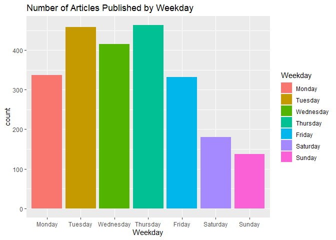
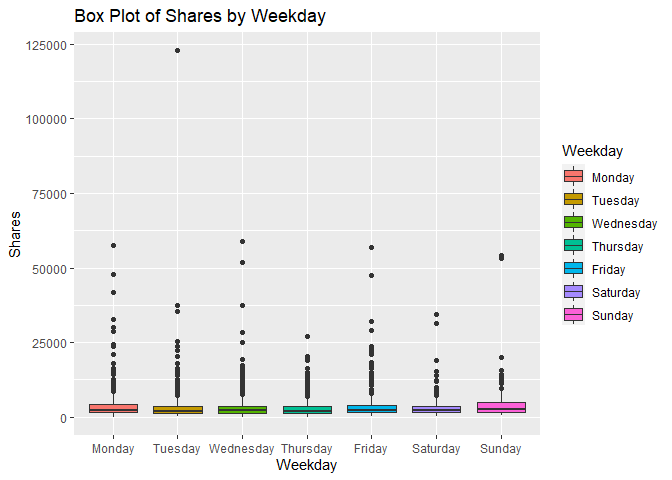
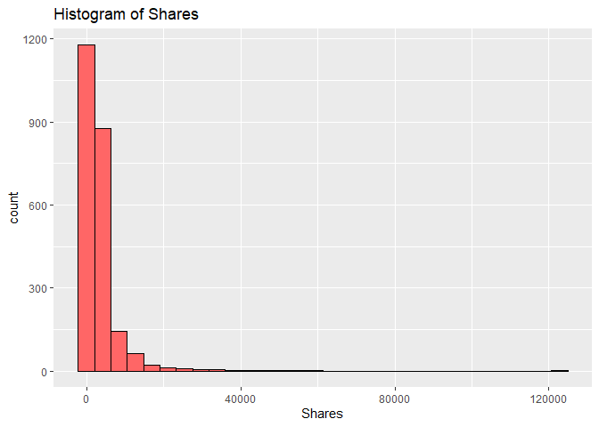
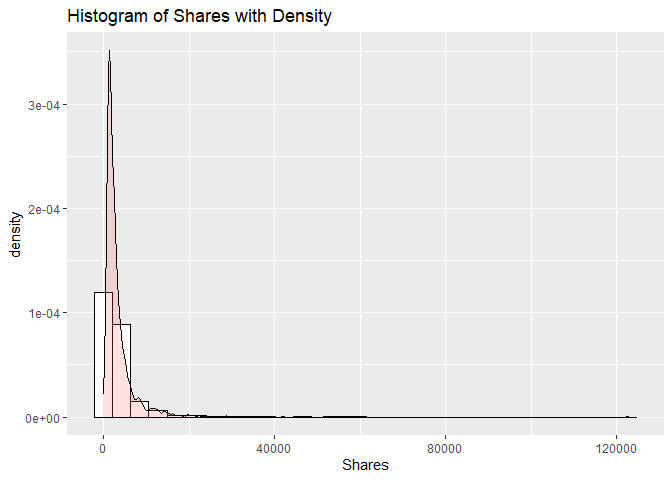
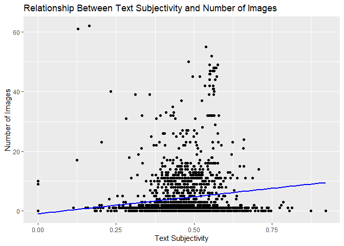
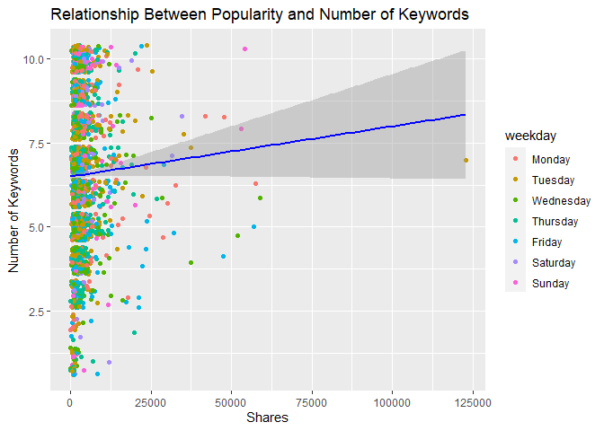
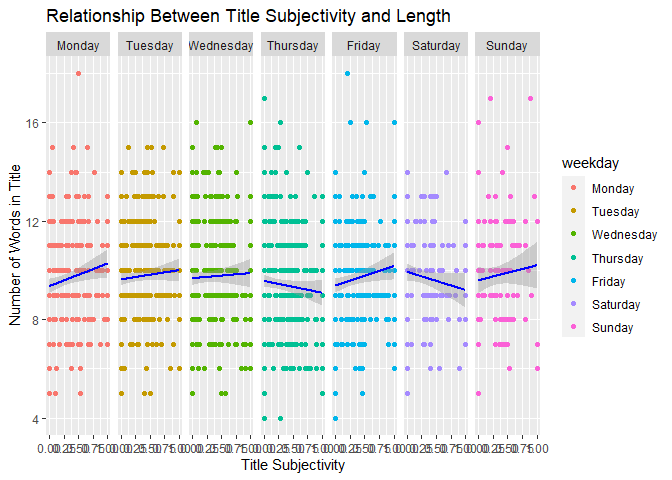

ST 558 Project 3
================
Melanie Kahn & Rachel Hardy
2022-11-14

-   <a href="#required-libraries" id="toc-required-libraries">Required
    Libraries</a>
-   <a href="#introduction-to-the-data"
    id="toc-introduction-to-the-data">Introduction to the Data</a>
-   <a href="#data" id="toc-data">Data</a>
    -   <a href="#reading-in-the-data" id="toc-reading-in-the-data">Reading in
        the Data</a>
    -   <a href="#modifying-the-data" id="toc-modifying-the-data">Modifying the
        Data</a>
    -   <a href="#splitting-the-data" id="toc-splitting-the-data">Splitting the
        Data</a>
-   <a href="#summarizations" id="toc-summarizations">Summarizations</a>
    -   <a href="#summary-statistics" id="toc-summary-statistics">Summary
        Statistics</a>
    -   <a href="#contingency-tables" id="toc-contingency-tables">Contingency
        Tables</a>
    -   <a href="#graphical-summaries" id="toc-graphical-summaries">Graphical
        Summaries</a>
        -   <a href="#bar-plot" id="toc-bar-plot">Bar Plot</a>
        -   <a href="#box-plot" id="toc-box-plot">Box Plot</a>
        -   <a href="#histograms" id="toc-histograms">Histograms</a>
        -   <a href="#scatter-plots" id="toc-scatter-plots">Scatter Plots</a>
-   <a href="#modeling" id="toc-modeling">Modeling</a>
    -   <a href="#linear-regression" id="toc-linear-regression">Linear
        Regression</a>
    -   <a href="#random-forest" id="toc-random-forest">Random Forest</a>
    -   <a href="#boosted-tree" id="toc-boosted-tree">Boosted Tree</a>
-   <a href="#comparison" id="toc-comparison">Comparison</a>

# Required Libraries

Running the code chunk below loads the `tidyverse`, `readr`, `ggplot2`,
`shiny`, `caret`, and `rmarkdown` packages.

``` r
library(tidyverse)
library(readr)
library(ggplot2)
library(shiny)
library(caret)
library(rmarkdown)
```

# Introduction to the Data

The online news popularity data used for this project summarizes a
diverse set of features about articles published by
[Mashable](http://www.mashable.com) over a two year period with the goal
of predicting the number of shares in social networks - a proxy for
popularity.

The original online news popularity data set included 58 predictive
variables, 2 non-predictive variables, 1 target variable. For the
purposes of this project, we are only using 14 non-predictive variables,
keeping the same target variable.

The variables present for each observation in this subset of the online
news popularity data set are as follows:

Non-Predictive Variables:

-   `url` - URL of the article  
-   `timedelta` - The number of days between the article publication and
    the data set acquisition

Predictive Variables:

-   `data_channel_is_*` - Binary variable indicating the type of data
    channel
    -   `lifestyle` - Lifestyle  
    -   `entertainment` - Entertainment  
    -   `bus` - Business  
    -   `socmed` - Social Media  
    -   `tech` - Tech  
    -   `world` - World  
-   `is_weekend` - Binary variable indicating if the article published
    on the weekend  
-   `weekday` - What day of the week the article was published (factor
    variable with seven levels)  
-   `num_imgs` - The number of images in the article  
-   `num_keywords` - The number of keywords in the metadata  
-   `n_tokens_title` - The number of words in the title  
-   `title_subjectivity` - Score of 0 - 1 indicating how subjective the
    title of the article is  
-   `global_subjectivity` - Score of 0 - 1 indicating how subjective the
    text of the article is

Target Variable:

-   `shares` - Number of shares

The purpose of the following analysis is to create predictive models for
this data set and find which one performs the best. After splitting the
data into a training and test set, the performance of a simple linear
regression model, a multiple regression model, a random forest model,
and a boosted tree model will be compared based on the root-mean-square
error (RMSE) calculation. The best model will have the smallest RMSE
from the test set. This process will be done across each data channel
(lifestyle,entertainment, business, social media, tech, and world) using
automated RMarkdown reports.

# Data

## Reading in the Data

Running the code chunk below reads in the online news popularity data
set using `read_csv()`.

``` r
newsOriginal <- read_csv(file = "./OnlineNewsPopularity.csv")
newsOriginal
```

    ## # A tibble: 39,644 × 61
    ##    url      timed…¹ n_tok…² n_tok…³ n_uni…⁴ n_non…⁵ n_non…⁶ num_h…⁷ num_s…⁸ num_i…⁹ num_v…˟ avera…˟ num_k…˟ data_…˟ data_…˟ data_…˟ data_…˟ data_…˟
    ##    <chr>      <dbl>   <dbl>   <dbl>   <dbl>   <dbl>   <dbl>   <dbl>   <dbl>   <dbl>   <dbl>   <dbl>   <dbl>   <dbl>   <dbl>   <dbl>   <dbl>   <dbl>
    ##  1 http://…     731      12     219   0.664    1.00   0.815       4       2       1       0    4.68       5       0       1       0       0       0
    ##  2 http://…     731       9     255   0.605    1.00   0.792       3       1       1       0    4.91       4       0       0       1       0       0
    ##  3 http://…     731       9     211   0.575    1.00   0.664       3       1       1       0    4.39       6       0       0       1       0       0
    ##  4 http://…     731       9     531   0.504    1.00   0.666       9       0       1       0    4.40       7       0       1       0       0       0
    ##  5 http://…     731      13    1072   0.416    1.00   0.541      19      19      20       0    4.68       7       0       0       0       0       1
    ##  6 http://…     731      10     370   0.560    1.00   0.698       2       2       0       0    4.36       9       0       0       0       0       1
    ##  7 http://…     731       8     960   0.418    1.00   0.550      21      20      20       0    4.65      10       1       0       0       0       0
    ##  8 http://…     731      12     989   0.434    1.00   0.572      20      20      20       0    4.62       9       0       0       0       0       1
    ##  9 http://…     731      11      97   0.670    1.00   0.837       2       0       0       0    4.86       7       0       0       0       0       1
    ## 10 http://…     731      10     231   0.636    1.00   0.797       4       1       1       1    5.09       5       0       0       0       0       0
    ## # … with 39,634 more rows, 43 more variables: data_channel_is_world <dbl>, kw_min_min <dbl>, kw_max_min <dbl>, kw_avg_min <dbl>, kw_min_max <dbl>,
    ## #   kw_max_max <dbl>, kw_avg_max <dbl>, kw_min_avg <dbl>, kw_max_avg <dbl>, kw_avg_avg <dbl>, self_reference_min_shares <dbl>,
    ## #   self_reference_max_shares <dbl>, self_reference_avg_sharess <dbl>, weekday_is_monday <dbl>, weekday_is_tuesday <dbl>,
    ## #   weekday_is_wednesday <dbl>, weekday_is_thursday <dbl>, weekday_is_friday <dbl>, weekday_is_saturday <dbl>, weekday_is_sunday <dbl>,
    ## #   is_weekend <dbl>, LDA_00 <dbl>, LDA_01 <dbl>, LDA_02 <dbl>, LDA_03 <dbl>, LDA_04 <dbl>, global_subjectivity <dbl>,
    ## #   global_sentiment_polarity <dbl>, global_rate_positive_words <dbl>, global_rate_negative_words <dbl>, rate_positive_words <dbl>,
    ## #   rate_negative_words <dbl>, avg_positive_polarity <dbl>, min_positive_polarity <dbl>, max_positive_polarity <dbl>, …

## Modifying the Data

Running the code chunk below subsets the data to only include
observations for the data channel we’re interested in.

``` r
news <- newsOriginal %>% filter(get(params$dataChannel) == 1)
news
```

    ## # A tibble: 2,323 × 61
    ##    url      timed…¹ n_tok…² n_tok…³ n_uni…⁴ n_non…⁵ n_non…⁶ num_h…⁷ num_s…⁸ num_i…⁹ num_v…˟ avera…˟ num_k…˟ data_…˟ data_…˟ data_…˟ data_…˟ data_…˟
    ##    <chr>      <dbl>   <dbl>   <dbl>   <dbl>   <dbl>   <dbl>   <dbl>   <dbl>   <dbl>   <dbl>   <dbl>   <dbl>   <dbl>   <dbl>   <dbl>   <dbl>   <dbl>
    ##  1 http://…     731       8     257   0.568    1.00   0.671       9       7       0       1    4.64       9       0       0       0       1       0
    ##  2 http://…     731       8     218   0.663    1.00   0.688      14       3      11       0    4.44      10       0       0       0       1       0
    ##  3 http://…     731       9    1226   0.410    1.00   0.617      10      10       1       1    4.39       7       0       0       0       1       0
    ##  4 http://…     731      10    1121   0.451    1.00   0.629      15      11       1       0    4.79       6       0       0       0       1       0
    ##  5 http://…     729       9     168   0.778    1.00   0.865       6       4      11       0    4.68       9       0       0       0       1       0
    ##  6 http://…     729       9     100   0.760    1.00   0.803       3       2       1       0    4.45       6       0       0       0       1       0
    ##  7 http://…     729      10    1596   0.420    1.00   0.632      19      10       8       0    4.63       6       0       0       0       1       0
    ##  8 http://…     728       7     518   0.486    1.00   0.654      11       1       1       0    4.79       7       0       0       0       1       0
    ##  9 http://…     727       8     358   0.503    1.00   0.687       4       4       1       0    4.25       4       0       0       0       1       0
    ## 10 http://…     727       6     358   0.622    1.00   0.777      24       6       1       0    5.39       8       0       0       0       1       0
    ## # … with 2,313 more rows, 43 more variables: data_channel_is_world <dbl>, kw_min_min <dbl>, kw_max_min <dbl>, kw_avg_min <dbl>, kw_min_max <dbl>,
    ## #   kw_max_max <dbl>, kw_avg_max <dbl>, kw_min_avg <dbl>, kw_max_avg <dbl>, kw_avg_avg <dbl>, self_reference_min_shares <dbl>,
    ## #   self_reference_max_shares <dbl>, self_reference_avg_sharess <dbl>, weekday_is_monday <dbl>, weekday_is_tuesday <dbl>,
    ## #   weekday_is_wednesday <dbl>, weekday_is_thursday <dbl>, weekday_is_friday <dbl>, weekday_is_saturday <dbl>, weekday_is_sunday <dbl>,
    ## #   is_weekend <dbl>, LDA_00 <dbl>, LDA_01 <dbl>, LDA_02 <dbl>, LDA_03 <dbl>, LDA_04 <dbl>, global_subjectivity <dbl>,
    ## #   global_sentiment_polarity <dbl>, global_rate_positive_words <dbl>, global_rate_negative_words <dbl>, rate_positive_words <dbl>,
    ## #   rate_negative_words <dbl>, avg_positive_polarity <dbl>, min_positive_polarity <dbl>, max_positive_polarity <dbl>, …

Running the code chunk below creates the categorical variable `weekday`
to the data set that tells us what day of the week the article was
published.

``` r
news <- news %>% mutate(weekday = if_else((weekday_is_monday == 1), "Monday",
                                  if_else((weekday_is_tuesday == 1), "Tuesday", 
                                  if_else((weekday_is_wednesday == 1), "Wednesday", 
                                  if_else((weekday_is_thursday == 1), "Thursday", 
                                  if_else((weekday_is_friday == 1), "Friday",
                                  if_else((weekday_is_saturday == 1), "Saturday", 
                                  if_else((weekday_is_sunday == 1), "Sunday", " ")))))))) %>%
                 select(url, shares, weekday, everything())

news$weekday <- factor(news$weekday, levels=c("Monday", "Tuesday", "Wednesday",
                                              "Thursday", "Friday", "Saturday", "Sunday"))
levels(news$weekday)
```

    ## [1] "Monday"    "Tuesday"   "Wednesday" "Thursday"  "Friday"    "Saturday"  "Sunday"

``` r
news
```

    ## # A tibble: 2,323 × 62
    ##    url       shares weekday timed…¹ n_tok…² n_tok…³ n_uni…⁴ n_non…⁵ n_non…⁶ num_h…⁷ num_s…⁸ num_i…⁹ num_v…˟ avera…˟ num_k…˟ data_…˟ data_…˟ data_…˟
    ##    <chr>      <dbl> <fct>     <dbl>   <dbl>   <dbl>   <dbl>   <dbl>   <dbl>   <dbl>   <dbl>   <dbl>   <dbl>   <dbl>   <dbl>   <dbl>   <dbl>   <dbl>
    ##  1 http://m…   2600 Monday      731       8     257   0.568    1.00   0.671       9       7       0       1    4.64       9       0       0       0
    ##  2 http://m…    690 Monday      731       8     218   0.663    1.00   0.688      14       3      11       0    4.44      10       0       0       0
    ##  3 http://m…   4800 Monday      731       9    1226   0.410    1.00   0.617      10      10       1       1    4.39       7       0       0       0
    ##  4 http://m…    851 Monday      731      10    1121   0.451    1.00   0.629      15      11       1       0    4.79       6       0       0       0
    ##  5 http://m…   4800 Wednes…     729       9     168   0.778    1.00   0.865       6       4      11       0    4.68       9       0       0       0
    ##  6 http://m…   9200 Wednes…     729       9     100   0.760    1.00   0.803       3       2       1       0    4.45       6       0       0       0
    ##  7 http://m…   1600 Wednes…     729      10    1596   0.420    1.00   0.632      19      10       8       0    4.63       6       0       0       0
    ##  8 http://m…    775 Thursd…     728       7     518   0.486    1.00   0.654      11       1       1       0    4.79       7       0       0       0
    ##  9 http://m…  18200 Friday      727       8     358   0.503    1.00   0.687       4       4       1       0    4.25       4       0       0       0
    ## 10 http://m…   1600 Friday      727       6     358   0.622    1.00   0.777      24       6       1       0    5.39       8       0       0       0
    ## # … with 2,313 more rows, 44 more variables: data_channel_is_socmed <dbl>, data_channel_is_tech <dbl>, data_channel_is_world <dbl>,
    ## #   kw_min_min <dbl>, kw_max_min <dbl>, kw_avg_min <dbl>, kw_min_max <dbl>, kw_max_max <dbl>, kw_avg_max <dbl>, kw_min_avg <dbl>,
    ## #   kw_max_avg <dbl>, kw_avg_avg <dbl>, self_reference_min_shares <dbl>, self_reference_max_shares <dbl>, self_reference_avg_sharess <dbl>,
    ## #   weekday_is_monday <dbl>, weekday_is_tuesday <dbl>, weekday_is_wednesday <dbl>, weekday_is_thursday <dbl>, weekday_is_friday <dbl>,
    ## #   weekday_is_saturday <dbl>, weekday_is_sunday <dbl>, is_weekend <dbl>, LDA_00 <dbl>, LDA_01 <dbl>, LDA_02 <dbl>, LDA_03 <dbl>, LDA_04 <dbl>,
    ## #   global_subjectivity <dbl>, global_sentiment_polarity <dbl>, global_rate_positive_words <dbl>, global_rate_negative_words <dbl>,
    ## #   rate_positive_words <dbl>, rate_negative_words <dbl>, avg_positive_polarity <dbl>, min_positive_polarity <dbl>, max_positive_polarity <dbl>, …

## Splitting the Data

Running the code chunk below splits the modified `news` data set into a
training and testing set using `createDataPartition()`. First the seed
is set to make sure the random sampling will be reproducible.
`createDataPartition()` then creates an indexing vector (`trainIndex`)
with a subset of the `shares` variable where the training subset
(`newsTrain`) will result in a vector (`list = FALSE`) that has
approximately 70% (`p = 0.7`) of the observations from the updated
`news` data set. This training vector is then used to create the
training set (`newsTrain`) with approximately 70% of the observations
from the updated `news` data set, and the test set (`newsTest`) with the
remaining 30% of the observations.

``` r
set.seed(100)
newsIndex <- createDataPartition(news$shares, p = 0.7, list = FALSE)

newsTrain <- news[newsIndex, ]
newsTest <- news[-newsIndex, ]

newsTrain
```

    ## # A tibble: 1,628 × 62
    ##    url       shares weekday timed…¹ n_tok…² n_tok…³ n_uni…⁴ n_non…⁵ n_non…⁶ num_h…⁷ num_s…⁸ num_i…⁹ num_v…˟ avera…˟ num_k…˟ data_…˟ data_…˟ data_…˟
    ##    <chr>      <dbl> <fct>     <dbl>   <dbl>   <dbl>   <dbl>   <dbl>   <dbl>   <dbl>   <dbl>   <dbl>   <dbl>   <dbl>   <dbl>   <dbl>   <dbl>   <dbl>
    ##  1 http://m…   2600 Monday      731       8     257   0.568    1.00   0.671       9       7       0       1    4.64       9       0       0       0
    ##  2 http://m…    690 Monday      731       8     218   0.663    1.00   0.688      14       3      11       0    4.44      10       0       0       0
    ##  3 http://m…   4800 Monday      731       9    1226   0.410    1.00   0.617      10      10       1       1    4.39       7       0       0       0
    ##  4 http://m…    851 Monday      731      10    1121   0.451    1.00   0.629      15      11       1       0    4.79       6       0       0       0
    ##  5 http://m…   9200 Wednes…     729       9     100   0.760    1.00   0.803       3       2       1       0    4.45       6       0       0       0
    ##  6 http://m…   1600 Wednes…     729      10    1596   0.420    1.00   0.632      19      10       8       0    4.63       6       0       0       0
    ##  7 http://m…    775 Thursd…     728       7     518   0.486    1.00   0.654      11       1       1       0    4.79       7       0       0       0
    ##  8 http://m…  18200 Friday      727       8     358   0.503    1.00   0.687       4       4       1       0    4.25       4       0       0       0
    ##  9 http://m…   1600 Friday      727       6     358   0.622    1.00   0.777      24       6       1       0    5.39       8       0       0       0
    ## 10 http://m…   9000 Friday      727      11     151   0.710    1.00   0.788       5       1       0       0    4.40       9       0       0       0
    ## # … with 1,618 more rows, 44 more variables: data_channel_is_socmed <dbl>, data_channel_is_tech <dbl>, data_channel_is_world <dbl>,
    ## #   kw_min_min <dbl>, kw_max_min <dbl>, kw_avg_min <dbl>, kw_min_max <dbl>, kw_max_max <dbl>, kw_avg_max <dbl>, kw_min_avg <dbl>,
    ## #   kw_max_avg <dbl>, kw_avg_avg <dbl>, self_reference_min_shares <dbl>, self_reference_max_shares <dbl>, self_reference_avg_sharess <dbl>,
    ## #   weekday_is_monday <dbl>, weekday_is_tuesday <dbl>, weekday_is_wednesday <dbl>, weekday_is_thursday <dbl>, weekday_is_friday <dbl>,
    ## #   weekday_is_saturday <dbl>, weekday_is_sunday <dbl>, is_weekend <dbl>, LDA_00 <dbl>, LDA_01 <dbl>, LDA_02 <dbl>, LDA_03 <dbl>, LDA_04 <dbl>,
    ## #   global_subjectivity <dbl>, global_sentiment_polarity <dbl>, global_rate_positive_words <dbl>, global_rate_negative_words <dbl>,
    ## #   rate_positive_words <dbl>, rate_negative_words <dbl>, avg_positive_polarity <dbl>, min_positive_polarity <dbl>, max_positive_polarity <dbl>, …

``` r
newsTest
```

    ## # A tibble: 695 × 62
    ##    url       shares weekday timed…¹ n_tok…² n_tok…³ n_uni…⁴ n_non…⁵ n_non…⁶ num_h…⁷ num_s…⁸ num_i…⁹ num_v…˟ avera…˟ num_k…˟ data_…˟ data_…˟ data_…˟
    ##    <chr>      <dbl> <fct>     <dbl>   <dbl>   <dbl>   <dbl>   <dbl>   <dbl>   <dbl>   <dbl>   <dbl>   <dbl>   <dbl>   <dbl>   <dbl>   <dbl>   <dbl>
    ##  1 http://m…   4800 Wednes…     729       9     168   0.778    1.00   0.865       6       4      11       0    4.68       9       0       0       0
    ##  2 http://m…   1700 Saturd…     726      13     293   0.585    1.00   0.759       6       5       1       0    4.67       8       0       0       0
    ##  3 http://m…   1100 Monday      724       8     263   0.664    1.00   0.673      14       3      11       0    4.31      10       0       0       0
    ##  4 http://m…   6000 Monday      724       9     563   0.585    1.00   0.766      13       0       1       0    5.54       7       0       0       0
    ##  5 http://m…   5400 Tuesday     723       9     912   0.424    1.00   0.611       5       5       1       0    4.35       6       0       0       0
    ##  6 http://m…   3800 Tuesday     723      11     403   0.478    1.00   0.617       4       2       0       1    4.72       6       0       0       0
    ##  7 http://m…   1200 Wednes…     722      14     316   0.584    1.00   0.825       8       6       1       0    4.47       5       0       0       0
    ##  8 http://m…   1500 Wednes…     722       8     405   0.432    1.00   0.574       3       2       9       0    4.03       7       0       0       0
    ##  9 http://m…   5800 Friday      720       7    1152   0.331    1.00   0.506      11       5       1       1    4.64       7       0       0       0
    ## 10 http://m…   3400 Friday      720      11     332   0.561    1.00   0.692       8       7       1       0    4.78       5       0       0       0
    ## # … with 685 more rows, 44 more variables: data_channel_is_socmed <dbl>, data_channel_is_tech <dbl>, data_channel_is_world <dbl>,
    ## #   kw_min_min <dbl>, kw_max_min <dbl>, kw_avg_min <dbl>, kw_min_max <dbl>, kw_max_max <dbl>, kw_avg_max <dbl>, kw_min_avg <dbl>,
    ## #   kw_max_avg <dbl>, kw_avg_avg <dbl>, self_reference_min_shares <dbl>, self_reference_max_shares <dbl>, self_reference_avg_sharess <dbl>,
    ## #   weekday_is_monday <dbl>, weekday_is_tuesday <dbl>, weekday_is_wednesday <dbl>, weekday_is_thursday <dbl>, weekday_is_friday <dbl>,
    ## #   weekday_is_saturday <dbl>, weekday_is_sunday <dbl>, is_weekend <dbl>, LDA_00 <dbl>, LDA_01 <dbl>, LDA_02 <dbl>, LDA_03 <dbl>, LDA_04 <dbl>,
    ## #   global_subjectivity <dbl>, global_sentiment_polarity <dbl>, global_rate_positive_words <dbl>, global_rate_negative_words <dbl>,
    ## #   rate_positive_words <dbl>, rate_negative_words <dbl>, avg_positive_polarity <dbl>, min_positive_polarity <dbl>, max_positive_polarity <dbl>, …

# Summarizations

## Summary Statistics

Running the code chunk below provides the mean and standard deviation
for the number of times articles in the `news` data set were shared
(`shares`).

``` r
mean(news$shares)
```

    ## [1] 3629.383

``` r
sd(news$shares)
```

    ## [1] 5524.167

Running the code chunk below provides the mean and standard deviation
for the number of images per article (`num_imgs`) in the `news` data
set.

``` r
mean(news$num_imgs)
```

    ## [1] 4.290142

``` r
sd(news$num_imgs)
```

    ## [1] 8.201711

Running the code chunk below provides the mean and standard deviation
for the number of keywords per article (`num_keywords`) in the `news`
data set.

``` r
mean(news$num_keywords)
```

    ## [1] 6.552303

``` r
sd(news$num_keywords)
```

    ## [1] 2.190379

## Contingency Tables

Running the code chunk below creates a contingency table showing the
number of articles in the online `news` popularity data set that were
published on the weekend (`is_weekend`).

``` r
tableWeekend <- table(news$is_weekend)
tableWeekend
```

    ## 
    ##    0    1 
    ## 2006  317

From the table **above**, we can see that 317 articles were published on
the weekend, and 2006 articles were published during the week.

Running the code chunk below creates a contingency table showing the
number of articles in the online `news` popularity data set that were
published on certain days of the week (`weekday`).

``` r
tableWeekday <- table(news$weekday)
tableWeekday
```

    ## 
    ##    Monday   Tuesday Wednesday  Thursday    Friday  Saturday    Sunday 
    ##       337       458       416       463       332       180       137

From the table **above**, we can see that 337 articles were published on
Monday, 317 were published on Tuesday, NA on Wednesday, NA on Thursday,
NA on Friday, NA on Saturday, NA articles were published on Sunday.

## Graphical Summaries

### Bar Plot

Running the code chunk below creates a bar plot to visualize the number
of articles published per each `weekday`. Using the aesthetics option
`aes(fill = weekday)` inside the `geom_bar()` function gives us a nicely
colored graph.

``` r
g <- ggplot(news, aes(x = weekday))

g + geom_bar(aes(fill = weekday)) + 
  labs(title = "Number of Articles Published by Weekday", x = "Weekday") +
  scale_fill_discrete(name = "Weekday")
```

<!-- -->

### Box Plot

Running the code chunk below creates a box plot of number of `shares`
for each `weekday`. Using the aesthetics option ‘fill = weekday’ gives
us a nicely colored graph.

``` r
g <- ggplot(news, aes(x = weekday, y = shares))

g + geom_boxplot(aes(fill = weekday)) + 
  labs(title = "Box Plot of Shares by Weekday", x = "Weekday", y = "Shares") +
  scale_fill_discrete(name = "Weekday")
```

<!-- -->

### Histograms

Running the code chunk below creates two histograms of the number of
`shares` that show us the distribution of the variable. The second
histogram has an added density layer to give us a better idea of how the
data is spread out.

``` r
g <- ggplot(news, aes(x = shares))

g + geom_histogram(color = "black", fill = "#FF6666") + labs(title = "Histogram of Shares") +
  labs(title = "Histogram of Shares", x = "Shares")
```

<!-- -->

``` r
g + geom_histogram(aes(y=..density..), colour="black", fill="white") + 
  geom_density(alpha=.2, fill="#FF6666") + 
  labs(title = "Histogram of Shares with Density", x = "Shares")
```

<!-- -->

### Scatter Plots

Running the code chunk below creates a scatter plot to visualize the
correlation between the text subjectivity (`global_subjectivity`) and
the number of images (`num_imgs`) articles have. The `geom_point()`
function plots the data points while the `geom_smooth()` function plots
the regression line using method `lm` for linear model.

Using this linear regression line on the scatter plot *below* helps
quantify the direction and strength of the relationship between the text
subjectivity on the x-axis and the number of images on the y-axis.
Results showing a regression line starting lower on the y-axis than it
ends (a *positive* slope) represents a *positive* linear correlation
between an article’s overall subjectivity and the number of images
used - if one increases, so does the other. Results showing a regression
line starting higher on the y-axis than it ends (a *negative* slope)
represents a *negative* linear correlation between the two, meaning the
trend in the data shows a higher number of images reduces subjectivity
in an article. The steepness of the slope associated with this
regression line indicates the strength of the variable relationship. The
closer a regression line gets to horizontal, the weaker the correlation
between the subjectivity and images; and vice versa.

``` r
g <- ggplot(news, aes(x = global_subjectivity, y = num_imgs))
g + geom_point() +
  geom_smooth(method = lm, col = "Blue", se = FALSE) +
  labs(title = "Relationship Between Text Subjectivity and Number of Images",
       x = "Text Subjectivity",
       y = "Number of Images")
```

<!-- -->

Running the code chunk below creates a scatter plot to visualize the
correlation between the number of `shares` and the number of keywords
(`num_keywords`) articles have. `geom_jitter` is used instead of
`geom_point()` to plot the data points in a manner where the `weekday`
component can be better visualized. The `geom_smooth()` function plots
the regression line using method `lm` for linear model.

Using this linear regression line on the scatter plot *below* helps
quantify the direction and strength of the relationship between the
number of shares on the x-axis and the number of keywords on the y-axis.
Results showing a regression line starting lower on the y-axis than it
ends (a *positive* slope) represents a *positive* linear correlation
between an article’s number of shares and the number of keywords used -
if one increases, so does the other. Results showing a regression line
starting higher on the y-axis than it ends (a *negative* slope)
represents a *negative* linear correlation between the two, meaning the
trend in the data shows a higher number of keywords reduces the number
of times an article is shared. The steepness of the slope associated
with this regression line indicates the strength of the variable
relationship. The closer a regression line gets to horizontal, the
weaker the correlation between the popularity and keywords; and vice
versa. As one of the default arguments for the `geom_smooth` function is
`se = TRUE`, a 95% confidence interval can also be seen. Wider
confidence intervals indicate increased uncertainty of the effect the
variables have on each other.

``` r
g <- ggplot(news, aes(x = shares, y = num_keywords))
g + geom_jitter(aes(color = weekday)) +
  geom_smooth(method = lm, col = "Blue") +
  labs(title = "Relationship Between Popularity and Number of Keywords",
       x = "Shares",
       y = "Number of Keywords")
```

<!-- -->

Running the code chunk below creates a facet grid scatter plot to
visualize the correlation between the number of words in the article’s
title (`n_tokens_title`) and title’s subjectivity score
(`title_subjectivity`) according to the day the article was published
(`weekday`). The `geom_point()` function plots the data points while the
`geom_smooth()` function plots the regression line using method `lm` for
linear model.

Using this linear regression line on the scatter plot *below* helps
quantify the direction and strength of the relationship between the
title subjectivity on the x-axis and the number of words in the title on
the y-axis. Results showing a regression line starting lower on the
y-axis than it ends (a *positive* slope) represents a *positive* linear
correlation between a title’s subjectivity and length - if one
increases, so does the other. Results showing a regression line starting
higher on the y-axis than it ends (a *negative* slope) represents a
*negative* linear correlation between the two, meaning the trend in the
data shows a higher number of words reduces title subjectivity. The
steepness of the slope associated with this regression line indicates
the strength of the variable relationship. The closer a regression line
gets to horizontal, the weaker the correlation between the title
subjectivity and length; and vice versa. The 95% confidence intervals
may be harder to see due to the faceted nature of these plots, but wider
confidence intervals still indicate increased uncertainty of the effect
the variables have on each other.

``` r
g <- ggplot(news, aes(x = title_subjectivity, y = n_tokens_title))
g + geom_point(aes(color = weekday)) +
  facet_grid(~ weekday) +
  geom_smooth(method = lm, col = "Blue") +
  labs(title = "Relationship Between Title Subjectivity and Length",
       x = "Title Subjectivity",
       y = "Number of Words in Title")
```

<!-- -->

# Modeling

## Linear Regression

Linear regression attempts to model the (linear) relationship between a
response variable and one or more predictor variables by fitting a
linear equation to the data. The simplest form of the linear equation is
`Y = a + bX`, where `Y` is the response variable, `a` is the intercept,
`b` is the slope, and `X` is the predictor (or explanatory) variable.
The most common method for fitting a regression model is least-squares
regression, where the best-fitting line is calculated by minimizing the
sum of the squared residuals.

For linear regression, it is usually important to understand which
variables are related and which variables scientifically should be in
the model. It is also important to split the data into a training set
and a testing set so the model does not become over-fit.

Running the code chunk below creates a multiple linear regression model
where `shares` is the response variable and the predictor variables are
`weekday`, `title_subjectivity`, `num_imgs`, `title_subjectivity^2`, and
`num_imgs^2`.

By using the `summary()` function, we can see the values for the
residuals and coefficients, as well as the performance criteria values
such as multiple R-squared.

``` r
set.seed(100)
firstLinearModel <- train(shares ~ weekday + title_subjectivity + num_imgs + I(title_subjectivity^2) + I(num_imgs^2), 
                        data = newsTrain,
                        method = "lm",
                        preProcess = c("center", "scale"),
                        trControl = trainControl(method = "cv"))
firstLinearModel
```

    ## Linear Regression 
    ## 
    ## 1628 samples
    ##    3 predictor
    ## 
    ## Pre-processing: centered (10), scaled (10) 
    ## Resampling: Cross-Validated (10 fold) 
    ## Summary of sample sizes: 1464, 1465, 1465, 1465, 1465, 1466, ... 
    ## Resampling results:
    ## 
    ##   RMSE      Rsquared    MAE    
    ##   5636.387  0.01319643  2783.55
    ## 
    ## Tuning parameter 'intercept' was held constant at a value of TRUE

``` r
summary(firstLinearModel)
```

    ## 
    ## Call:
    ## lm(formula = .outcome ~ ., data = dat)
    ## 
    ## Residuals:
    ##    Min     1Q Median     3Q    Max 
    ##  -5063  -2282  -1449    222 119016 
    ## 
    ## Coefficients:
    ##                           Estimate Std. Error t value Pr(>|t|)    
    ## (Intercept)                3698.64     147.96  24.997   <2e-16 ***
    ## weekdayTuesday             -145.10     204.28  -0.710   0.4776    
    ## weekdayWednesday            -84.18     201.66  -0.417   0.6764    
    ## weekdayThursday            -341.09     203.45  -1.677   0.0938 .  
    ## weekdayFriday               118.20     193.62   0.610   0.5416    
    ## weekdaySaturday            -129.76     178.02  -0.729   0.4662    
    ## weekdaySunday               259.94     170.31   1.526   0.1271    
    ## title_subjectivity           71.58     453.45   0.158   0.8746    
    ## num_imgs                    -23.39     389.34  -0.060   0.9521    
    ## `I(title_subjectivity^2)`   326.10     453.23   0.720   0.4719    
    ## `I(num_imgs^2)`            -330.91     389.26  -0.850   0.3954    
    ## ---
    ## Signif. codes:  0 '***' 0.001 '**' 0.01 '*' 0.05 '.' 0.1 ' ' 1
    ## 
    ## Residual standard error: 5970 on 1617 degrees of freedom
    ## Multiple R-squared:  0.01453,    Adjusted R-squared:  0.008435 
    ## F-statistic: 2.384 on 10 and 1617 DF,  p-value: 0.008366

Now that the multiple linear regression model has been trained
(`firstLinearModel`), running the code chunk below will check how well
the model does on the test set `newsTest` using the `postResample()`
function. The RMSE from the `postResample` output is then stored in an
object `firstLinearRMSE` for later use in our comparison functions.

``` r
firstLinearPredict <- predict(firstLinearModel, newdata = newsTest)

firstLinearPerformance <- postResample(firstLinearPredict, newsTest$shares)
firstLinearPerformance
```

    ##         RMSE     Rsquared          MAE 
    ## 4.262855e+03 7.125295e-04 2.545722e+03

``` r
attributes(firstLinearPerformance)
```

    ## $names
    ## [1] "RMSE"     "Rsquared" "MAE"

``` r
firstLinearRMSE <- firstLinearPerformance[1]
firstLinearRMSE
```

    ##     RMSE 
    ## 4262.855

Running the code chunk below creates a simple linear regression model
where `shares` is the response variable and the predictor variables are
`weekday`, `num_imgs`, `num_keywords`, `n_tokens_title`,
`title_subjectivity`, and `global_subjectivity`. The `summary()`
function is used to examine the values for the residuals and
coefficients, as well as the performance criteria values such as
multiple R-squared.

``` r
set.seed(100)
secondLinearModel <- train(shares ~ weekday + num_imgs + num_keywords + n_tokens_title + title_subjectivity + global_subjectivity, 
                        data = newsTrain,
                        method = "lm",
                        preProcess = c("center", "scale"),
                        trControl = trainControl(method = "cv"))
secondLinearModel
```

    ## Linear Regression 
    ## 
    ## 1628 samples
    ##    6 predictor
    ## 
    ## Pre-processing: centered (11), scaled (11) 
    ## Resampling: Cross-Validated (10 fold) 
    ## Summary of sample sizes: 1464, 1465, 1465, 1465, 1465, 1466, ... 
    ## Resampling results:
    ## 
    ##   RMSE      Rsquared    MAE     
    ##   5631.164  0.01520187  2767.295
    ## 
    ## Tuning parameter 'intercept' was held constant at a value of TRUE

``` r
summary(secondLinearModel)
```

    ## 
    ## Call:
    ## lm(formula = .outcome ~ ., data = dat)
    ## 
    ## Residuals:
    ##    Min     1Q Median     3Q    Max 
    ##  -5136  -2297  -1397    231 118828 
    ## 
    ## Coefficients:
    ##                     Estimate Std. Error t value Pr(>|t|)    
    ## (Intercept)          3698.64     147.89  25.009   <2e-16 ***
    ## weekdayTuesday       -151.25     203.46  -0.743   0.4574    
    ## weekdayWednesday      -83.51     201.41  -0.415   0.6785    
    ## weekdayThursday      -342.16     203.40  -1.682   0.0927 .  
    ## weekdayFriday         126.62     193.54   0.654   0.5131    
    ## weekdaySaturday      -160.00     178.42  -0.897   0.3700    
    ## weekdaySunday         247.64     170.23   1.455   0.1459    
    ## num_imgs             -335.19     151.12  -2.218   0.0267 *  
    ## num_keywords          272.53     149.63   1.821   0.0687 .  
    ## n_tokens_title        -97.62     148.47  -0.658   0.5109    
    ## title_subjectivity    390.87     151.66   2.577   0.0100 *  
    ## global_subjectivity   -48.57     151.86  -0.320   0.7491    
    ## ---
    ## Signif. codes:  0 '***' 0.001 '**' 0.01 '*' 0.05 '.' 0.1 ' ' 1
    ## 
    ## Residual standard error: 5967 on 1616 degrees of freedom
    ## Multiple R-squared:  0.01609,    Adjusted R-squared:  0.009389 
    ## F-statistic: 2.402 on 11 and 1616 DF,  p-value: 0.005894

Now that the simple linear regression model has been trained
(`secondLinearModel`), running the code chunk below will check how well
the model does on the test set `newsTest` using the `postResample()`
function. The RMSE from the `postResample` output is then stored in an
object `secondLinearRMSE` for later use in our comparison functions.

``` r
secondLinearPredict <- predict(secondLinearModel, newdata = newsTest)

secondLinearPerformance <- postResample(secondLinearPredict, newsTest$shares)
secondLinearPerformance
```

    ##         RMSE     Rsquared          MAE 
    ## 4.279102e+03 1.913781e-04 2.554024e+03

``` r
attributes(secondLinearPerformance)
```

    ## $names
    ## [1] "RMSE"     "Rsquared" "MAE"

``` r
secondLinearRMSE <- secondLinearPerformance[1]
secondLinearRMSE
```

    ##     RMSE 
    ## 4279.102

## Random Forest

To understand random forests, it is first important to understand bagged
trees which are created using bootstrap aggregation. For bagged trees,
the sample is treated as the population and re-sampling is done with
replacement. The process of creating a bagged tree is below:

-   Step 1: Create a bootstrap sample using `sample()`  
-   Step 2: Train the tree on this sample (no pruning necessary)  
-   Step 3: Repeat B = 1000 times (no set mark)  
-   Step 4: Final prediction is average of these predictions (for
    regression trees) **OR** use majority vote as final classification
    prediction (classification trees)

Random forests are essentially bagged trees, except not all the
predictors are used for each model. A random subset of predictors is
used for each tree model (bootstrap sample). The purpose of doing this
is to prevent one or two strong predictors from dominating all tree
models and creating unwanted correlation between models.

Running the code chunk below trains the random forest model. The formula
notation used in the `train()` function models the `shares` variable
using the following predictor/explanatory variables: `weekday`,
`num_imgs`, and `num_keywords`. To use the random forest model, the
`method` argument was specified as `"rf"`. The data was pre-processed by
centering and scaling. Cross validation was used five-fold and repeated
three (3) times. The argument `tuneGrid` was then used to replicate the
random forest model a total of five (5) times. The best model is then
chosen based on the performance criteria.

``` r
set.seed(100)
randomForestCtrl <- trainControl(method = "repeatedcv", number = 5, repeats = 3)
randomForestFit <- train(shares ~ weekday + num_imgs + num_keywords, 
                         data = newsTrain, method = "rf", 
                         trControl = randomForestCtrl,
                         preProcess = c("center","scale"), 
                         tuneGrid = data.frame(mtry = 1:5))

randomForestFit
```

    ## Random Forest 
    ## 
    ## 1628 samples
    ##    3 predictor
    ## 
    ## Pre-processing: centered (8), scaled (8) 
    ## Resampling: Cross-Validated (5 fold, repeated 3 times) 
    ## Summary of sample sizes: 1302, 1303, 1302, 1302, 1303, 1302, ... 
    ## Resampling results across tuning parameters:
    ## 
    ##   mtry  RMSE      Rsquared     MAE     
    ##   1     5812.996  0.014079290  2757.667
    ##   2     5815.828  0.012422111  2772.954
    ##   3     5865.080  0.009577404  2816.002
    ##   4     5940.325  0.007801826  2873.411
    ##   5     6012.292  0.006955410  2920.502
    ## 
    ## RMSE was used to select the optimal model using the smallest value.
    ## The final value used for the model was mtry = 1.

Now that the random forest model has been trained (`randomForestFit`),
running the code chunk below will check how well the model does on the
test set `newsTest` using the `postResample()` function. The RMSE from
the `postResample` output is then stored in an object `rfRMSE` for later
use in our comparison functions.

``` r
randomForestPredict <- predict(randomForestFit, newdata = newsTest)

randomForestPerformance <- postResample(randomForestPredict, newsTest$shares)
randomForestPerformance
```

    ##         RMSE     Rsquared          MAE 
    ## 4.227721e+03 7.717095e-04 2.533712e+03

``` r
attributes(randomForestPerformance)
```

    ## $names
    ## [1] "RMSE"     "Rsquared" "MAE"

``` r
rfRMSE <- randomForestPerformance[1]
rfRMSE
```

    ##     RMSE 
    ## 4227.721

## Boosted Tree

Boosted trees are another enhancement to the single tree methods.
However, unlike bagged and random forest models, boosted trees do not
use bootstrapping. Boosting is a general method to slowly train your
tree so you don’t overfit your model. The trees are grown in a
sequential manner where each subsequent tree is based off a modified
version of the original data, updating the predictions as the tree is
grown. The process is described below:

-   Step 1: Initialize predictions as 0  
-   Step 2: Find the residuals for every observation
    -   Residuals in first tree fit will be original data values
        (observed - 0 = observed)  
-   Step 3: Fit a regression tree with `d` splits where the residuals
    are the response  
-   Step 4: Update predictions using the new predictions from step 3
    multiplied by the growth rate (Lambda tuning parameter)  
-   Step 5: Continue to update residuals for new predictions (steps 2
    -4) `B` times

Running the code chunk below trains the boosted tree model. The formula
notation used in the `train()` function models the `shares` variable
using the following predictor/explanatory variables: `weekday`,
`num_imgs`, `num_keywords`, `n_tokens_title`, and `title_subjectivity`.
To use the boosted tree model, the `method` argument was specified as
`"gbm"`. The data was pre-processed by centering and scaling. `tuneGrid`
was then used to consider values of `n.trees` = 50, `interaction.depth`
= 1, `shrinkage` = 0.1, and `n.minobsinnode` = 10. Lastly,
`trainControl()` was used within the `trControl` argument to do 10 fold
cross-validation using the `"cv"` `method`.

``` r
boostTreeFit <- train(shares ~ weekday + num_imgs + num_keywords + n_tokens_title + title_subjectivity
                        + global_subjectivity, data = newsTrain,
                        method = "gbm",
                        preProcess = c("center", "scale"),
                        tuneGrid = data.frame(n.trees = 50, interaction.depth = 1, shrinkage = 0.1, n.minobsinnode = 10),
                        trControl = trainControl(method = "cv", number = 10))
```

    ## Iter   TrainDeviance   ValidDeviance   StepSize   Improve
    ##      1 36041361.8220             nan     0.1000 29413.6687
    ##      2 36013042.6494             nan     0.1000 -895.7701
    ##      3 35945481.7175             nan     0.1000 -69561.5535
    ##      4 35929952.0017             nan     0.1000 -18014.6643
    ##      5 35895925.4461             nan     0.1000 -37102.2954
    ##      6 35876919.4239             nan     0.1000 -31262.6553
    ##      7 35844693.0940             nan     0.1000 16425.7830
    ##      8 35832566.4323             nan     0.1000 -56320.2793
    ##      9 35788556.9816             nan     0.1000 34963.5243
    ##     10 35775279.3889             nan     0.1000 -54198.3898
    ##     20 35574234.1260             nan     0.1000 -34564.6676
    ##     40 35343929.5316             nan     0.1000 -50780.2160
    ##     50 35227464.2049             nan     0.1000 -25407.9917
    ## 
    ## Iter   TrainDeviance   ValidDeviance   StepSize   Improve
    ##      1 38594084.3344             nan     0.1000 -794.3015
    ##      2 38540935.5891             nan     0.1000 20841.6593
    ##      3 38494720.6226             nan     0.1000 11531.3247
    ##      4 38432175.0129             nan     0.1000 -43414.2595
    ##      5 38402179.8850             nan     0.1000 -38918.5115
    ##      6 38350922.1894             nan     0.1000 -31000.4428
    ##      7 38326035.6283             nan     0.1000 5101.6589
    ##      8 38300860.2006             nan     0.1000 -25940.6489
    ##      9 38258913.3311             nan     0.1000 6630.0777
    ##     10 38216549.5569             nan     0.1000 -22119.8556
    ##     20 37983699.6040             nan     0.1000 4422.4250
    ##     40 37685802.0940             nan     0.1000 -5127.3909
    ##     50 37545118.9952             nan     0.1000 3861.0168
    ## 
    ## Iter   TrainDeviance   ValidDeviance   StepSize   Improve
    ##      1 39054873.7788             nan     0.1000 32809.2290
    ##      2 39024736.0347             nan     0.1000 -14852.6831
    ##      3 38981787.7499             nan     0.1000 11349.8689
    ##      4 38941498.0666             nan     0.1000 7033.0833
    ##      5 38903529.7327             nan     0.1000 26773.6403
    ##      6 38882331.1031             nan     0.1000 1356.6097
    ##      7 38851916.9136             nan     0.1000 14648.9129
    ##      8 38829721.1116             nan     0.1000 -56155.5010
    ##      9 38792628.9860             nan     0.1000 24156.8789
    ##     10 38754673.9069             nan     0.1000 2713.8560
    ##     20 38544166.7636             nan     0.1000 -9267.5906
    ##     40 38233324.3873             nan     0.1000 -45633.8384
    ##     50 38106750.4156             nan     0.1000 4641.3553
    ## 
    ## Iter   TrainDeviance   ValidDeviance   StepSize   Improve
    ##      1 36605946.8201             nan     0.1000 -4586.1113
    ##      2 36548041.1324             nan     0.1000 -13854.1181
    ##      3 36519669.3902             nan     0.1000 20907.3402
    ##      4 36482340.2697             nan     0.1000 -13189.6826
    ##      5 36446313.4209             nan     0.1000 6330.5302
    ##      6 36422763.4802             nan     0.1000 -23105.1936
    ##      7 36401771.1261             nan     0.1000 -11705.9837
    ##      8 36384314.7002             nan     0.1000 -17889.8207
    ##      9 36369747.5425             nan     0.1000 -24170.1953
    ##     10 36344699.5959             nan     0.1000 -6571.4002
    ##     20 36093849.4271             nan     0.1000 16780.8614
    ##     40 35843805.5840             nan     0.1000 -95395.3559
    ##     50 35770915.3364             nan     0.1000 -58446.5767
    ## 
    ## Iter   TrainDeviance   ValidDeviance   StepSize   Improve
    ##      1 37105008.2163             nan     0.1000 1480.6375
    ##      2 37078179.0772             nan     0.1000 7167.9628
    ##      3 37035591.4692             nan     0.1000 32432.4364
    ##      4 37011181.9044             nan     0.1000 2313.7521
    ##      5 36969817.2507             nan     0.1000 34852.4717
    ##      6 36931555.6342             nan     0.1000 -3751.0082
    ##      7 36897615.7318             nan     0.1000 -33752.5654
    ##      8 36859312.5413             nan     0.1000 -7247.2932
    ##      9 36842479.8277             nan     0.1000 -36958.9940
    ##     10 36810124.7690             nan     0.1000 -205.0095
    ##     20 36565523.0292             nan     0.1000 -57561.5963
    ##     40 36265016.0437             nan     0.1000 -1161.6752
    ##     50 36166153.3718             nan     0.1000 -41465.1241
    ## 
    ## Iter   TrainDeviance   ValidDeviance   StepSize   Improve
    ##      1 27247595.9840             nan     0.1000 34040.9180
    ##      2 27220543.8954             nan     0.1000 15783.6649
    ##      3 27176196.5423             nan     0.1000 34024.2356
    ##      4 27126167.2699             nan     0.1000 -28296.0748
    ##      5 27101744.4708             nan     0.1000 16949.2009
    ##      6 27039392.1875             nan     0.1000 28327.5982
    ##      7 27010775.6226             nan     0.1000 -16036.4394
    ##      8 26951124.8515             nan     0.1000 -22929.0415
    ##      9 26933534.3752             nan     0.1000 -20764.0599
    ##     10 26901291.9007             nan     0.1000 20147.1267
    ##     20 26688869.6473             nan     0.1000 -726.6014
    ##     40 26402243.4312             nan     0.1000 -10600.4063
    ##     50 26295974.0000             nan     0.1000 -4105.4234
    ## 
    ## Iter   TrainDeviance   ValidDeviance   StepSize   Improve
    ##      1 35187849.7074             nan     0.1000 -32492.8342
    ##      2 35172706.0742             nan     0.1000 -31860.6407
    ##      3 35142367.5344             nan     0.1000 27802.9087
    ##      4 35116998.6042             nan     0.1000 -4812.1033
    ##      5 35086609.0566             nan     0.1000 -6100.8319
    ##      6 35051456.1264             nan     0.1000 15271.3455
    ##      7 35019173.6863             nan     0.1000 25810.3462
    ##      8 34993011.3902             nan     0.1000 2257.8999
    ##      9 34970642.7709             nan     0.1000 3432.1671
    ##     10 34940236.3279             nan     0.1000 -68538.1122
    ##     20 34744942.1368             nan     0.1000 -29380.4236
    ##     40 34502340.6391             nan     0.1000 -26383.2104
    ##     50 34433649.1414             nan     0.1000 -33305.1999
    ## 
    ## Iter   TrainDeviance   ValidDeviance   StepSize   Improve
    ##      1 32797728.4467             nan     0.1000 -42498.0312
    ##      2 32744900.6173             nan     0.1000 17290.5905
    ##      3 32718655.4007             nan     0.1000 -5209.0372
    ##      4 32690372.6216             nan     0.1000 -2142.5937
    ##      5 32653412.1247             nan     0.1000 -3794.3657
    ##      6 32625093.5847             nan     0.1000 -15639.1598
    ##      7 32594808.2692             nan     0.1000 2729.2937
    ##      8 32556394.5512             nan     0.1000 14316.7037
    ##      9 32514203.7927             nan     0.1000 27766.3398
    ##     10 32494167.2694             nan     0.1000 16627.7646
    ##     20 32344574.6620             nan     0.1000 -11201.1703
    ##     40 32092217.4773             nan     0.1000 -26823.3465
    ##     50 32028216.7713             nan     0.1000 -919.6580
    ## 
    ## Iter   TrainDeviance   ValidDeviance   StepSize   Improve
    ##      1 37546324.9209             nan     0.1000 2728.6545
    ##      2 37508549.3335             nan     0.1000 -1116.9391
    ##      3 37475008.9076             nan     0.1000 13758.4885
    ##      4 37415034.9560             nan     0.1000 -3695.5426
    ##      5 37377983.7301             nan     0.1000 3186.7048
    ##      6 37350879.3384             nan     0.1000 6127.0180
    ##      7 37314974.3011             nan     0.1000 13367.7385
    ##      8 37265185.5067             nan     0.1000 3812.2083
    ##      9 37239640.5728             nan     0.1000 12417.3517
    ##     10 37210869.6806             nan     0.1000 -22162.5955
    ##     20 37024137.9575             nan     0.1000 33161.3085
    ##     40 36670536.2996             nan     0.1000 -21520.5218
    ##     50 36564764.9548             nan     0.1000 -84680.0816
    ## 
    ## Iter   TrainDeviance   ValidDeviance   StepSize   Improve
    ##      1 38565131.4070             nan     0.1000 -18793.2848
    ##      2 38520231.8493             nan     0.1000 18594.3054
    ##      3 38490542.2513             nan     0.1000 12726.3722
    ##      4 38455322.9646             nan     0.1000 7192.1688
    ##      5 38427815.1553             nan     0.1000 3560.9908
    ##      6 38404988.6601             nan     0.1000 -59823.0759
    ##      7 38366269.0186             nan     0.1000 32194.7068
    ##      8 38365005.2510             nan     0.1000 -25933.7761
    ##      9 38341106.4786             nan     0.1000 -3603.3124
    ##     10 38316810.1507             nan     0.1000 8184.4756
    ##     20 38048853.2708             nan     0.1000 3464.3560
    ##     40 37764863.4570             nan     0.1000 -50377.7345
    ##     50 37613724.4718             nan     0.1000 13966.9218
    ## 
    ## Iter   TrainDeviance   ValidDeviance   StepSize   Improve
    ##      1 35896373.5327             nan     0.1000 1337.9404
    ##      2 35868554.1241             nan     0.1000 7775.3745
    ##      3 35833107.3850             nan     0.1000  457.7766
    ##      4 35809802.0502             nan     0.1000 -5911.2446
    ##      5 35788080.5423             nan     0.1000 -5081.7490
    ##      6 35763648.7872             nan     0.1000 -958.0820
    ##      7 35729944.5754             nan     0.1000 9371.4231
    ##      8 35710286.2544             nan     0.1000 10079.3922
    ##      9 35672161.8568             nan     0.1000 8062.8318
    ##     10 35637521.6120             nan     0.1000 -4406.1321
    ##     20 35430914.0406             nan     0.1000 -67991.5371
    ##     40 35099826.8038             nan     0.1000 -23507.7265
    ##     50 34987928.0877             nan     0.1000 -13947.8485

``` r
boostTreeFit
```

    ## Stochastic Gradient Boosting 
    ## 
    ## 1628 samples
    ##    6 predictor
    ## 
    ## Pre-processing: centered (11), scaled (11) 
    ## Resampling: Cross-Validated (10 fold) 
    ## Summary of sample sizes: 1465, 1465, 1466, 1466, 1464, 1466, ... 
    ## Resampling results:
    ## 
    ##   RMSE      Rsquared    MAE     
    ##   5545.221  0.01233307  2767.942
    ## 
    ## Tuning parameter 'n.trees' was held constant at a value of 50
    ## Tuning parameter 'interaction.depth' was held constant at a value of 1
    ## 
    ## Tuning parameter 'shrinkage' was held constant at a value of 0.1
    ## Tuning parameter 'n.minobsinnode' was held constant at a value of 10

Now that the boosted tree model has been trained (`boostTreeFit`),
running the code chunk below will check how well the model does on the
test set `newsTest` using the `postResample()` function. The RMSE from
the `postResample` output is then stored in an object `boostRMSE` for
later use in our comparison functions.

``` r
boostingPredict <- predict(boostTreeFit, newdata = newsTest)

boostTreePerformance <- postResample(boostingPredict, newsTest$shares)
boostTreePerformance
```

    ##         RMSE     Rsquared          MAE 
    ## 4.234230e+03 3.306020e-03 2.534616e+03

``` r
attributes(boostTreePerformance)
```

    ## $names
    ## [1] "RMSE"     "Rsquared" "MAE"

``` r
boostRMSE <- boostTreePerformance[1]
boostRMSE
```

    ##    RMSE 
    ## 4234.23

# Comparison

Running the code chunk below writes two functions:

-   `bestRMSE()` - This function takes in all four (4) RMSE values and
    chooses the lowest one.
-   `bestModel()` - This function takes in all four (4) RMSE values and
    shows which model corresponds to the lowest RMSE value.

``` r
bestRMSE <- function(linear1, linear2, rf, boost){
  vec <- c(linear1, linear2, rf, boost)
  bestRMSE <- min(vec)
  
  return(bestRMSE)
}

bestModel <- function(linear1, linear2, rf, boost){
  vec <- c(linear1, linear2, rf, boost)
  bestRMSE <- min(vec)
  
  model <- if_else((bestRMSE == linear1), "First Linear Model", 
            if_else((bestRMSE == linear2), "Second Linear Model", 
             if_else((bestRMSE == rf), "Random Forest",
              if_else((bestRMSE == boost), "Boosted Tree", 
               "Error"))))
  
  return(model)
}

bestRMSE <- bestRMSE(firstLinearRMSE, secondLinearRMSE, rfRMSE, boostRMSE)
bestModel <- bestModel(firstLinearRMSE, secondLinearRMSE, rfRMSE, boostRMSE)

bestRMSE; bestModel
```

    ## [1] 4227.721

    ## [1] "Random Forest"

The best model is Random Forest with a corresponding RMSE value of
4227.7207965.
