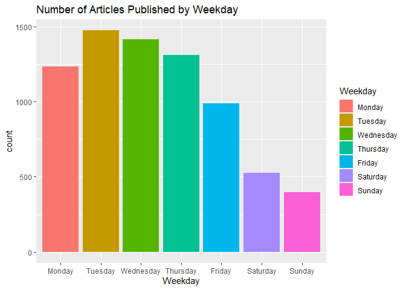
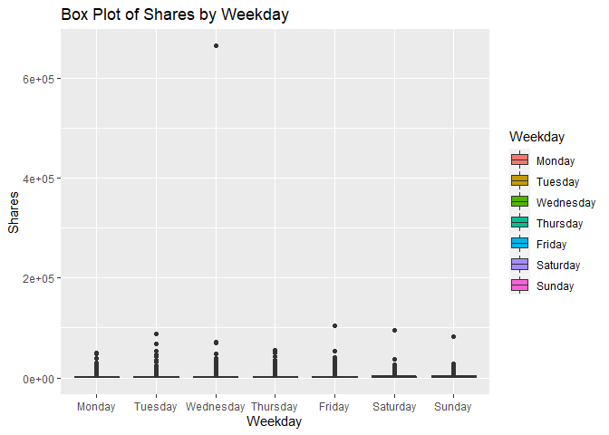
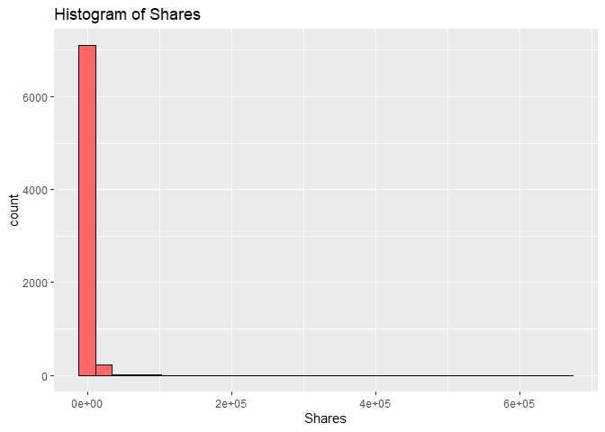
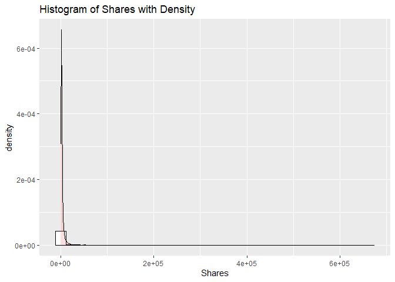
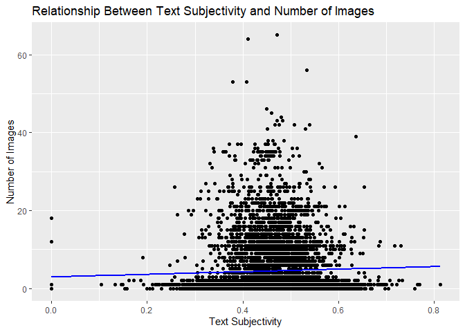
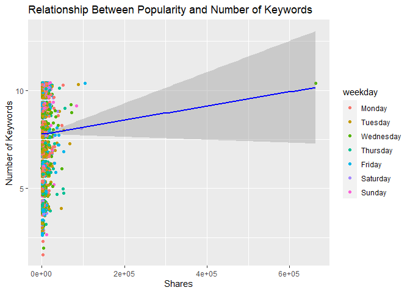
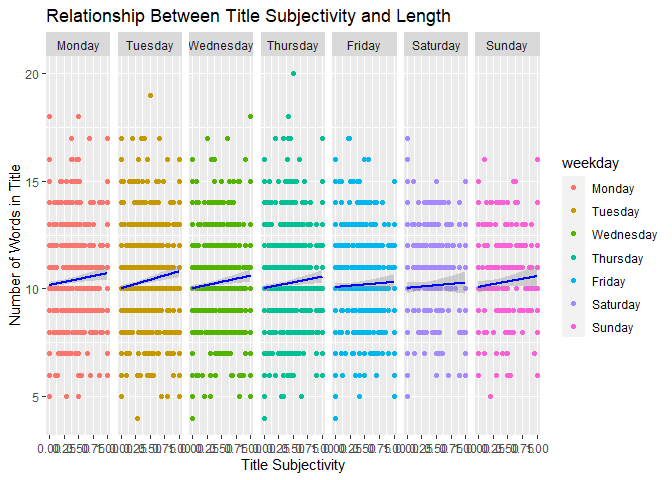

ST 558 Project 3
================
Melanie Kahn & Rachel Hardy
2022-11-14

-   <a href="#required-libraries" id="toc-required-libraries">Required
    Libraries</a>
-   <a href="#introduction-to-the-data"
    id="toc-introduction-to-the-data">Introduction to the Data</a>
-   <a href="#data" id="toc-data">Data</a>
    -   <a href="#reading-in-the-data" id="toc-reading-in-the-data">Reading in
        the Data</a>
    -   <a href="#modifying-the-data" id="toc-modifying-the-data">Modifying the
        Data</a>
    -   <a href="#splitting-the-data" id="toc-splitting-the-data">Splitting the
        Data</a>
-   <a href="#summarizations" id="toc-summarizations">Summarizations</a>
    -   <a href="#summary-statistics" id="toc-summary-statistics">Summary
        Statistics</a>
    -   <a href="#contingency-tables" id="toc-contingency-tables">Contingency
        Tables</a>
    -   <a href="#graphical-summaries" id="toc-graphical-summaries">Graphical
        Summaries</a>
        -   <a href="#bar-plot" id="toc-bar-plot">Bar Plot</a>
        -   <a href="#box-plot" id="toc-box-plot">Box Plot</a>
        -   <a href="#histograms" id="toc-histograms">Histograms</a>
        -   <a href="#scatter-plots" id="toc-scatter-plots">Scatter Plots</a>
-   <a href="#modeling" id="toc-modeling">Modeling</a>
    -   <a href="#linear-regression" id="toc-linear-regression">Linear
        Regression</a>
    -   <a href="#random-forest" id="toc-random-forest">Random Forest</a>
    -   <a href="#boosted-tree" id="toc-boosted-tree">Boosted Tree</a>
-   <a href="#comparison" id="toc-comparison">Comparison</a>

# Required Libraries

Running the code chunk below loads the `tidyverse`, `readr`, `ggplot2`,
`shiny`, `caret`, and `rmarkdown` packages.

``` r
library(tidyverse)
library(readr)
library(ggplot2)
library(shiny)
library(caret)
library(rmarkdown)
```

# Introduction to the Data

The online news popularity data used for this project summarizes a
diverse set of features about articles published by
[Mashable](http://www.mashable.com) over a two year period with the goal
of predicting the number of shares in social networks - a proxy for
popularity.

The original online news popularity data set included 58 predictive
variables, 2 non-predictive variables, 1 target variable. For the
purposes of this project, we are only using 14 non-predictive variables,
keeping the same target variable.

The variables present for each observation in this subset of the online
news popularity data set are as follows:

Non-Predictive Variables:

-   `url` - URL of the article  
-   `timedelta` - The number of days between the article publication and
    the data set acquisition

Predictive Variables:

-   `data_channel_is_*` - Binary variable indicating the type of data
    channel
    -   `lifestyle` - Lifestyle  
    -   `entertainment` - Entertainment  
    -   `bus` - Business  
    -   `socmed` - Social Media  
    -   `tech` - Tech  
    -   `world` - World  
-   `is_weekend` - Binary variable indicating if the article published
    on the weekend  
-   `weekday` - What day of the week the article was published (factor
    variable with seven levels)  
-   `num_imgs` - The number of images in the article  
-   `num_keywords` - The number of keywords in the metadata  
-   `n_tokens_title` - The number of words in the title  
-   `title_subjectivity` - Score of 0 - 1 indicating how subjective the
    title of the article is  
-   `global_subjectivity` - Score of 0 - 1 indicating how subjective the
    text of the article is

Target Variable:

-   `shares` - Number of shares

The purpose of the following analysis is to create predictive models for
this data set and find which one performs the best. After splitting the
data into a training and test set, the performance of a simple linear
regression model, a multiple regression model, a random forest model,
and a boosted tree model will be compared based on the root-mean-square
error (RMSE) calculation. The best model will have the smallest RMSE
from the test set. This process will be done across each data channel
(lifestyle,entertainment, business, social media, tech, and world) using
automated RMarkdown reports.

# Data

## Reading in the Data

Running the code chunk below reads in the online news popularity data
set using `read_csv()`.

``` r
newsOriginal <- read_csv(file = "./OnlineNewsPopularity.csv")
newsOriginal
```

    ## # A tibble: 39,644 × 61
    ##    url      timed…¹ n_tok…² n_tok…³ n_uni…⁴ n_non…⁵ n_non…⁶ num_h…⁷ num_s…⁸ num_i…⁹ num_v…˟ avera…˟ num_k…˟ data_…˟ data_…˟ data_…˟ data_…˟ data_…˟
    ##    <chr>      <dbl>   <dbl>   <dbl>   <dbl>   <dbl>   <dbl>   <dbl>   <dbl>   <dbl>   <dbl>   <dbl>   <dbl>   <dbl>   <dbl>   <dbl>   <dbl>   <dbl>
    ##  1 http://…     731      12     219   0.664    1.00   0.815       4       2       1       0    4.68       5       0       1       0       0       0
    ##  2 http://…     731       9     255   0.605    1.00   0.792       3       1       1       0    4.91       4       0       0       1       0       0
    ##  3 http://…     731       9     211   0.575    1.00   0.664       3       1       1       0    4.39       6       0       0       1       0       0
    ##  4 http://…     731       9     531   0.504    1.00   0.666       9       0       1       0    4.40       7       0       1       0       0       0
    ##  5 http://…     731      13    1072   0.416    1.00   0.541      19      19      20       0    4.68       7       0       0       0       0       1
    ##  6 http://…     731      10     370   0.560    1.00   0.698       2       2       0       0    4.36       9       0       0       0       0       1
    ##  7 http://…     731       8     960   0.418    1.00   0.550      21      20      20       0    4.65      10       1       0       0       0       0
    ##  8 http://…     731      12     989   0.434    1.00   0.572      20      20      20       0    4.62       9       0       0       0       0       1
    ##  9 http://…     731      11      97   0.670    1.00   0.837       2       0       0       0    4.86       7       0       0       0       0       1
    ## 10 http://…     731      10     231   0.636    1.00   0.797       4       1       1       1    5.09       5       0       0       0       0       0
    ## # … with 39,634 more rows, 43 more variables: data_channel_is_world <dbl>, kw_min_min <dbl>, kw_max_min <dbl>, kw_avg_min <dbl>, kw_min_max <dbl>,
    ## #   kw_max_max <dbl>, kw_avg_max <dbl>, kw_min_avg <dbl>, kw_max_avg <dbl>, kw_avg_avg <dbl>, self_reference_min_shares <dbl>,
    ## #   self_reference_max_shares <dbl>, self_reference_avg_sharess <dbl>, weekday_is_monday <dbl>, weekday_is_tuesday <dbl>,
    ## #   weekday_is_wednesday <dbl>, weekday_is_thursday <dbl>, weekday_is_friday <dbl>, weekday_is_saturday <dbl>, weekday_is_sunday <dbl>,
    ## #   is_weekend <dbl>, LDA_00 <dbl>, LDA_01 <dbl>, LDA_02 <dbl>, LDA_03 <dbl>, LDA_04 <dbl>, global_subjectivity <dbl>,
    ## #   global_sentiment_polarity <dbl>, global_rate_positive_words <dbl>, global_rate_negative_words <dbl>, rate_positive_words <dbl>,
    ## #   rate_negative_words <dbl>, avg_positive_polarity <dbl>, min_positive_polarity <dbl>, max_positive_polarity <dbl>, …

## Modifying the Data

Running the code chunk below subsets the data to only include
observations for the data channel we’re interested in.

``` r
news <- newsOriginal %>% filter(get(params$dataChannel) == 1)
news
```

    ## # A tibble: 7,346 × 61
    ##    url      timed…¹ n_tok…² n_tok…³ n_uni…⁴ n_non…⁵ n_non…⁶ num_h…⁷ num_s…⁸ num_i…⁹ num_v…˟ avera…˟ num_k…˟ data_…˟ data_…˟ data_…˟ data_…˟ data_…˟
    ##    <chr>      <dbl>   <dbl>   <dbl>   <dbl>   <dbl>   <dbl>   <dbl>   <dbl>   <dbl>   <dbl>   <dbl>   <dbl>   <dbl>   <dbl>   <dbl>   <dbl>   <dbl>
    ##  1 http://…     731      13    1072   0.416    1.00   0.541      19      19      20       0    4.68       7       0       0       0       0       1
    ##  2 http://…     731      10     370   0.560    1.00   0.698       2       2       0       0    4.36       9       0       0       0       0       1
    ##  3 http://…     731      12     989   0.434    1.00   0.572      20      20      20       0    4.62       9       0       0       0       0       1
    ##  4 http://…     731      11      97   0.670    1.00   0.837       2       0       0       0    4.86       7       0       0       0       0       1
    ##  5 http://…     731       8    1207   0.411    1.00   0.549      24      24      42       0    4.72       8       0       0       0       0       1
    ##  6 http://…     731      13    1248   0.391    1.00   0.523      21      19      20       0    4.69      10       0       0       0       0       1
    ##  7 http://…     731      11    1154   0.427    1.00   0.573      20      20      20       0    4.63       7       0       0       0       0       1
    ##  8 http://…     731       8     266   0.573    1.00   0.721       5       2       1       0    4.26      10       0       0       0       0       1
    ##  9 http://…     731       8     331   0.563    1.00   0.724       5       3       1       0    4.78       9       0       0       0       0       1
    ## 10 http://…     731      12    1225   0.385    1.00   0.509      22      22      28       0    4.64       9       0       0       0       0       1
    ## # … with 7,336 more rows, 43 more variables: data_channel_is_world <dbl>, kw_min_min <dbl>, kw_max_min <dbl>, kw_avg_min <dbl>, kw_min_max <dbl>,
    ## #   kw_max_max <dbl>, kw_avg_max <dbl>, kw_min_avg <dbl>, kw_max_avg <dbl>, kw_avg_avg <dbl>, self_reference_min_shares <dbl>,
    ## #   self_reference_max_shares <dbl>, self_reference_avg_sharess <dbl>, weekday_is_monday <dbl>, weekday_is_tuesday <dbl>,
    ## #   weekday_is_wednesday <dbl>, weekday_is_thursday <dbl>, weekday_is_friday <dbl>, weekday_is_saturday <dbl>, weekday_is_sunday <dbl>,
    ## #   is_weekend <dbl>, LDA_00 <dbl>, LDA_01 <dbl>, LDA_02 <dbl>, LDA_03 <dbl>, LDA_04 <dbl>, global_subjectivity <dbl>,
    ## #   global_sentiment_polarity <dbl>, global_rate_positive_words <dbl>, global_rate_negative_words <dbl>, rate_positive_words <dbl>,
    ## #   rate_negative_words <dbl>, avg_positive_polarity <dbl>, min_positive_polarity <dbl>, max_positive_polarity <dbl>, …

Running the code chunk below creates the categorical variable `weekday`
to the data set that tells us what day of the week the article was
published.

``` r
news <- news %>% mutate(weekday = if_else((weekday_is_monday == 1), "Monday",
                                  if_else((weekday_is_tuesday == 1), "Tuesday", 
                                  if_else((weekday_is_wednesday == 1), "Wednesday", 
                                  if_else((weekday_is_thursday == 1), "Thursday", 
                                  if_else((weekday_is_friday == 1), "Friday",
                                  if_else((weekday_is_saturday == 1), "Saturday", 
                                  if_else((weekday_is_sunday == 1), "Sunday", " ")))))))) %>%
                 select(url, shares, weekday, everything())

news$weekday <- factor(news$weekday, levels=c("Monday", "Tuesday", "Wednesday",
                                              "Thursday", "Friday", "Saturday", "Sunday"))
levels(news$weekday)
```

    ## [1] "Monday"    "Tuesday"   "Wednesday" "Thursday"  "Friday"    "Saturday"  "Sunday"

``` r
news
```

    ## # A tibble: 7,346 × 62
    ##    url       shares weekday timed…¹ n_tok…² n_tok…³ n_uni…⁴ n_non…⁵ n_non…⁶ num_h…⁷ num_s…⁸ num_i…⁹ num_v…˟ avera…˟ num_k…˟ data_…˟ data_…˟ data_…˟
    ##    <chr>      <dbl> <fct>     <dbl>   <dbl>   <dbl>   <dbl>   <dbl>   <dbl>   <dbl>   <dbl>   <dbl>   <dbl>   <dbl>   <dbl>   <dbl>   <dbl>   <dbl>
    ##  1 http://m…    505 Monday      731      13    1072   0.416    1.00   0.541      19      19      20       0    4.68       7       0       0       0
    ##  2 http://m…    855 Monday      731      10     370   0.560    1.00   0.698       2       2       0       0    4.36       9       0       0       0
    ##  3 http://m…    891 Monday      731      12     989   0.434    1.00   0.572      20      20      20       0    4.62       9       0       0       0
    ##  4 http://m…   3600 Monday      731      11      97   0.670    1.00   0.837       2       0       0       0    4.86       7       0       0       0
    ##  5 http://m…  17100 Monday      731       8    1207   0.411    1.00   0.549      24      24      42       0    4.72       8       0       0       0
    ##  6 http://m…   2800 Monday      731      13    1248   0.391    1.00   0.523      21      19      20       0    4.69      10       0       0       0
    ##  7 http://m…    445 Monday      731      11    1154   0.427    1.00   0.573      20      20      20       0    4.63       7       0       0       0
    ##  8 http://m…    783 Monday      731       8     266   0.573    1.00   0.721       5       2       1       0    4.26      10       0       0       0
    ##  9 http://m…   1500 Monday      731       8     331   0.563    1.00   0.724       5       3       1       0    4.78       9       0       0       0
    ## 10 http://m…   1800 Monday      731      12    1225   0.385    1.00   0.509      22      22      28       0    4.64       9       0       0       0
    ## # … with 7,336 more rows, 44 more variables: data_channel_is_socmed <dbl>, data_channel_is_tech <dbl>, data_channel_is_world <dbl>,
    ## #   kw_min_min <dbl>, kw_max_min <dbl>, kw_avg_min <dbl>, kw_min_max <dbl>, kw_max_max <dbl>, kw_avg_max <dbl>, kw_min_avg <dbl>,
    ## #   kw_max_avg <dbl>, kw_avg_avg <dbl>, self_reference_min_shares <dbl>, self_reference_max_shares <dbl>, self_reference_avg_sharess <dbl>,
    ## #   weekday_is_monday <dbl>, weekday_is_tuesday <dbl>, weekday_is_wednesday <dbl>, weekday_is_thursday <dbl>, weekday_is_friday <dbl>,
    ## #   weekday_is_saturday <dbl>, weekday_is_sunday <dbl>, is_weekend <dbl>, LDA_00 <dbl>, LDA_01 <dbl>, LDA_02 <dbl>, LDA_03 <dbl>, LDA_04 <dbl>,
    ## #   global_subjectivity <dbl>, global_sentiment_polarity <dbl>, global_rate_positive_words <dbl>, global_rate_negative_words <dbl>,
    ## #   rate_positive_words <dbl>, rate_negative_words <dbl>, avg_positive_polarity <dbl>, min_positive_polarity <dbl>, max_positive_polarity <dbl>, …

## Splitting the Data

Running the code chunk below splits the modified `news` data set into a
training and testing set using `createDataPartition()`. First the seed
is set to make sure the random sampling will be reproducible.
`createDataPartition()` then creates an indexing vector (`trainIndex`)
with a subset of the `shares` variable where the training subset
(`newsTrain`) will result in a vector (`list = FALSE`) that has
approximately 70% (`p = 0.7`) of the observations from the updated
`news` data set. This training vector is then used to create the
training set (`newsTrain`) with approximately 70% of the observations
from the updated `news` data set, and the test set (`newsTest`) with the
remaining 30% of the observations.

``` r
set.seed(100)
newsIndex <- createDataPartition(news$shares, p = 0.7, list = FALSE)

newsTrain <- news[newsIndex, ]
newsTest <- news[-newsIndex, ]

newsTrain
```

    ## # A tibble: 5,145 × 62
    ##    url       shares weekday timed…¹ n_tok…² n_tok…³ n_uni…⁴ n_non…⁵ n_non…⁶ num_h…⁷ num_s…⁸ num_i…⁹ num_v…˟ avera…˟ num_k…˟ data_…˟ data_…˟ data_…˟
    ##    <chr>      <dbl> <fct>     <dbl>   <dbl>   <dbl>   <dbl>   <dbl>   <dbl>   <dbl>   <dbl>   <dbl>   <dbl>   <dbl>   <dbl>   <dbl>   <dbl>   <dbl>
    ##  1 http://m…    505 Monday      731      13    1072   0.416    1.00   0.541      19      19      20       0    4.68       7       0       0       0
    ##  2 http://m…    855 Monday      731      10     370   0.560    1.00   0.698       2       2       0       0    4.36       9       0       0       0
    ##  3 http://m…    891 Monday      731      12     989   0.434    1.00   0.572      20      20      20       0    4.62       9       0       0       0
    ##  4 http://m…   3600 Monday      731      11      97   0.670    1.00   0.837       2       0       0       0    4.86       7       0       0       0
    ##  5 http://m…    445 Monday      731      11    1154   0.427    1.00   0.573      20      20      20       0    4.63       7       0       0       0
    ##  6 http://m…    783 Monday      731       8     266   0.573    1.00   0.721       5       2       1       0    4.26      10       0       0       0
    ##  7 http://m…   1800 Monday      731      12    1225   0.385    1.00   0.509      22      22      28       0    4.64       9       0       0       0
    ##  8 http://m…   3900 Monday      731      10     633   0.476    1.00   0.580       2       2      19       0    4.99       7       0       0       0
    ##  9 http://m…    480 Monday      731      14     290   0.612    1.00   0.762       0       0      14       0    4.07       9       0       0       0
    ## 10 http://m…   4200 Monday      731      14    1237   0.424    1.00   0.570      24      24      42       0    4.70       7       0       0       0
    ## # … with 5,135 more rows, 44 more variables: data_channel_is_socmed <dbl>, data_channel_is_tech <dbl>, data_channel_is_world <dbl>,
    ## #   kw_min_min <dbl>, kw_max_min <dbl>, kw_avg_min <dbl>, kw_min_max <dbl>, kw_max_max <dbl>, kw_avg_max <dbl>, kw_min_avg <dbl>,
    ## #   kw_max_avg <dbl>, kw_avg_avg <dbl>, self_reference_min_shares <dbl>, self_reference_max_shares <dbl>, self_reference_avg_sharess <dbl>,
    ## #   weekday_is_monday <dbl>, weekday_is_tuesday <dbl>, weekday_is_wednesday <dbl>, weekday_is_thursday <dbl>, weekday_is_friday <dbl>,
    ## #   weekday_is_saturday <dbl>, weekday_is_sunday <dbl>, is_weekend <dbl>, LDA_00 <dbl>, LDA_01 <dbl>, LDA_02 <dbl>, LDA_03 <dbl>, LDA_04 <dbl>,
    ## #   global_subjectivity <dbl>, global_sentiment_polarity <dbl>, global_rate_positive_words <dbl>, global_rate_negative_words <dbl>,
    ## #   rate_positive_words <dbl>, rate_negative_words <dbl>, avg_positive_polarity <dbl>, min_positive_polarity <dbl>, max_positive_polarity <dbl>, …

``` r
newsTest
```

    ## # A tibble: 2,201 × 62
    ##    url       shares weekday timed…¹ n_tok…² n_tok…³ n_uni…⁴ n_non…⁵ n_non…⁶ num_h…⁷ num_s…⁸ num_i…⁹ num_v…˟ avera…˟ num_k…˟ data_…˟ data_…˟ data_…˟
    ##    <chr>      <dbl> <fct>     <dbl>   <dbl>   <dbl>   <dbl>   <dbl>   <dbl>   <dbl>   <dbl>   <dbl>   <dbl>   <dbl>   <dbl>   <dbl>   <dbl>   <dbl>
    ##  1 http://m…  17100 Monday      731       8    1207   0.411    1.00   0.549      24      24      42       0    4.72       8       0       0       0
    ##  2 http://m…   2800 Monday      731      13    1248   0.391    1.00   0.523      21      19      20       0    4.69      10       0       0       0
    ##  3 http://m…   1500 Monday      731       8     331   0.563    1.00   0.724       5       3       1       0    4.78       9       0       0       0
    ##  4 http://m…   7700 Monday      731      10    1244   0.418    1.00   0.563      27      22      20       0    4.75      10       0       0       0
    ##  5 http://m…   1100 Monday      731      10    1036   0.430    1.00   0.560      21      21      20       0    4.73       9       0       0       0
    ##  6 http://m…    401 Monday      731       6     174   0.692    1.00   0.903       0       0       1       0    4.80       8       0       0       0
    ##  7 http://m…    695 Monday      731      11    1108   0.409    1.00   0.538      21      21      20       0    4.65       9       0       0       0
    ##  8 http://m…   1200 Monday      731      11    1089   0.419    1.00   0.553      20      20      20       0    4.69       8       0       0       0
    ##  9 http://m…    382 Monday      731       9     944   0.433    1.00   0.566      21      21      20       0    4.71       8       0       0       0
    ## 10 http://m…    834 Monday      731      12     238   0.621    1.00   0.823       3       1       1       0    4.26       9       0       0       0
    ## # … with 2,191 more rows, 44 more variables: data_channel_is_socmed <dbl>, data_channel_is_tech <dbl>, data_channel_is_world <dbl>,
    ## #   kw_min_min <dbl>, kw_max_min <dbl>, kw_avg_min <dbl>, kw_min_max <dbl>, kw_max_max <dbl>, kw_avg_max <dbl>, kw_min_avg <dbl>,
    ## #   kw_max_avg <dbl>, kw_avg_avg <dbl>, self_reference_min_shares <dbl>, self_reference_max_shares <dbl>, self_reference_avg_sharess <dbl>,
    ## #   weekday_is_monday <dbl>, weekday_is_tuesday <dbl>, weekday_is_wednesday <dbl>, weekday_is_thursday <dbl>, weekday_is_friday <dbl>,
    ## #   weekday_is_saturday <dbl>, weekday_is_sunday <dbl>, is_weekend <dbl>, LDA_00 <dbl>, LDA_01 <dbl>, LDA_02 <dbl>, LDA_03 <dbl>, LDA_04 <dbl>,
    ## #   global_subjectivity <dbl>, global_sentiment_polarity <dbl>, global_rate_positive_words <dbl>, global_rate_negative_words <dbl>,
    ## #   rate_positive_words <dbl>, rate_negative_words <dbl>, avg_positive_polarity <dbl>, min_positive_polarity <dbl>, max_positive_polarity <dbl>, …

# Summarizations

## Summary Statistics

Running the code chunk below provides the mean and standard deviation
for the number of times articles in the `news` data set were shared
(`shares`).

``` r
mean(news$shares)
```

    ## [1] 3072.283

``` r
sd(news$shares)
```

    ## [1] 9024.344

Running the code chunk below provides the mean and standard deviation
for the number of images per article (`num_imgs`) in the `news` data
set.

``` r
mean(news$num_imgs)
```

    ## [1] 4.434522

``` r
sd(news$num_imgs)
```

    ## [1] 7.024018

Running the code chunk below provides the mean and standard deviation
for the number of keywords per article (`num_keywords`) in the `news`
data set.

``` r
mean(news$num_keywords)
```

    ## [1] 7.775932

``` r
sd(news$num_keywords)
```

    ## [1] 1.713566

## Contingency Tables

Running the code chunk below creates a contingency table showing the
number of articles in the online `news` popularity data set that were
published on the weekend (`is_weekend`).

``` r
tableWeekend <- table(news$is_weekend)
tableWeekend
```

    ## 
    ##    0    1 
    ## 6425  921

From the table **above**, we can see that 921 articles were published on
the weekend, and 6425 articles were published during the week.

Running the code chunk below creates a contingency table showing the
number of articles in the online `news` popularity data set that were
published on certain days of the week (`weekday`).

``` r
tableWeekday <- table(news$weekday)
tableWeekday
```

    ## 
    ##    Monday   Tuesday Wednesday  Thursday    Friday  Saturday    Sunday 
    ##      1235      1474      1417      1310       989       525       396

From the table **above**, we can see that 1235 articles were published
on Monday, 921 were published on Tuesday, NA on Wednesday, NA on
Thursday, NA on Friday, NA on Saturday, NA articles were published on
Sunday.

## Graphical Summaries

### Bar Plot

Running the code chunk below creates a bar plot to visualize the number
of articles published per each `weekday`. Using the aesthetics option
`aes(fill = weekday)` inside the `geom_bar()` function gives us a nicely
colored graph.

``` r
g <- ggplot(news, aes(x = weekday))

g + geom_bar(aes(fill = weekday)) + 
  labs(title = "Number of Articles Published by Weekday", x = "Weekday") +
  scale_fill_discrete(name = "Weekday")
```

<!-- -->

### Box Plot

Running the code chunk below creates a box plot of number of `shares`
for each `weekday`. Using the aesthetics option ‘fill = weekday’ gives
us a nicely colored graph.

``` r
g <- ggplot(news, aes(x = weekday, y = shares))

g + geom_boxplot(aes(fill = weekday)) + 
  labs(title = "Box Plot of Shares by Weekday", x = "Weekday", y = "Shares") +
  scale_fill_discrete(name = "Weekday")
```

<!-- -->

### Histograms

Running the code chunk below creates two histograms of the number of
`shares` that show us the distribution of the variable. The second
histogram has an added density layer to give us a better idea of how the
data is spread out.

``` r
g <- ggplot(news, aes(x = shares))

g + geom_histogram(color = "black", fill = "#FF6666") + labs(title = "Histogram of Shares") +
  labs(title = "Histogram of Shares", x = "Shares")
```

<!-- -->

``` r
g + geom_histogram(aes(y=..density..), colour="black", fill="white") + 
  geom_density(alpha=.2, fill="#FF6666") + 
  labs(title = "Histogram of Shares with Density", x = "Shares")
```

<!-- -->

### Scatter Plots

Running the code chunk below creates a scatter plot to visualize the
correlation between the text subjectivity (`global_subjectivity`) and
the number of images (`num_imgs`) articles have. The `geom_point()`
function plots the data points while the `geom_smooth()` function plots
the regression line using method `lm` for linear model.

Using this linear regression line on the scatter plot *below* helps
quantify the direction and strength of the relationship between the text
subjectivity on the x-axis and the number of images on the y-axis.
Results showing a regression line starting lower on the y-axis than it
ends (a *positive* slope) represents a *positive* linear correlation
between an article’s overall subjectivity and the number of images
used - if one increases, so does the other. Results showing a regression
line starting higher on the y-axis than it ends (a *negative* slope)
represents a *negative* linear correlation between the two, meaning the
trend in the data shows a higher number of images reduces subjectivity
in an article. The steepness of the slope associated with this
regression line indicates the strength of the variable relationship. The
closer a regression line gets to horizontal, the weaker the correlation
between the subjectivity and images; and vice versa.

``` r
g <- ggplot(news, aes(x = global_subjectivity, y = num_imgs))
g + geom_point() +
  geom_smooth(method = lm, col = "Blue", se = FALSE) +
  labs(title = "Relationship Between Text Subjectivity and Number of Images",
       x = "Text Subjectivity",
       y = "Number of Images")
```

<!-- -->

Running the code chunk below creates a scatter plot to visualize the
correlation between the number of `shares` and the number of keywords
(`num_keywords`) articles have. `geom_jitter` is used instead of
`geom_point()` to plot the data points in a manner where the `weekday`
component can be better visualized. The `geom_smooth()` function plots
the regression line using method `lm` for linear model.

Using this linear regression line on the scatter plot *below* helps
quantify the direction and strength of the relationship between the
number of shares on the x-axis and the number of keywords on the y-axis.
Results showing a regression line starting lower on the y-axis than it
ends (a *positive* slope) represents a *positive* linear correlation
between an article’s number of shares and the number of keywords used -
if one increases, so does the other. Results showing a regression line
starting higher on the y-axis than it ends (a *negative* slope)
represents a *negative* linear correlation between the two, meaning the
trend in the data shows a higher number of keywords reduces the number
of times an article is shared. The steepness of the slope associated
with this regression line indicates the strength of the variable
relationship. The closer a regression line gets to horizontal, the
weaker the correlation between the popularity and keywords; and vice
versa. As one of the default arguments for the `geom_smooth` function is
`se = TRUE`, a 95% confidence interval can also be seen. Wider
confidence intervals indicate increased uncertainty of the effect the
variables have on each other.

``` r
g <- ggplot(news, aes(x = shares, y = num_keywords))
g + geom_jitter(aes(color = weekday)) +
  geom_smooth(method = lm, col = "Blue") +
  labs(title = "Relationship Between Popularity and Number of Keywords",
       x = "Shares",
       y = "Number of Keywords")
```

<!-- -->

Running the code chunk below creates a facet grid scatter plot to
visualize the correlation between the number of words in the article’s
title (`n_tokens_title`) and title’s subjectivity score
(`title_subjectivity`) according to the day the article was published
(`weekday`). The `geom_point()` function plots the data points while the
`geom_smooth()` function plots the regression line using method `lm` for
linear model.

Using this linear regression line on the scatter plot *below* helps
quantify the direction and strength of the relationship between the
title subjectivity on the x-axis and the number of words in the title on
the y-axis. Results showing a regression line starting lower on the
y-axis than it ends (a *positive* slope) represents a *positive* linear
correlation between a title’s subjectivity and length - if one
increases, so does the other. Results showing a regression line starting
higher on the y-axis than it ends (a *negative* slope) represents a
*negative* linear correlation between the two, meaning the trend in the
data shows a higher number of words reduces title subjectivity. The
steepness of the slope associated with this regression line indicates
the strength of the variable relationship. The closer a regression line
gets to horizontal, the weaker the correlation between the title
subjectivity and length; and vice versa. The 95% confidence intervals
may be harder to see due to the faceted nature of these plots, but wider
confidence intervals still indicate increased uncertainty of the effect
the variables have on each other.

``` r
g <- ggplot(news, aes(x = title_subjectivity, y = n_tokens_title))
g + geom_point(aes(color = weekday)) +
  facet_grid(~ weekday) +
  geom_smooth(method = lm, col = "Blue") +
  labs(title = "Relationship Between Title Subjectivity and Length",
       x = "Title Subjectivity",
       y = "Number of Words in Title")
```

<!-- -->

# Modeling

## Linear Regression

Linear regression attempts to model the (linear) relationship between a
response variable and one or more predictor variables by fitting a
linear equation to the data. The simplest form of the linear equation is
`Y = a + bX`, where `Y` is the response variable, `a` is the intercept,
`b` is the slope, and `X` is the predictor (or explanatory) variable.
The most common method for fitting a regression model is least-squares
regression, where the best-fitting line is calculated by minimizing the
sum of the squared residuals.

For linear regression, it is usually important to understand which
variables are related and which variables scientifically should be in
the model. It is also important to split the data into a training set
and a testing set so the model does not become over-fit.

Running the code chunk below creates a multiple linear regression model
where `shares` is the response variable and the predictor variables are
`weekday`, `title_subjectivity`, `num_imgs`, `title_subjectivity^2`, and
`num_imgs^2`.

By using the `summary()` function, we can see the values for the
residuals and coefficients, as well as the performance criteria values
such as multiple R-squared.

``` r
set.seed(100)
firstLinearModel <- train(shares ~ weekday + title_subjectivity + num_imgs + I(title_subjectivity^2) + I(num_imgs^2), 
                        data = newsTrain,
                        method = "lm",
                        preProcess = c("center", "scale"),
                        trControl = trainControl(method = "cv"))
firstLinearModel
```

    ## Linear Regression 
    ## 
    ## 5145 samples
    ##    3 predictor
    ## 
    ## Pre-processing: centered (10), scaled (10) 
    ## Resampling: Cross-Validated (10 fold) 
    ## Summary of sample sizes: 4630, 4632, 4630, 4630, 4632, 4629, ... 
    ## Resampling results:
    ## 
    ##   RMSE      Rsquared     MAE    
    ##   7064.289  0.002415064  2424.29
    ## 
    ## Tuning parameter 'intercept' was held constant at a value of TRUE

``` r
summary(firstLinearModel)
```

    ## 
    ## Call:
    ## lm(formula = .outcome ~ ., data = dat)
    ## 
    ## Residuals:
    ##    Min     1Q Median     3Q    Max 
    ##  -3784  -1939  -1315    -90 659786 
    ## 
    ## Coefficients:
    ##                           Estimate Std. Error t value Pr(>|t|)    
    ## (Intercept)                3115.03     144.65  21.536   <2e-16 ***
    ## weekdayTuesday               46.48     191.38   0.243   0.8081    
    ## weekdayWednesday            374.23     189.65   1.973   0.0485 *  
    ## weekdayThursday              44.47     188.52   0.236   0.8135    
    ## weekdayFriday               109.51     180.48   0.607   0.5440    
    ## weekdaySaturday             206.54     166.72   1.239   0.2155    
    ## weekdaySunday               254.11     162.70   1.562   0.1184    
    ## title_subjectivity          363.25     426.46   0.852   0.3944    
    ## num_imgs                    430.06     358.05   1.201   0.2298    
    ## `I(title_subjectivity^2)`  -248.71     426.44  -0.583   0.5598    
    ## `I(num_imgs^2)`            -373.46     357.90  -1.043   0.2968    
    ## ---
    ## Signif. codes:  0 '***' 0.001 '**' 0.01 '*' 0.05 '.' 0.1 ' ' 1
    ## 
    ## Residual standard error: 10380 on 5134 degrees of freedom
    ## Multiple R-squared:  0.002037,   Adjusted R-squared:  9.338e-05 
    ## F-statistic: 1.048 on 10 and 5134 DF,  p-value: 0.3996

Now that the multiple linear regression model has been trained
(`firstLinearModel`), running the code chunk below will check how well
the model does on the test set `newsTest` using the `postResample()`
function. The RMSE from the `postResample` output is then stored in an
object `firstLinearRMSE` for later use in our comparison functions.

``` r
firstLinearPredict <- predict(firstLinearModel, newdata = newsTest)

firstLinearPerformance <- postResample(firstLinearPredict, newsTest$shares)
firstLinearPerformance
```

    ##         RMSE     Rsquared          MAE 
    ## 4.505678e+03 6.816867e-04 2.309642e+03

``` r
attributes(firstLinearPerformance)
```

    ## $names
    ## [1] "RMSE"     "Rsquared" "MAE"

``` r
firstLinearRMSE <- firstLinearPerformance[1]
firstLinearRMSE
```

    ##     RMSE 
    ## 4505.678

Running the code chunk below creates a simple linear regression model
where `shares` is the response variable and the predictor variables are
`weekday`, `num_imgs`, `num_keywords`, `n_tokens_title`,
`title_subjectivity`, and `global_subjectivity`. The `summary()`
function is used to examine the values for the residuals and
coefficients, as well as the performance criteria values such as
multiple R-squared.

``` r
set.seed(100)
secondLinearModel <- train(shares ~ weekday + num_imgs + num_keywords + n_tokens_title + title_subjectivity + global_subjectivity, 
                        data = newsTrain,
                        method = "lm",
                        preProcess = c("center", "scale"),
                        trControl = trainControl(method = "cv"))
secondLinearModel
```

    ## Linear Regression 
    ## 
    ## 5145 samples
    ##    6 predictor
    ## 
    ## Pre-processing: centered (11), scaled (11) 
    ## Resampling: Cross-Validated (10 fold) 
    ## Summary of sample sizes: 4630, 4632, 4630, 4630, 4632, 4629, ... 
    ## Resampling results:
    ## 
    ##   RMSE      Rsquared     MAE     
    ##   7070.771  0.002596778  2428.517
    ## 
    ## Tuning parameter 'intercept' was held constant at a value of TRUE

``` r
summary(secondLinearModel)
```

    ## 
    ## Call:
    ## lm(formula = .outcome ~ ., data = dat)
    ## 
    ## Residuals:
    ##    Min     1Q Median     3Q    Max 
    ##  -3787  -1963  -1297    -64 659613 
    ## 
    ## Coefficients:
    ##                     Estimate Std. Error t value Pr(>|t|)    
    ## (Intercept)          3115.03     144.65  21.534   <2e-16 ***
    ## weekdayTuesday         47.51     191.36   0.248   0.8039    
    ## weekdayWednesday      379.50     189.69   2.001   0.0455 *  
    ## weekdayThursday        41.47     188.62   0.220   0.8260    
    ## weekdayFriday         110.10     180.54   0.610   0.5420    
    ## weekdaySaturday       206.09     166.74   1.236   0.2165    
    ## weekdaySunday         244.63     163.09   1.500   0.1337    
    ## num_imgs               69.13     145.88   0.474   0.6356    
    ## num_keywords          190.83     146.15   1.306   0.1917    
    ## n_tokens_title        -21.66     145.61  -0.149   0.8818    
    ## title_subjectivity    130.57     146.69   0.890   0.3734    
    ## global_subjectivity    35.25     146.39   0.241   0.8098    
    ## ---
    ## Signif. codes:  0 '***' 0.001 '**' 0.01 '*' 0.05 '.' 0.1 ' ' 1
    ## 
    ## Residual standard error: 10380 on 5133 degrees of freedom
    ## Multiple R-squared:  0.002109,   Adjusted R-squared:  -2.944e-05 
    ## F-statistic: 0.9862 on 11 and 5133 DF,  p-value: 0.4562

Now that the simple linear regression model has been trained
(`secondLinearModel`), running the code chunk below will check how well
the model does on the test set `newsTest` using the `postResample()`
function. The RMSE from the `postResample` output is then stored in an
object `secondLinearRMSE` for later use in our comparison functions.

``` r
secondLinearPredict <- predict(secondLinearModel, newdata = newsTest)

secondLinearPerformance <- postResample(secondLinearPredict, newsTest$shares)
secondLinearPerformance
```

    ##         RMSE     Rsquared          MAE 
    ## 4.498354e+03 1.541936e-03 2.301154e+03

``` r
attributes(secondLinearPerformance)
```

    ## $names
    ## [1] "RMSE"     "Rsquared" "MAE"

``` r
secondLinearRMSE <- secondLinearPerformance[1]
secondLinearRMSE
```

    ##     RMSE 
    ## 4498.354

## Random Forest

To understand random forests, it is first important to understand bagged
trees which are created using bootstrap aggregation. For bagged trees,
the sample is treated as the population and re-sampling is done with
replacement. The process of creating a bagged tree is below:

-   Step 1: Create a bootstrap sample using `sample()`  
-   Step 2: Train the tree on this sample (no pruning necessary)  
-   Step 3: Repeat B = 1000 times (no set mark)  
-   Step 4: Final prediction is average of these predictions (for
    regression trees) **OR** use majority vote as final classification
    prediction (classification trees)

Random forests are essentially bagged trees, except not all the
predictors are used for each model. A random subset of predictors is
used for each tree model (bootstrap sample). The purpose of doing this
is to prevent one or two strong predictors from dominating all tree
models and creating unwanted correlation between models.

Running the code chunk below trains the random forest model. The formula
notation used in the `train()` function models the `shares` variable
using the following predictor/explanatory variables: `weekday`,
`num_imgs`, and `num_keywords`. To use the random forest model, the
`method` argument was specified as `"rf"`. The data was pre-processed by
centering and scaling. Cross validation was used five-fold and repeated
three (3) times. The argument `tuneGrid` was then used to replicate the
random forest model a total of five (5) times. The best model is then
chosen based on the performance criteria.

``` r
set.seed(100)
randomForestCtrl <- trainControl(method = "repeatedcv", number = 5, repeats = 3)
randomForestFit <- train(shares ~ weekday + num_imgs + num_keywords, 
                         data = newsTrain, method = "rf", 
                         trControl = randomForestCtrl,
                         preProcess = c("center","scale"), 
                         tuneGrid = data.frame(mtry = 1:5))

randomForestFit
```

    ## Random Forest 
    ## 
    ## 5145 samples
    ##    3 predictor
    ## 
    ## Pre-processing: centered (8), scaled (8) 
    ## Resampling: Cross-Validated (5 fold, repeated 3 times) 
    ## Summary of sample sizes: 4116, 4117, 4116, 4115, 4116, 4115, ... 
    ## Resampling results across tuning parameters:
    ## 
    ##   mtry  RMSE      Rsquared     MAE     
    ##   1     8071.850  0.001963496  2412.081
    ##   2     8093.881  0.001982102  2419.545
    ##   3     8134.825  0.002053810  2439.876
    ##   4     8192.657  0.001988437  2473.414
    ##   5     8256.361  0.002012749  2514.215
    ## 
    ## RMSE was used to select the optimal model using the smallest value.
    ## The final value used for the model was mtry = 1.

Now that the random forest model has been trained (`randomForestFit`),
running the code chunk below will check how well the model does on the
test set `newsTest` using the `postResample()` function. The RMSE from
the `postResample` output is then stored in an object `rfRMSE` for later
use in our comparison functions.

``` r
randomForestPredict <- predict(randomForestFit, newdata = newsTest)

randomForestPerformance <- postResample(randomForestPredict, newsTest$shares)
randomForestPerformance
```

    ##         RMSE     Rsquared          MAE 
    ## 4.490455e+03 1.074370e-03 2.296301e+03

``` r
attributes(randomForestPerformance)
```

    ## $names
    ## [1] "RMSE"     "Rsquared" "MAE"

``` r
rfRMSE <- randomForestPerformance[1]
rfRMSE
```

    ##     RMSE 
    ## 4490.455

## Boosted Tree

Boosted trees are another enhancement to the single tree methods.
However, unlike bagged and random forest models, boosted trees do not
use bootstrapping. Boosting is a general method to slowly train your
tree so you don’t overfit your model. The trees are grown in a
sequential manner where each subsequent tree is based off a modified
version of the original data, updating the predictions as the tree is
grown. The process is described below:

-   Step 1: Initialize predictions as 0  
-   Step 2: Find the residuals for every observation
    -   Residuals in first tree fit will be original data values
        (observed - 0 = observed)  
-   Step 3: Fit a regression tree with `d` splits where the residuals
    are the response  
-   Step 4: Update predictions using the new predictions from step 3
    multiplied by the growth rate (Lambda tuning parameter)  
-   Step 5: Continue to update residuals for new predictions (steps 2
    -4) `B` times

Running the code chunk below trains the boosted tree model. The formula
notation used in the `train()` function models the `shares` variable
using the following predictor/explanatory variables: `weekday`,
`num_imgs`, `num_keywords`, `n_tokens_title`, and `title_subjectivity`.
To use the boosted tree model, the `method` argument was specified as
`"gbm"`. The data was pre-processed by centering and scaling. `tuneGrid`
was then used to consider values of `n.trees` = 50, `interaction.depth`
= 1, `shrinkage` = 0.1, and `n.minobsinnode` = 10. Lastly,
`trainControl()` was used within the `trControl` argument to do 10 fold
cross-validation using the `"cv"` `method`.

``` r
boostTreeFit <- train(shares ~ weekday + num_imgs + num_keywords + n_tokens_title + title_subjectivity
                        + global_subjectivity, data = newsTrain,
                        method = "gbm",
                        preProcess = c("center", "scale"),
                        tuneGrid = data.frame(n.trees = 50, interaction.depth = 1, shrinkage = 0.1, n.minobsinnode = 10),
                        trControl = trainControl(method = "cv", number = 10))
```

    ## Iter   TrainDeviance   ValidDeviance   StepSize   Improve
    ##      1 22830559.4725             nan     0.1000 -1227.7512
    ##      2 22801845.5543             nan     0.1000 17481.2866
    ##      3 22782096.4598             nan     0.1000 12705.4416
    ##      4 22764724.3609             nan     0.1000 4309.8723
    ##      5 22752626.2004             nan     0.1000 1828.5623
    ##      6 22737329.5478             nan     0.1000 10146.9610
    ##      7 22725439.0975             nan     0.1000 3143.4489
    ##      8 22714873.0515             nan     0.1000 -3299.7244
    ##      9 22707216.0659             nan     0.1000 -172.4318
    ##     10 22697585.1870             nan     0.1000 2465.0406
    ##     20 22621702.8440             nan     0.1000 -3464.0215
    ##     40 22549949.4495             nan     0.1000 -1903.6115
    ##     50 22530863.2428             nan     0.1000 -6287.7559
    ## 
    ## Iter   TrainDeviance   ValidDeviance   StepSize   Improve
    ##      1 114849732.9400             nan     0.1000 -6586.9421
    ##      2 114784120.3529             nan     0.1000 21492.6263
    ##      3 114775123.1751             nan     0.1000 -462.8009
    ##      4 114761319.8752             nan     0.1000 -578.4561
    ##      5 114705575.8318             nan     0.1000 -9680.7796
    ##      6 114666032.1765             nan     0.1000 -13188.6789
    ##      7 114633125.1570             nan     0.1000 -48424.5061
    ##      8 114623761.8009             nan     0.1000 -3683.2735
    ##      9 114579132.0813             nan     0.1000 -14610.2765
    ##     10 114572873.7641             nan     0.1000 -8237.5336
    ##     20 114387189.7252             nan     0.1000 -8408.0474
    ##     40 114248241.3037             nan     0.1000 -28393.1626
    ##     50 114213525.5811             nan     0.1000 -25979.2144
    ## 
    ## Iter   TrainDeviance   ValidDeviance   StepSize   Improve
    ##      1 117401467.7643             nan     0.1000 -17533.6313
    ##      2 117380192.0254             nan     0.1000 -1128.4641
    ##      3 117372948.3951             nan     0.1000 -13226.8283
    ##      4 117316120.2116             nan     0.1000 4755.9106
    ##      5 117274761.2641             nan     0.1000 -4633.4570
    ##      6 117262723.2761             nan     0.1000 -6693.2274
    ##      7 117211994.2402             nan     0.1000 -13644.5965
    ##      8 117197600.5565             nan     0.1000 -6092.0763
    ##      9 117186520.4342             nan     0.1000 -19030.9906
    ##     10 117154693.0269             nan     0.1000 -28189.8624
    ##     20 117023712.5944             nan     0.1000 -36013.0899
    ##     40 116834690.9209             nan     0.1000 15478.2625
    ##     50 116768260.6137             nan     0.1000 5850.9986
    ## 
    ## Iter   TrainDeviance   ValidDeviance   StepSize   Improve
    ##      1 116291578.0637             nan     0.1000 -11840.6363
    ##      2 116284476.6173             nan     0.1000 -16234.8299
    ##      3 116209754.8537             nan     0.1000 -2029.0297
    ##      4 116166479.2050             nan     0.1000 -19127.1556
    ##      5 116135080.8650             nan     0.1000 -43152.6780
    ##      6 116121305.1395             nan     0.1000 4020.2339
    ##      7 116070558.4286             nan     0.1000 -14871.0548
    ##      8 116043075.6678             nan     0.1000 -6804.0972
    ##      9 116013369.1738             nan     0.1000 -43568.1687
    ##     10 115978261.8510             nan     0.1000 -2922.9716
    ##     20 115866674.2098             nan     0.1000 -5102.5375
    ##     40 115691568.6416             nan     0.1000 -37699.8859
    ##     50 115589963.2575             nan     0.1000 -9756.5096
    ## 
    ## Iter   TrainDeviance   ValidDeviance   StepSize   Improve
    ##      1 115833624.4003             nan     0.1000 -714.6610
    ##      2 115792118.4059             nan     0.1000 4232.7632
    ##      3 115750161.1787             nan     0.1000 -33439.0306
    ##      4 115711314.1985             nan     0.1000 -13090.8134
    ##      5 115700978.2204             nan     0.1000 -4515.8211
    ##      6 115690882.0878             nan     0.1000 -9481.9495
    ##      7 115679375.5716             nan     0.1000 -20075.5123
    ##      8 115668267.6413             nan     0.1000 1176.8415
    ##      9 115659932.0661             nan     0.1000 -10883.9349
    ##     10 115629612.8635             nan     0.1000 -28665.9166
    ##     20 115475731.0610             nan     0.1000 -6458.7701
    ##     40 115356275.1206             nan     0.1000 -16907.6444
    ##     50 115264098.3256             nan     0.1000 -27994.9571
    ## 
    ## Iter   TrainDeviance   ValidDeviance   StepSize   Improve
    ##      1 117020649.3927             nan     0.1000 5391.8484
    ##      2 116953337.6424             nan     0.1000 12534.5529
    ##      3 116906783.9292             nan     0.1000 2370.9756
    ##      4 116893086.4491             nan     0.1000 -10446.0797
    ##      5 116848408.9719             nan     0.1000 -17396.8015
    ##      6 116833885.9290             nan     0.1000 -1003.1787
    ##      7 116811241.1812             nan     0.1000 -22582.5787
    ##      8 116802347.0425             nan     0.1000 -8581.3566
    ##      9 116815790.8001             nan     0.1000 -51961.4473
    ##     10 116812654.6733             nan     0.1000 -22118.6329
    ##     20 116638671.6041             nan     0.1000 -39360.5246
    ##     40 116401659.0374             nan     0.1000 21938.4948
    ##     50 116282205.8614             nan     0.1000 -29025.2695
    ## 
    ## Iter   TrainDeviance   ValidDeviance   StepSize   Improve
    ##      1 117399835.2867             nan     0.1000 -1689.9400
    ##      2 117349668.0308             nan     0.1000 -14918.1500
    ##      3 117339978.9520             nan     0.1000 -4768.2368
    ##      4 117297183.0253             nan     0.1000 10176.9457
    ##      5 117260208.6012             nan     0.1000 -15924.0502
    ##      6 117237786.3356             nan     0.1000 -20310.2658
    ##      7 117203038.9915             nan     0.1000 -26627.1516
    ##      8 117191245.2812             nan     0.1000 -6531.2718
    ##      9 117175042.8681             nan     0.1000 -33089.8378
    ##     10 117156470.0364             nan     0.1000 -11659.5586
    ##     20 117022735.9907             nan     0.1000 -6529.4740
    ##     40 116830650.8388             nan     0.1000 -40465.6308
    ##     50 116743307.7152             nan     0.1000 -11456.8571
    ## 
    ## Iter   TrainDeviance   ValidDeviance   StepSize   Improve
    ##      1 117768307.9097             nan     0.1000 15669.4409
    ##      2 117757876.4189             nan     0.1000 -13276.9697
    ##      3 117709504.8040             nan     0.1000 9674.2227
    ##      4 117673267.2546             nan     0.1000 -20885.6996
    ##      5 117664694.2643             nan     0.1000 -7904.6369
    ##      6 117651706.6308             nan     0.1000 -2682.7841
    ##      7 117639675.7218             nan     0.1000 -2813.9282
    ##      8 117591636.6011             nan     0.1000 -5246.9501
    ##      9 117583136.7253             nan     0.1000 -10280.5421
    ##     10 117571734.5354             nan     0.1000 -9411.3730
    ##     20 117349858.8920             nan     0.1000 -21253.4083
    ##     40 117216343.0850             nan     0.1000 -34770.3170
    ##     50 117149423.2261             nan     0.1000 9688.0967
    ## 
    ## Iter   TrainDeviance   ValidDeviance   StepSize   Improve
    ##      1 117990816.3219             nan     0.1000 8991.9609
    ##      2 117992481.1051             nan     0.1000 -33732.4528
    ##      3 117998644.7630             nan     0.1000 -29835.1864
    ##      4 117987524.0148             nan     0.1000 -1434.0429
    ##      5 117944722.8773             nan     0.1000 -13735.0848
    ##      6 117914227.2802             nan     0.1000 -35986.4859
    ##      7 117907010.0800             nan     0.1000 -12556.3769
    ##      8 117868445.6887             nan     0.1000 -14007.5601
    ##      9 117857096.3462             nan     0.1000 -2332.7998
    ##     10 117815680.5743             nan     0.1000 -5870.9417
    ##     20 117657870.9415             nan     0.1000 -23519.3995
    ##     40 117504035.9213             nan     0.1000 -33944.3552
    ##     50 117440797.1949             nan     0.1000 -32876.6970
    ## 
    ## Iter   TrainDeviance   ValidDeviance   StepSize   Improve
    ##      1 118597931.8912             nan     0.1000 4536.1671
    ##      2 118519310.4085             nan     0.1000 -20147.2991
    ##      3 118509834.9442             nan     0.1000 -9268.2809
    ##      4 118511766.8998             nan     0.1000 -19960.3513
    ##      5 118467002.2883             nan     0.1000 -11984.9842
    ##      6 118419477.6899             nan     0.1000 -6001.1026
    ##      7 118411728.3968             nan     0.1000 -1707.9362
    ##      8 118403914.7138             nan     0.1000 -3088.4452
    ##      9 118370027.5108             nan     0.1000 -16366.9450
    ##     10 118362803.3554             nan     0.1000 -11426.1110
    ##     20 118176816.7556             nan     0.1000 5353.4478
    ##     40 117960282.5128             nan     0.1000 -47472.8241
    ##     50 117861115.8909             nan     0.1000 -32123.9103
    ## 
    ## Iter   TrainDeviance   ValidDeviance   StepSize   Improve
    ##      1 107628388.9103             nan     0.1000 -22427.7686
    ##      2 107568335.3598             nan     0.1000 -9618.7531
    ##      3 107559606.0938             nan     0.1000 -5667.3598
    ##      4 107549556.3243             nan     0.1000 -1226.8370
    ##      5 107537864.5510             nan     0.1000 -208.5618
    ##      6 107530030.1030             nan     0.1000 -8200.0226
    ##      7 107496491.7087             nan     0.1000 -27440.3319
    ##      8 107487043.3803             nan     0.1000 -3376.7082
    ##      9 107478299.2054             nan     0.1000 1184.1499
    ##     10 107457866.8454             nan     0.1000 -28049.6777
    ##     20 107253653.3013             nan     0.1000 -20210.5576
    ##     40 107122630.5674             nan     0.1000 -28390.7405
    ##     50 107073168.7600             nan     0.1000 -28384.7653

``` r
boostTreeFit
```

    ## Stochastic Gradient Boosting 
    ## 
    ## 5145 samples
    ##    6 predictor
    ## 
    ## Pre-processing: centered (11), scaled (11) 
    ## Resampling: Cross-Validated (10 fold) 
    ## Summary of sample sizes: 4632, 4630, 4631, 4630, 4629, 4632, ... 
    ## Resampling results:
    ## 
    ##   RMSE      Rsquared    MAE     
    ##   7167.528  0.00311246  2420.343
    ## 
    ## Tuning parameter 'n.trees' was held constant at a value of 50
    ## Tuning parameter 'interaction.depth' was held constant at a value of 1
    ## 
    ## Tuning parameter 'shrinkage' was held constant at a value of 0.1
    ## Tuning parameter 'n.minobsinnode' was held constant at a value of 10

Now that the boosted tree model has been trained (`boostTreeFit`),
running the code chunk below will check how well the model does on the
test set `newsTest` using the `postResample()` function. The RMSE from
the `postResample` output is then stored in an object `boostRMSE` for
later use in our comparison functions.

``` r
boostingPredict <- predict(boostTreeFit, newdata = newsTest)

boostTreePerformance <- postResample(boostingPredict, newsTest$shares)
boostTreePerformance
```

    ##         RMSE     Rsquared          MAE 
    ## 4.505015e+03 1.087246e-03 2.305028e+03

``` r
attributes(boostTreePerformance)
```

    ## $names
    ## [1] "RMSE"     "Rsquared" "MAE"

``` r
boostRMSE <- boostTreePerformance[1]
boostRMSE
```

    ##     RMSE 
    ## 4505.015

# Comparison

Running the code chunk below writes two functions:

-   `bestRMSE()` - This function takes in all four (4) RMSE values and
    chooses the lowest one.
-   `bestModel()` - This function takes in all four (4) RMSE values and
    shows which model corresponds to the lowest RMSE value.

``` r
bestRMSE <- function(linear1, linear2, rf, boost){
  vec <- c(linear1, linear2, rf, boost)
  bestRMSE <- min(vec)
  
  return(bestRMSE)
}

bestModel <- function(linear1, linear2, rf, boost){
  vec <- c(linear1, linear2, rf, boost)
  bestRMSE <- min(vec)
  
  model <- if_else((bestRMSE == linear1), "First Linear Model", 
            if_else((bestRMSE == linear2), "Second Linear Model", 
             if_else((bestRMSE == rf), "Random Forest",
              if_else((bestRMSE == boost), "Boosted Tree", 
               "Error"))))
  
  return(model)
}

bestRMSE <- bestRMSE(firstLinearRMSE, secondLinearRMSE, rfRMSE, boostRMSE)
bestModel <- bestModel(firstLinearRMSE, secondLinearRMSE, rfRMSE, boostRMSE)

bestRMSE; bestModel
```

    ## [1] 4490.455

    ## [1] "Random Forest"

The best model is Random Forest with a corresponding RMSE value of
4490.4551778.
