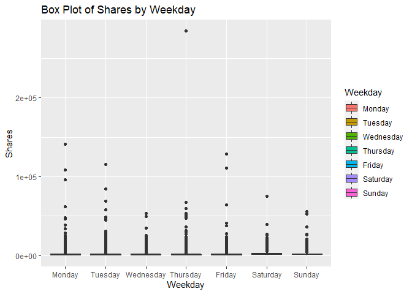
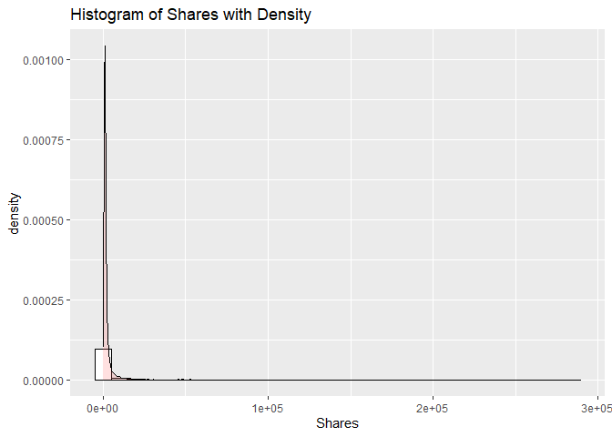

ST 558 Project 3
================
Melanie Kahn & Rachel Hardy
2022-11-14

-   <a href="#required-libraries" id="toc-required-libraries">Required
    Libraries</a>
-   <a href="#introduction-to-the-data"
    id="toc-introduction-to-the-data">Introduction to the Data</a>
-   <a href="#data" id="toc-data">Data</a>
    -   <a href="#reading-in-the-data" id="toc-reading-in-the-data">Reading in
        the Data</a>
    -   <a href="#modifying-the-data" id="toc-modifying-the-data">Modifying the
        Data</a>
    -   <a href="#splitting-the-data" id="toc-splitting-the-data">Splitting the
        Data</a>
-   <a href="#summarizations" id="toc-summarizations">Summarizations</a>
    -   <a href="#summary-statistics" id="toc-summary-statistics">Summary
        Statistics</a>
    -   <a href="#contingency-tables" id="toc-contingency-tables">Contingency
        Tables</a>
    -   <a href="#graphical-summaries" id="toc-graphical-summaries">Graphical
        Summaries</a>
        -   <a href="#bar-plot" id="toc-bar-plot">Bar Plot</a>
        -   <a href="#box-plot" id="toc-box-plot">Box Plot</a>
        -   <a href="#histograms" id="toc-histograms">Histograms</a>
        -   <a href="#scatter-plots" id="toc-scatter-plots">Scatter Plots</a>
-   <a href="#modeling" id="toc-modeling">Modeling</a>
    -   <a href="#linear-regression" id="toc-linear-regression">Linear
        Regression</a>
    -   <a href="#random-forest" id="toc-random-forest">Random Forest</a>
    -   <a href="#boosted-tree" id="toc-boosted-tree">Boosted Tree</a>
-   <a href="#comparison" id="toc-comparison">Comparison</a>

# Required Libraries

Running the code chunk below loads the `tidyverse`, `readr`, `ggplot2`,
`shiny`, `caret`, and `rmarkdown` packages.

``` r
library(tidyverse)
library(readr)
library(ggplot2)
library(shiny)
library(caret)
library(rmarkdown)
```

# Introduction to the Data

The online news popularity data used for this project summarizes a
diverse set of features about articles published by
[Mashable](http://www.mashable.com) over a two year period with the goal
of predicting the number of shares in social networks - a proxy for
popularity.

The original online news popularity data set included 58 predictive
variables, 2 non-predictive variables, 1 target variable. For the
purposes of this project, we are only using 14 non-predictive variables,
keeping the same target variable.

The variables present for each observation in this subset of the online
news popularity data set are as follows:

Non-Predictive Variables:

-   `url` - URL of the article  
-   `timedelta` - The number of days between the article publication and
    the data set acquisition

Predictive Variables:

-   `data_channel_is_*` - Binary variable indicating the type of data
    channel
    -   `lifestyle` - Lifestyle  
    -   `entertainment` - Entertainment  
    -   `bus` - Business  
    -   `socmed` - Social Media  
    -   `tech` - Tech  
    -   `world` - World  
-   `is_weekend` - Binary variable indicating if the article published
    on the weekend  
-   `weekday` - What day of the week the article was published (factor
    variable with seven levels)  
-   `num_imgs` - The number of images in the article  
-   `num_keywords` - The number of keywords in the metadata  
-   `n_tokens_title` - The number of words in the title  
-   `title_subjectivity` - Score of 0 - 1 indicating how subjective the
    title of the article is  
-   `global_subjectivity` - Score of 0 - 1 indicating how subjective the
    text of the article is

Target Variable:

-   `shares` - Number of shares

The purpose of the following analysis is to create predictive models for
this data set and find which one performs the best. After splitting the
data into a training and test set, the performance of a simple linear
regression model, a multiple regression model, a random forest model,
and a boosted tree model will be compared based on the root-mean-square
error (RMSE) calculation. The best model will have the smallest RMSE
from the test set. This process will be done across each data channel
(lifestyle,entertainment, business, social media, tech, and world) using
automated RMarkdown reports.

# Data

## Reading in the Data

Running the code chunk below reads in the online news popularity data
set using `read_csv()`.

``` r
newsOriginal <- read_csv(file = "./OnlineNewsPopularity.csv")
newsOriginal
```

    ## # A tibble: 39,644 × 61
    ##    url      timed…¹ n_tok…² n_tok…³ n_uni…⁴ n_non…⁵ n_non…⁶ num_h…⁷ num_s…⁸ num_i…⁹ num_v…˟ avera…˟ num_k…˟ data_…˟ data_…˟ data_…˟ data_…˟ data_…˟
    ##    <chr>      <dbl>   <dbl>   <dbl>   <dbl>   <dbl>   <dbl>   <dbl>   <dbl>   <dbl>   <dbl>   <dbl>   <dbl>   <dbl>   <dbl>   <dbl>   <dbl>   <dbl>
    ##  1 http://…     731      12     219   0.664    1.00   0.815       4       2       1       0    4.68       5       0       1       0       0       0
    ##  2 http://…     731       9     255   0.605    1.00   0.792       3       1       1       0    4.91       4       0       0       1       0       0
    ##  3 http://…     731       9     211   0.575    1.00   0.664       3       1       1       0    4.39       6       0       0       1       0       0
    ##  4 http://…     731       9     531   0.504    1.00   0.666       9       0       1       0    4.40       7       0       1       0       0       0
    ##  5 http://…     731      13    1072   0.416    1.00   0.541      19      19      20       0    4.68       7       0       0       0       0       1
    ##  6 http://…     731      10     370   0.560    1.00   0.698       2       2       0       0    4.36       9       0       0       0       0       1
    ##  7 http://…     731       8     960   0.418    1.00   0.550      21      20      20       0    4.65      10       1       0       0       0       0
    ##  8 http://…     731      12     989   0.434    1.00   0.572      20      20      20       0    4.62       9       0       0       0       0       1
    ##  9 http://…     731      11      97   0.670    1.00   0.837       2       0       0       0    4.86       7       0       0       0       0       1
    ## 10 http://…     731      10     231   0.636    1.00   0.797       4       1       1       1    5.09       5       0       0       0       0       0
    ## # … with 39,634 more rows, 43 more variables: data_channel_is_world <dbl>, kw_min_min <dbl>, kw_max_min <dbl>, kw_avg_min <dbl>, kw_min_max <dbl>,
    ## #   kw_max_max <dbl>, kw_avg_max <dbl>, kw_min_avg <dbl>, kw_max_avg <dbl>, kw_avg_avg <dbl>, self_reference_min_shares <dbl>,
    ## #   self_reference_max_shares <dbl>, self_reference_avg_sharess <dbl>, weekday_is_monday <dbl>, weekday_is_tuesday <dbl>,
    ## #   weekday_is_wednesday <dbl>, weekday_is_thursday <dbl>, weekday_is_friday <dbl>, weekday_is_saturday <dbl>, weekday_is_sunday <dbl>,
    ## #   is_weekend <dbl>, LDA_00 <dbl>, LDA_01 <dbl>, LDA_02 <dbl>, LDA_03 <dbl>, LDA_04 <dbl>, global_subjectivity <dbl>,
    ## #   global_sentiment_polarity <dbl>, global_rate_positive_words <dbl>, global_rate_negative_words <dbl>, rate_positive_words <dbl>,
    ## #   rate_negative_words <dbl>, avg_positive_polarity <dbl>, min_positive_polarity <dbl>, max_positive_polarity <dbl>, …

## Modifying the Data

Running the code chunk below subsets the data to only include
observations for the data channel we’re interested in.

``` r
news <- newsOriginal %>% filter(get(params$dataChannel) == 1)
news
```

    ## # A tibble: 8,427 × 61
    ##    url      timed…¹ n_tok…² n_tok…³ n_uni…⁴ n_non…⁵ n_non…⁶ num_h…⁷ num_s…⁸ num_i…⁹ num_v…˟ avera…˟ num_k…˟ data_…˟ data_…˟ data_…˟ data_…˟ data_…˟
    ##    <chr>      <dbl>   <dbl>   <dbl>   <dbl>   <dbl>   <dbl>   <dbl>   <dbl>   <dbl>   <dbl>   <dbl>   <dbl>   <dbl>   <dbl>   <dbl>   <dbl>   <dbl>
    ##  1 http://…     731      10     231   0.636    1.00   0.797       4       1       1       1    5.09       5       0       0       0       0       0
    ##  2 http://…     731       9    1248   0.490    1.00   0.732      11       0       1       0    4.62       8       0       0       0       0       0
    ##  3 http://…     731      12     682   0.460    1.00   0.635      10       0       1       0    4.62       6       0       0       0       0       0
    ##  4 http://…     731       9     391   0.510    1.00   0.650       9       2       1       1    5.30       7       0       0       0       0       0
    ##  5 http://…     731      11     125   0.675    1.00   0.797       1       1       1       0    4.82       6       0       0       0       0       0
    ##  6 http://…     731      11     799   0.504    1.00   0.738       8       6       1       0    4.70       6       0       0       0       0       0
    ##  7 http://…     731      11     317   0.611    1.00   0.729       7       6       1       0    5.24       5       0       0       0       0       0
    ##  8 http://…     731      11     399   0.598    1.00   0.806       8       0       1       0    4.58       7       0       0       0       0       0
    ##  9 http://…     731       9     443   0.467    1.00   0.589       3       1       1       0    5.01       6       0       0       0       0       0
    ## 10 http://…     730      12     288   0.589    1.00   0.726       5       2       0       0    4.38       6       0       0       0       0       0
    ## # … with 8,417 more rows, 43 more variables: data_channel_is_world <dbl>, kw_min_min <dbl>, kw_max_min <dbl>, kw_avg_min <dbl>, kw_min_max <dbl>,
    ## #   kw_max_max <dbl>, kw_avg_max <dbl>, kw_min_avg <dbl>, kw_max_avg <dbl>, kw_avg_avg <dbl>, self_reference_min_shares <dbl>,
    ## #   self_reference_max_shares <dbl>, self_reference_avg_sharess <dbl>, weekday_is_monday <dbl>, weekday_is_tuesday <dbl>,
    ## #   weekday_is_wednesday <dbl>, weekday_is_thursday <dbl>, weekday_is_friday <dbl>, weekday_is_saturday <dbl>, weekday_is_sunday <dbl>,
    ## #   is_weekend <dbl>, LDA_00 <dbl>, LDA_01 <dbl>, LDA_02 <dbl>, LDA_03 <dbl>, LDA_04 <dbl>, global_subjectivity <dbl>,
    ## #   global_sentiment_polarity <dbl>, global_rate_positive_words <dbl>, global_rate_negative_words <dbl>, rate_positive_words <dbl>,
    ## #   rate_negative_words <dbl>, avg_positive_polarity <dbl>, min_positive_polarity <dbl>, max_positive_polarity <dbl>, …

Running the code chunk below creates the categorical variable `weekday`
to the data set that tells us what day of the week the article was
published.

``` r
news <- news %>% mutate(weekday = if_else((weekday_is_monday == 1), "Monday",
                                  if_else((weekday_is_tuesday == 1), "Tuesday", 
                                  if_else((weekday_is_wednesday == 1), "Wednesday", 
                                  if_else((weekday_is_thursday == 1), "Thursday", 
                                  if_else((weekday_is_friday == 1), "Friday",
                                  if_else((weekday_is_saturday == 1), "Saturday", 
                                  if_else((weekday_is_sunday == 1), "Sunday", " ")))))))) %>%
                 select(url, shares, weekday, everything())

news$weekday <- factor(news$weekday, levels=c("Monday", "Tuesday", "Wednesday",
                                              "Thursday", "Friday", "Saturday", "Sunday"))
levels(news$weekday)
```

    ## [1] "Monday"    "Tuesday"   "Wednesday" "Thursday"  "Friday"    "Saturday"  "Sunday"

``` r
news
```

    ## # A tibble: 8,427 × 62
    ##    url       shares weekday timed…¹ n_tok…² n_tok…³ n_uni…⁴ n_non…⁵ n_non…⁶ num_h…⁷ num_s…⁸ num_i…⁹ num_v…˟ avera…˟ num_k…˟ data_…˟ data_…˟ data_…˟
    ##    <chr>      <dbl> <fct>     <dbl>   <dbl>   <dbl>   <dbl>   <dbl>   <dbl>   <dbl>   <dbl>   <dbl>   <dbl>   <dbl>   <dbl>   <dbl>   <dbl>   <dbl>
    ##  1 http://m…    710 Monday      731      10     231   0.636    1.00   0.797       4       1       1       1    5.09       5       0       0       0
    ##  2 http://m…   2200 Monday      731       9    1248   0.490    1.00   0.732      11       0       1       0    4.62       8       0       0       0
    ##  3 http://m…   1600 Monday      731      12     682   0.460    1.00   0.635      10       0       1       0    4.62       6       0       0       0
    ##  4 http://m…    598 Monday      731       9     391   0.510    1.00   0.650       9       2       1       1    5.30       7       0       0       0
    ##  5 http://m…   1500 Monday      731      11     125   0.675    1.00   0.797       1       1       1       0    4.82       6       0       0       0
    ##  6 http://m…    504 Monday      731      11     799   0.504    1.00   0.738       8       6       1       0    4.70       6       0       0       0
    ##  7 http://m…   1800 Monday      731      11     317   0.611    1.00   0.729       7       6       1       0    5.24       5       0       0       0
    ##  8 http://m…   1200 Monday      731      11     399   0.598    1.00   0.806       8       0       1       0    4.58       7       0       0       0
    ##  9 http://m…    495 Monday      731       9     443   0.467    1.00   0.589       3       1       1       0    5.01       6       0       0       0
    ## 10 http://m…    755 Tuesday     730      12     288   0.589    1.00   0.726       5       2       0       0    4.38       6       0       0       0
    ## # … with 8,417 more rows, 44 more variables: data_channel_is_socmed <dbl>, data_channel_is_tech <dbl>, data_channel_is_world <dbl>,
    ## #   kw_min_min <dbl>, kw_max_min <dbl>, kw_avg_min <dbl>, kw_min_max <dbl>, kw_max_max <dbl>, kw_avg_max <dbl>, kw_min_avg <dbl>,
    ## #   kw_max_avg <dbl>, kw_avg_avg <dbl>, self_reference_min_shares <dbl>, self_reference_max_shares <dbl>, self_reference_avg_sharess <dbl>,
    ## #   weekday_is_monday <dbl>, weekday_is_tuesday <dbl>, weekday_is_wednesday <dbl>, weekday_is_thursday <dbl>, weekday_is_friday <dbl>,
    ## #   weekday_is_saturday <dbl>, weekday_is_sunday <dbl>, is_weekend <dbl>, LDA_00 <dbl>, LDA_01 <dbl>, LDA_02 <dbl>, LDA_03 <dbl>, LDA_04 <dbl>,
    ## #   global_subjectivity <dbl>, global_sentiment_polarity <dbl>, global_rate_positive_words <dbl>, global_rate_negative_words <dbl>,
    ## #   rate_positive_words <dbl>, rate_negative_words <dbl>, avg_positive_polarity <dbl>, min_positive_polarity <dbl>, max_positive_polarity <dbl>, …

## Splitting the Data

Running the code chunk below splits the modified `news` data set into a
training and testing set using `createDataPartition()`. First the seed
is set to make sure the random sampling will be reproducible.
`createDataPartition()` then creates an indexing vector (`trainIndex`)
with a subset of the `shares` variable where the training subset
(`newsTrain`) will result in a vector (`list = FALSE`) that has
approximately 70% (`p = 0.7`) of the observations from the updated
`news` data set. This training vector is then used to create the
training set (`newsTrain`) with approximately 70% of the observations
from the updated `news` data set, and the test set (`newsTest`) with the
remaining 30% of the observations.

``` r
set.seed(100)
newsIndex <- createDataPartition(news$shares, p = 0.7, list = FALSE)

newsTrain <- news[newsIndex, ]
newsTest <- news[-newsIndex, ]

newsTrain
```

    ## # A tibble: 5,900 × 62
    ##    url       shares weekday timed…¹ n_tok…² n_tok…³ n_uni…⁴ n_non…⁵ n_non…⁶ num_h…⁷ num_s…⁸ num_i…⁹ num_v…˟ avera…˟ num_k…˟ data_…˟ data_…˟ data_…˟
    ##    <chr>      <dbl> <fct>     <dbl>   <dbl>   <dbl>   <dbl>   <dbl>   <dbl>   <dbl>   <dbl>   <dbl>   <dbl>   <dbl>   <dbl>   <dbl>   <dbl>   <dbl>
    ##  1 http://m…    710 Monday      731      10     231   0.636    1.00   0.797       4       1       1       1    5.09       5       0       0       0
    ##  2 http://m…   1600 Monday      731      12     682   0.460    1.00   0.635      10       0       1       0    4.62       6       0       0       0
    ##  3 http://m…    598 Monday      731       9     391   0.510    1.00   0.650       9       2       1       1    5.30       7       0       0       0
    ##  4 http://m…   1500 Monday      731      11     125   0.675    1.00   0.797       1       1       1       0    4.82       6       0       0       0
    ##  5 http://m…    504 Monday      731      11     799   0.504    1.00   0.738       8       6       1       0    4.70       6       0       0       0
    ##  6 http://m…   1800 Monday      731      11     317   0.611    1.00   0.729       7       6       1       0    5.24       5       0       0       0
    ##  7 http://m…   1200 Monday      731      11     399   0.598    1.00   0.806       8       0       1       0    4.58       7       0       0       0
    ##  8 http://m…    495 Monday      731       9     443   0.467    1.00   0.589       3       1       1       0    5.01       6       0       0       0
    ##  9 http://m…    755 Tuesday     730      12     288   0.589    1.00   0.726       5       2       0       0    4.38       6       0       0       0
    ## 10 http://m…    468 Tuesday     730      10     414   0.607    1.00   0.777       8       0       1       0    4.98       6       0       0       0
    ## # … with 5,890 more rows, 44 more variables: data_channel_is_socmed <dbl>, data_channel_is_tech <dbl>, data_channel_is_world <dbl>,
    ## #   kw_min_min <dbl>, kw_max_min <dbl>, kw_avg_min <dbl>, kw_min_max <dbl>, kw_max_max <dbl>, kw_avg_max <dbl>, kw_min_avg <dbl>,
    ## #   kw_max_avg <dbl>, kw_avg_avg <dbl>, self_reference_min_shares <dbl>, self_reference_max_shares <dbl>, self_reference_avg_sharess <dbl>,
    ## #   weekday_is_monday <dbl>, weekday_is_tuesday <dbl>, weekday_is_wednesday <dbl>, weekday_is_thursday <dbl>, weekday_is_friday <dbl>,
    ## #   weekday_is_saturday <dbl>, weekday_is_sunday <dbl>, is_weekend <dbl>, LDA_00 <dbl>, LDA_01 <dbl>, LDA_02 <dbl>, LDA_03 <dbl>, LDA_04 <dbl>,
    ## #   global_subjectivity <dbl>, global_sentiment_polarity <dbl>, global_rate_positive_words <dbl>, global_rate_negative_words <dbl>,
    ## #   rate_positive_words <dbl>, rate_negative_words <dbl>, avg_positive_polarity <dbl>, min_positive_polarity <dbl>, max_positive_polarity <dbl>, …

``` r
newsTest
```

    ## # A tibble: 2,527 × 62
    ##    url       shares weekday timed…¹ n_tok…² n_tok…³ n_uni…⁴ n_non…⁵ n_non…⁶ num_h…⁷ num_s…⁸ num_i…⁹ num_v…˟ avera…˟ num_k…˟ data_…˟ data_…˟ data_…˟
    ##    <chr>      <dbl> <fct>     <dbl>   <dbl>   <dbl>   <dbl>   <dbl>   <dbl>   <dbl>   <dbl>   <dbl>   <dbl>   <dbl>   <dbl>   <dbl>   <dbl>   <dbl>
    ##  1 http://m…   2200 Monday      731       9    1248   0.490    1.00   0.732      11       0       1       0    4.62       8       0       0       0
    ##  2 http://m…    971 Wednes…     729      10     498   0.535    1.00   0.702       7       0       1       0    4.88       6       0       0       0
    ##  3 http://m…   1400 Wednes…     729      12     540   0.370    1.00   0.505       1       1      10       0    4.15      10       0       0       0
    ##  4 http://m…   5600 Wednes…     729       6     389   0.556    1.00   0.726       9       5       1       1    4.32       7       0       0       0
    ##  5 http://m…    412 Wednes…     729      12     537   0.538    1.00   0.742       2       0       1       0    4.98       6       0       0       0
    ##  6 http://m…    373 Wednes…     729      10     614   0.531    1.00   0.750      11       2       1       0    4.76       4       0       0       0
    ##  7 http://m…   2800 Wednes…     729      10     372   0.549    1.00   0.689       4       0       1       0    5.03       5       0       0       0
    ##  8 http://m…    450 Wednes…     729       9     230   0.670    1.00   0.879       7       0       1       1    4.80       7       0       0       0
    ##  9 http://m…    529 Wednes…     729      11     365   0.581    1.00   0.742       9       8       1       0    4.70       7       0       0       0
    ## 10 http://m…   5500 Thursd…     728      10     317   0.562    1.00   0.674       6       3       1       0    4.99       7       0       0       0
    ## # … with 2,517 more rows, 44 more variables: data_channel_is_socmed <dbl>, data_channel_is_tech <dbl>, data_channel_is_world <dbl>,
    ## #   kw_min_min <dbl>, kw_max_min <dbl>, kw_avg_min <dbl>, kw_min_max <dbl>, kw_max_max <dbl>, kw_avg_max <dbl>, kw_min_avg <dbl>,
    ## #   kw_max_avg <dbl>, kw_avg_avg <dbl>, self_reference_min_shares <dbl>, self_reference_max_shares <dbl>, self_reference_avg_sharess <dbl>,
    ## #   weekday_is_monday <dbl>, weekday_is_tuesday <dbl>, weekday_is_wednesday <dbl>, weekday_is_thursday <dbl>, weekday_is_friday <dbl>,
    ## #   weekday_is_saturday <dbl>, weekday_is_sunday <dbl>, is_weekend <dbl>, LDA_00 <dbl>, LDA_01 <dbl>, LDA_02 <dbl>, LDA_03 <dbl>, LDA_04 <dbl>,
    ## #   global_subjectivity <dbl>, global_sentiment_polarity <dbl>, global_rate_positive_words <dbl>, global_rate_negative_words <dbl>,
    ## #   rate_positive_words <dbl>, rate_negative_words <dbl>, avg_positive_polarity <dbl>, min_positive_polarity <dbl>, max_positive_polarity <dbl>, …

# Summarizations

## Summary Statistics

Running the code chunk below provides the mean and standard deviation
for the number of times articles in the `news` data set were shared
(`shares`).

``` r
mean(news$shares)
```

    ## [1] 2287.734

``` r
sd(news$shares)
```

    ## [1] 6089.669

Running the code chunk below provides the mean and standard deviation
for the number of images per article (`num_imgs`) in the `news` data
set.

``` r
mean(news$num_imgs)
```

    ## [1] 2.841225

``` r
sd(news$num_imgs)
```

    ## [1] 5.217095

Running the code chunk below provides the mean and standard deviation
for the number of keywords per article (`num_keywords`) in the `news`
data set.

``` r
mean(news$num_keywords)
```

    ## [1] 7.289664

``` r
sd(news$num_keywords)
```

    ## [1] 1.883377

## Contingency Tables

Running the code chunk below creates a contingency table showing the
number of articles in the online `news` popularity data set that were
published on the weekend (`is_weekend`).

``` r
tableWeekend <- table(news$is_weekend)
tableWeekend
```

    ## 
    ##    0    1 
    ## 7341 1086

From the table **above**, we can see that 1086 articles were published
on the weekend, and 7341 articles were published during the week.

Running the code chunk below creates a contingency table showing the
number of articles in the online `news` popularity data set that were
published on certain days of the week (`weekday`).

``` r
tableWeekday <- table(news$weekday)
tableWeekday
```

    ## 
    ##    Monday   Tuesday Wednesday  Thursday    Friday  Saturday    Sunday 
    ##      1356      1546      1565      1569      1305       519       567

From the table **above**, we can see that 1356 articles were published
on Monday, 1086 were published on Tuesday, NA on Wednesday, NA on
Thursday, NA on Friday, NA on Saturday, NA articles were published on
Sunday.

## Graphical Summaries

### Bar Plot

Running the code chunk below creates a bar plot to visualize the number
of articles published per each `weekday`. Using the aesthetics option
`aes(fill = weekday)` inside the `geom_bar()` function gives us a nicely
colored graph.

``` r
g <- ggplot(news, aes(x = weekday))

g + geom_bar(aes(fill = weekday)) + 
  labs(title = "Number of Articles Published by Weekday", x = "Weekday") +
  scale_fill_discrete(name = "Weekday")
```

<!-- -->

### Box Plot

Running the code chunk below creates a box plot of number of `shares`
for each `weekday`. Using the aesthetics option ‘fill = weekday’ gives
us a nicely colored graph.

``` r
g <- ggplot(news, aes(x = weekday, y = shares))

g + geom_boxplot(aes(fill = weekday)) + 
  labs(title = "Box Plot of Shares by Weekday", x = "Weekday", y = "Shares") +
  scale_fill_discrete(name = "Weekday")
```

<!-- -->

### Histograms

Running the code chunk below creates two histograms of the number of
`shares` that show us the distribution of the variable. The second
histogram has an added density layer to give us a better idea of how the
data is spread out.

``` r
g <- ggplot(news, aes(x = shares))

g + geom_histogram(color = "black", fill = "#FF6666") + labs(title = "Histogram of Shares") +
  labs(title = "Histogram of Shares", x = "Shares")
```

<!-- -->

``` r
g + geom_histogram(aes(y=..density..), colour="black", fill="white") + 
  geom_density(alpha=.2, fill="#FF6666") + 
  labs(title = "Histogram of Shares with Density", x = "Shares")
```

<!-- -->

### Scatter Plots

Running the code chunk below creates a scatter plot to visualize the
correlation between the text subjectivity (`global_subjectivity`) and
the number of images (`num_imgs`) articles have. The `geom_point()`
function plots the data points while the `geom_smooth()` function plots
the regression line using method `lm` for linear model.

Using this linear regression line on the scatter plot *below* helps
quantify the direction and strength of the relationship between the text
subjectivity on the x-axis and the number of images on the y-axis.
Results showing a regression line starting lower on the y-axis than it
ends (a *positive* slope) represents a *positive* linear correlation
between an article’s overall subjectivity and the number of images
used - if one increases, so does the other. Results showing a regression
line starting higher on the y-axis than it ends (a *negative* slope)
represents a *negative* linear correlation between the two, meaning the
trend in the data shows a higher number of images reduces subjectivity
in an article. The steepness of the slope associated with this
regression line indicates the strength of the variable relationship. The
closer a regression line gets to horizontal, the weaker the correlation
between the subjectivity and images; and vice versa.

``` r
g <- ggplot(news, aes(x = global_subjectivity, y = num_imgs))
g + geom_point() +
  geom_smooth(method = lm, col = "Blue", se = FALSE) +
  labs(title = "Relationship Between Text Subjectivity and Number of Images",
       x = "Text Subjectivity",
       y = "Number of Images")
```

<!-- -->

Running the code chunk below creates a scatter plot to visualize the
correlation between the number of `shares` and the number of keywords
(`num_keywords`) articles have. `geom_jitter` is used instead of
`geom_point()` to plot the data points in a manner where the `weekday`
component can be better visualized. The `geom_smooth()` function plots
the regression line using method `lm` for linear model.

Using this linear regression line on the scatter plot *below* helps
quantify the direction and strength of the relationship between the
number of shares on the x-axis and the number of keywords on the y-axis.
Results showing a regression line starting lower on the y-axis than it
ends (a *positive* slope) represents a *positive* linear correlation
between an article’s number of shares and the number of keywords used -
if one increases, so does the other. Results showing a regression line
starting higher on the y-axis than it ends (a *negative* slope)
represents a *negative* linear correlation between the two, meaning the
trend in the data shows a higher number of keywords reduces the number
of times an article is shared. The steepness of the slope associated
with this regression line indicates the strength of the variable
relationship. The closer a regression line gets to horizontal, the
weaker the correlation between the popularity and keywords; and vice
versa. As one of the default arguments for the `geom_smooth` function is
`se = TRUE`, a 95% confidence interval can also be seen. Wider
confidence intervals indicate increased uncertainty of the effect the
variables have on each other.

``` r
g <- ggplot(news, aes(x = shares, y = num_keywords))
g + geom_jitter(aes(color = weekday)) +
  geom_smooth(method = lm, col = "Blue") +
  labs(title = "Relationship Between Popularity and Number of Keywords",
       x = "Shares",
       y = "Number of Keywords")
```

<!-- -->

Running the code chunk below creates a facet grid scatter plot to
visualize the correlation between the number of words in the article’s
title (`n_tokens_title`) and title’s subjectivity score
(`title_subjectivity`) according to the day the article was published
(`weekday`). The `geom_point()` function plots the data points while the
`geom_smooth()` function plots the regression line using method `lm` for
linear model.

Using this linear regression line on the scatter plot *below* helps
quantify the direction and strength of the relationship between the
title subjectivity on the x-axis and the number of words in the title on
the y-axis. Results showing a regression line starting lower on the
y-axis than it ends (a *positive* slope) represents a *positive* linear
correlation between a title’s subjectivity and length - if one
increases, so does the other. Results showing a regression line starting
higher on the y-axis than it ends (a *negative* slope) represents a
*negative* linear correlation between the two, meaning the trend in the
data shows a higher number of words reduces title subjectivity. The
steepness of the slope associated with this regression line indicates
the strength of the variable relationship. The closer a regression line
gets to horizontal, the weaker the correlation between the title
subjectivity and length; and vice versa. The 95% confidence intervals
may be harder to see due to the faceted nature of these plots, but wider
confidence intervals still indicate increased uncertainty of the effect
the variables have on each other.

``` r
g <- ggplot(news, aes(x = title_subjectivity, y = n_tokens_title))
g + geom_point(aes(color = weekday)) +
  facet_grid(~ weekday) +
  geom_smooth(method = lm, col = "Blue") +
  labs(title = "Relationship Between Title Subjectivity and Length",
       x = "Title Subjectivity",
       y = "Number of Words in Title")
```

<!-- -->

# Modeling

## Linear Regression

Linear regression attempts to model the (linear) relationship between a
response variable and one or more predictor variables by fitting a
linear equation to the data. The simplest form of the linear equation is
`Y = a + bX`, where `Y` is the response variable, `a` is the intercept,
`b` is the slope, and `X` is the predictor (or explanatory) variable.
The most common method for fitting a regression model is least-squares
regression, where the best-fitting line is calculated by minimizing the
sum of the squared residuals.

For linear regression, it is usually important to understand which
variables are related and which variables scientifically should be in
the model. It is also important to split the data into a training set
and a testing set so the model does not become over-fit.

Running the code chunk below creates a multiple linear regression model
where `shares` is the response variable and the predictor variables are
`weekday`, `title_subjectivity`, `num_imgs`, `title_subjectivity^2`, and
`num_imgs^2`.

By using the `summary()` function, we can see the values for the
residuals and coefficients, as well as the performance criteria values
such as multiple R-squared.

``` r
set.seed(100)
firstLinearModel <- train(shares ~ weekday + title_subjectivity + num_imgs + I(title_subjectivity^2) + I(num_imgs^2), 
                        data = newsTrain,
                        method = "lm",
                        preProcess = c("center", "scale"),
                        trControl = trainControl(method = "cv"))
firstLinearModel
```

    ## Linear Regression 
    ## 
    ## 5900 samples
    ##    3 predictor
    ## 
    ## Pre-processing: centered (10), scaled (10) 
    ## Resampling: Cross-Validated (10 fold) 
    ## Summary of sample sizes: 5310, 5310, 5310, 5311, 5309, 5310, ... 
    ## Resampling results:
    ## 
    ##   RMSE      Rsquared  MAE     
    ##   6142.105  0.010266  2003.896
    ## 
    ## Tuning parameter 'intercept' was held constant at a value of TRUE

``` r
summary(firstLinearModel)
```

    ## 
    ## Call:
    ## lm(formula = .outcome ~ ., data = dat)
    ## 
    ## Residuals:
    ##    Min     1Q Median     3Q    Max 
    ##  -5485  -1473  -1041   -359 282373 
    ## 
    ## Coefficients:
    ##                           Estimate Std. Error t value Pr(>|t|)    
    ## (Intercept)                2331.18      86.55  26.933  < 2e-16 ***
    ## weekdayTuesday             -140.74     115.14  -1.222 0.221631    
    ## weekdayWednesday           -274.51     114.91  -2.389 0.016934 *  
    ## weekdayThursday             -39.21     115.22  -0.340 0.733661    
    ## weekdayFriday              -130.61     111.44  -1.172 0.241249    
    ## weekdaySaturday              80.80      98.73   0.818 0.413171    
    ## weekdaySunday               -19.07      99.73  -0.191 0.848355    
    ## title_subjectivity          235.23     264.09   0.891 0.373122    
    ## num_imgs                    617.11     165.79   3.722 0.000199 ***
    ## `I(title_subjectivity^2)`   -45.98     264.15  -0.174 0.861815    
    ## `I(num_imgs^2)`            -144.79     165.72  -0.874 0.382319    
    ## ---
    ## Signif. codes:  0 '***' 0.001 '**' 0.01 '*' 0.05 '.' 0.1 ' ' 1
    ## 
    ## Residual standard error: 6648 on 5889 degrees of freedom
    ## Multiple R-squared:  0.008338,   Adjusted R-squared:  0.006655 
    ## F-statistic: 4.952 on 10 and 5889 DF,  p-value: 3.522e-07

Now that the multiple linear regression model has been trained
(`firstLinearModel`), running the code chunk below will check how well
the model does on the test set `newsTest` using the `postResample()`
function. The RMSE from the `postResample` output is then stored in an
object `firstLinearRMSE` for later use in our comparison functions.

``` r
firstLinearPredict <- predict(firstLinearModel, newdata = newsTest)

firstLinearPerformance <- postResample(firstLinearPredict, newsTest$shares)
firstLinearPerformance
```

    ##         RMSE     Rsquared          MAE 
    ## 4.429633e+03 9.829830e-03 1.867803e+03

``` r
attributes(firstLinearPerformance)
```

    ## $names
    ## [1] "RMSE"     "Rsquared" "MAE"

``` r
firstLinearRMSE <- firstLinearPerformance[1]
firstLinearRMSE
```

    ##     RMSE 
    ## 4429.633

Running the code chunk below creates a simple linear regression model
where `shares` is the response variable and the predictor variables are
`weekday`, `num_imgs`, `num_keywords`, `n_tokens_title`,
`title_subjectivity`, and `global_subjectivity`. The `summary()`
function is used to examine the values for the residuals and
coefficients, as well as the performance criteria values such as
multiple R-squared.

``` r
set.seed(100)
secondLinearModel <- train(shares ~ weekday + num_imgs + num_keywords + n_tokens_title + title_subjectivity + global_subjectivity, 
                        data = newsTrain,
                        method = "lm",
                        preProcess = c("center", "scale"),
                        trControl = trainControl(method = "cv"))
secondLinearModel
```

    ## Linear Regression 
    ## 
    ## 5900 samples
    ##    6 predictor
    ## 
    ## Pre-processing: centered (11), scaled (11) 
    ## Resampling: Cross-Validated (10 fold) 
    ## Summary of sample sizes: 5310, 5310, 5310, 5311, 5309, 5310, ... 
    ## Resampling results:
    ## 
    ##   RMSE      Rsquared    MAE     
    ##   6136.275  0.01126277  2011.158
    ## 
    ## Tuning parameter 'intercept' was held constant at a value of TRUE

``` r
summary(secondLinearModel)
```

    ## 
    ## Call:
    ## lm(formula = .outcome ~ ., data = dat)
    ## 
    ## Residuals:
    ##    Min     1Q Median     3Q    Max 
    ##  -6972  -1527   -997   -257 281878 
    ## 
    ## Coefficients:
    ##                     Estimate Std. Error t value Pr(>|t|)    
    ## (Intercept)          2331.18      86.40  26.981  < 2e-16 ***
    ## weekdayTuesday       -145.57     114.93  -1.267  0.20535    
    ## weekdayWednesday     -279.44     114.74  -2.435  0.01491 *  
    ## weekdayThursday       -42.34     115.04  -0.368  0.71282    
    ## weekdayFriday        -143.25     111.27  -1.287  0.19803    
    ## weekdaySaturday        79.22      98.68   0.803  0.42209    
    ## weekdaySunday         -21.74      99.64  -0.218  0.82729    
    ## num_imgs              542.48      88.21   6.150 8.25e-10 ***
    ## num_keywords          123.93      86.80   1.428  0.15340    
    ## n_tokens_title        285.12      86.81   3.284  0.00103 ** 
    ## title_subjectivity    137.07      87.42   1.568  0.11694    
    ## global_subjectivity   277.66      88.81   3.126  0.00178 ** 
    ## ---
    ## Signif. codes:  0 '***' 0.001 '**' 0.01 '*' 0.05 '.' 0.1 ' ' 1
    ## 
    ## Residual standard error: 6637 on 5888 degrees of freedom
    ## Multiple R-squared:  0.01198,    Adjusted R-squared:  0.01013 
    ## F-statistic: 6.489 on 11 and 5888 DF,  p-value: 7.88e-11

Now that the simple linear regression model has been trained
(`secondLinearModel`), running the code chunk below will check how well
the model does on the test set `newsTest` using the `postResample()`
function. The RMSE from the `postResample` output is then stored in an
object `secondLinearRMSE` for later use in our comparison functions.

``` r
secondLinearPredict <- predict(secondLinearModel, newdata = newsTest)

secondLinearPerformance <- postResample(secondLinearPredict, newsTest$shares)
secondLinearPerformance
```

    ##         RMSE     Rsquared          MAE 
    ## 4.419019e+03 1.531085e-02 1.870856e+03

``` r
attributes(secondLinearPerformance)
```

    ## $names
    ## [1] "RMSE"     "Rsquared" "MAE"

``` r
secondLinearRMSE <- secondLinearPerformance[1]
secondLinearRMSE
```

    ##     RMSE 
    ## 4419.019

## Random Forest

To understand random forests, it is first important to understand bagged
trees which are created using bootstrap aggregation. For bagged trees,
the sample is treated as the population and re-sampling is done with
replacement. The process of creating a bagged tree is below:

-   Step 1: Create a bootstrap sample using `sample()`  
-   Step 2: Train the tree on this sample (no pruning necessary)  
-   Step 3: Repeat B = 1000 times (no set mark)  
-   Step 4: Final prediction is average of these predictions (for
    regression trees) **OR** use majority vote as final classification
    prediction (classification trees)

Random forests are essentially bagged trees, except not all the
predictors are used for each model. A random subset of predictors is
used for each tree model (bootstrap sample). The purpose of doing this
is to prevent one or two strong predictors from dominating all tree
models and creating unwanted correlation between models.

Running the code chunk below trains the random forest model. The formula
notation used in the `train()` function models the `shares` variable
using the following predictor/explanatory variables: `weekday`,
`num_imgs`, and `num_keywords`. To use the random forest model, the
`method` argument was specified as `"rf"`. The data was pre-processed by
centering and scaling. Cross validation was used five-fold and repeated
three (3) times. The argument `tuneGrid` was then used to replicate the
random forest model a total of five (5) times. The best model is then
chosen based on the performance criteria.

``` r
set.seed(100)
randomForestCtrl <- trainControl(method = "repeatedcv", number = 5, repeats = 3)
randomForestFit <- train(shares ~ weekday + num_imgs + num_keywords, 
                         data = newsTrain, method = "rf", 
                         trControl = randomForestCtrl,
                         preProcess = c("center","scale"), 
                         tuneGrid = data.frame(mtry = 1:5))

randomForestFit
```

    ## Random Forest 
    ## 
    ## 5900 samples
    ##    3 predictor
    ## 
    ## Pre-processing: centered (8), scaled (8) 
    ## Resampling: Cross-Validated (5 fold, repeated 3 times) 
    ## Summary of sample sizes: 4720, 4719, 4719, 4721, 4721, 4719, ... 
    ## Resampling results across tuning parameters:
    ## 
    ##   mtry  RMSE      Rsquared     MAE     
    ##   1     6289.750  0.007977672  2002.621
    ##   2     6305.073  0.006308072  2004.037
    ##   3     6364.748  0.004922626  2025.750
    ##   4     6450.594  0.004161797  2063.747
    ##   5     6529.572  0.003524990  2096.927
    ## 
    ## RMSE was used to select the optimal model using the smallest value.
    ## The final value used for the model was mtry = 1.

Now that the random forest model has been trained (`randomForestFit`),
running the code chunk below will check how well the model does on the
test set `newsTest` using the `postResample()` function. The RMSE from
the `postResample` output is then stored in an object `rfRMSE` for later
use in our comparison functions.

``` r
randomForestPredict <- predict(randomForestFit, newdata = newsTest)

randomForestPerformance <- postResample(randomForestPredict, newsTest$shares)
randomForestPerformance
```

    ##         RMSE     Rsquared          MAE 
    ## 4.425226e+03 1.313038e-02 1.863079e+03

``` r
attributes(randomForestPerformance)
```

    ## $names
    ## [1] "RMSE"     "Rsquared" "MAE"

``` r
rfRMSE <- randomForestPerformance[1]
rfRMSE
```

    ##     RMSE 
    ## 4425.226

## Boosted Tree

Boosted trees are another enhancement to the single tree methods.
However, unlike bagged and random forest models, boosted trees do not
use bootstrapping. Boosting is a general method to slowly train your
tree so you don’t overfit your model. The trees are grown in a
sequential manner where each subsequent tree is based off a modified
version of the original data, updating the predictions as the tree is
grown. The process is described below:

-   Step 1: Initialize predictions as 0  
-   Step 2: Find the residuals for every observation
    -   Residuals in first tree fit will be original data values
        (observed - 0 = observed)  
-   Step 3: Fit a regression tree with `d` splits where the residuals
    are the response  
-   Step 4: Update predictions using the new predictions from step 3
    multiplied by the growth rate (Lambda tuning parameter)  
-   Step 5: Continue to update residuals for new predictions (steps 2
    -4) `B` times

Running the code chunk below trains the boosted tree model. The formula
notation used in the `train()` function models the `shares` variable
using the following predictor/explanatory variables: `weekday`,
`num_imgs`, `num_keywords`, `n_tokens_title`, and `title_subjectivity`.
To use the boosted tree model, the `method` argument was specified as
`"gbm"`. The data was pre-processed by centering and scaling. `tuneGrid`
was then used to consider values of `n.trees` = 50, `interaction.depth`
= 1, `shrinkage` = 0.1, and `n.minobsinnode` = 10. Lastly,
`trainControl()` was used within the `trControl` argument to do 10 fold
cross-validation using the `"cv"` `method`.

``` r
boostTreeFit <- train(shares ~ weekday + num_imgs + num_keywords + n_tokens_title + title_subjectivity
                        + global_subjectivity, data = newsTrain,
                        method = "gbm",
                        preProcess = c("center", "scale"),
                        tuneGrid = data.frame(n.trees = 50, interaction.depth = 1, shrinkage = 0.1, n.minobsinnode = 10),
                        trControl = trainControl(method = "cv", number = 10))
```

    ## Iter   TrainDeviance   ValidDeviance   StepSize   Improve
    ##      1 44327796.0858             nan     0.1000 39205.5230
    ##      2 44273977.3478             nan     0.1000 38212.9714
    ##      3 44239628.5356             nan     0.1000 36182.8117
    ##      4 44193105.4415             nan     0.1000 19163.7745
    ##      5 44164656.8618             nan     0.1000 15111.0963
    ##      6 44117719.2380             nan     0.1000 16715.6643
    ##      7 44079544.8802             nan     0.1000 24337.3167
    ##      8 44022344.1432             nan     0.1000 -5755.4261
    ##      9 43984201.9271             nan     0.1000 2959.6420
    ##     10 43945142.7263             nan     0.1000 14315.6550
    ##     20 43673831.0453             nan     0.1000 -1598.3149
    ##     40 43433120.8735             nan     0.1000 3566.3779
    ##     50 43396229.3465             nan     0.1000 -21592.4246
    ## 
    ## Iter   TrainDeviance   ValidDeviance   StepSize   Improve
    ##      1 47669385.4514             nan     0.1000 31952.2157
    ##      2 47581682.0159             nan     0.1000 58371.8326
    ##      3 47517943.1010             nan     0.1000 -14467.0265
    ##      4 47435719.6477             nan     0.1000 23867.1213
    ##      5 47389370.4430             nan     0.1000 7141.3051
    ##      6 47360536.6774             nan     0.1000 18466.9642
    ##      7 47307552.0081             nan     0.1000 20234.8365
    ##      8 47262389.1078             nan     0.1000 15159.5136
    ##      9 47222667.0179             nan     0.1000 29380.5539
    ##     10 47188881.5333             nan     0.1000 -29829.3070
    ##     20 46941979.5167             nan     0.1000 -13444.1623
    ##     40 46734139.4598             nan     0.1000 5113.3480
    ##     50 46648525.8339             nan     0.1000 -21083.7024
    ## 
    ## Iter   TrainDeviance   ValidDeviance   StepSize   Improve
    ##      1 42200853.6847             nan     0.1000 25794.4269
    ##      2 42153538.4434             nan     0.1000 42570.7341
    ##      3 42106181.1872             nan     0.1000 -3445.1603
    ##      4 42063767.9454             nan     0.1000 -16097.2116
    ##      5 42043298.3566             nan     0.1000 -18378.4542
    ##      6 41998225.4792             nan     0.1000 6357.8155
    ##      7 41958595.3887             nan     0.1000 3261.5068
    ##      8 41930325.4100             nan     0.1000 7488.0525
    ##      9 41884295.6970             nan     0.1000 6899.2511
    ##     10 41838450.5588             nan     0.1000 33649.8999
    ##     20 41551610.1602             nan     0.1000 -4372.8180
    ##     40 41270728.0296             nan     0.1000 1180.6984
    ##     50 41197875.8710             nan     0.1000 -44361.2249
    ## 
    ## Iter   TrainDeviance   ValidDeviance   StepSize   Improve
    ##      1 46829026.7623             nan     0.1000 17973.3137
    ##      2 46809682.9745             nan     0.1000 -19444.4926
    ##      3 46747391.6656             nan     0.1000 53168.5953
    ##      4 46695907.8326             nan     0.1000 13348.4954
    ##      5 46651808.9303             nan     0.1000 18880.9583
    ##      6 46601061.3929             nan     0.1000 10825.3545
    ##      7 46558817.7950             nan     0.1000 4437.1888
    ##      8 46519660.1289             nan     0.1000 3476.8494
    ##      9 46464406.8486             nan     0.1000 23544.7332
    ##     10 46422740.6128             nan     0.1000 3556.8294
    ##     20 46161603.7667             nan     0.1000 -1528.4146
    ##     40 45931294.1732             nan     0.1000 -23567.5222
    ##     50 45844380.5696             nan     0.1000 -9764.5972
    ## 
    ## Iter   TrainDeviance   ValidDeviance   StepSize   Improve
    ##      1 43920875.8539             nan     0.1000 36171.9096
    ##      2 43877676.8927             nan     0.1000 -8045.9723
    ##      3 43857300.7822             nan     0.1000 -11296.1487
    ##      4 43803491.6765             nan     0.1000 37426.3470
    ##      5 43753691.4718             nan     0.1000 14028.3961
    ##      6 43704314.1979             nan     0.1000 26374.2487
    ##      7 43667070.2692             nan     0.1000 10876.3384
    ##      8 43620700.7304             nan     0.1000 36145.5327
    ##      9 43576142.9189             nan     0.1000 22127.4979
    ##     10 43538412.9623             nan     0.1000 33191.0508
    ##     20 43279620.7405             nan     0.1000 1493.6189
    ##     40 42951704.9910             nan     0.1000 -3222.2996
    ##     50 42893506.8293             nan     0.1000 -25709.0293
    ## 
    ## Iter   TrainDeviance   ValidDeviance   StepSize   Improve
    ##      1 46079618.2768             nan     0.1000 4955.6736
    ##      2 46037444.0129             nan     0.1000 3633.2527
    ##      3 45978172.4262             nan     0.1000 55062.3416
    ##      4 45907494.9031             nan     0.1000 41824.9509
    ##      5 45815907.6971             nan     0.1000 -4841.7423
    ##      6 45782183.7947             nan     0.1000 -11744.3393
    ##      7 45716012.8969             nan     0.1000 27812.7024
    ##      8 45665655.0590             nan     0.1000 36255.2479
    ##      9 45628115.2209             nan     0.1000 2174.4029
    ##     10 45597746.0437             nan     0.1000 -23091.8409
    ##     20 45319462.9528             nan     0.1000 -2712.9961
    ##     40 45036316.3815             nan     0.1000 -14757.9186
    ##     50 44951195.4423             nan     0.1000 1333.1338
    ## 
    ## Iter   TrainDeviance   ValidDeviance   StepSize   Improve
    ##      1 47754957.8951             nan     0.1000 19625.8954
    ##      2 47686339.2183             nan     0.1000 57617.1957
    ##      3 47599517.1612             nan     0.1000 40081.6921
    ##      4 47547615.2321             nan     0.1000 12410.4317
    ##      5 47496340.5993             nan     0.1000 17713.8203
    ##      6 47447961.2635             nan     0.1000 24769.6211
    ##      7 47410000.0621             nan     0.1000 15858.0026
    ##      8 47353893.9275             nan     0.1000 45619.5752
    ##      9 47309798.3916             nan     0.1000 37112.0567
    ##     10 47289665.1292             nan     0.1000 -27311.9445
    ##     20 47024485.8277             nan     0.1000 -21421.7627
    ##     40 46719418.8331             nan     0.1000 -6834.4178
    ##     50 46606603.2732             nan     0.1000 -29476.1385
    ## 
    ## Iter   TrainDeviance   ValidDeviance   StepSize   Improve
    ##      1 47392678.9144             nan     0.1000 -6110.2462
    ##      2 47329319.1938             nan     0.1000 7370.5385
    ##      3 47284620.6421             nan     0.1000 11799.2063
    ##      4 47232108.0337             nan     0.1000 -31865.7933
    ##      5 47200369.0747             nan     0.1000 3220.8901
    ##      6 47098245.3358             nan     0.1000 52860.0658
    ##      7 47035042.3101             nan     0.1000 48664.6530
    ##      8 47004729.8855             nan     0.1000 -21678.2890
    ##      9 46948439.0782             nan     0.1000 17398.4878
    ##     10 46929029.2411             nan     0.1000 -22341.6470
    ##     20 46605759.8145             nan     0.1000 16189.7592
    ##     40 46315666.5717             nan     0.1000 -16843.9379
    ##     50 46247768.5858             nan     0.1000 -9270.5529
    ## 
    ## Iter   TrainDeviance   ValidDeviance   StepSize   Improve
    ##      1 45055246.7548             nan     0.1000 63224.1934
    ##      2 44984031.1405             nan     0.1000 53063.2484
    ##      3 44944711.6372             nan     0.1000 14678.0423
    ##      4 44901262.4007             nan     0.1000 30333.1460
    ##      5 44848016.0571             nan     0.1000 -5316.8204
    ##      6 44789796.8316             nan     0.1000 -498.1963
    ##      7 44730074.0507             nan     0.1000 46524.6484
    ##      8 44707116.5801             nan     0.1000 15240.4996
    ##      9 44669191.3959             nan     0.1000 12388.8174
    ##     10 44629529.5471             nan     0.1000 -31486.0813
    ##     20 44284826.9272             nan     0.1000 -7738.0510
    ##     40 44010376.0150             nan     0.1000 29108.4057
    ##     50 43895205.9233             nan     0.1000 17219.4476
    ## 
    ## Iter   TrainDeviance   ValidDeviance   StepSize   Improve
    ##      1 32977602.6653             nan     0.1000 57233.2451
    ##      2 32916729.2924             nan     0.1000 47566.1163
    ##      3 32838108.5121             nan     0.1000 54952.7743
    ##      4 32787735.4176             nan     0.1000 30930.1582
    ##      5 32753502.7994             nan     0.1000 1808.6368
    ##      6 32696921.2625             nan     0.1000 35106.4457
    ##      7 32636025.1393             nan     0.1000 -10609.5998
    ##      8 32598336.5296             nan     0.1000 17112.5324
    ##      9 32578574.4462             nan     0.1000 -16250.2561
    ##     10 32559511.6512             nan     0.1000 6656.1398
    ##     20 32320957.5707             nan     0.1000 2009.9163
    ##     40 32150186.3909             nan     0.1000 -42341.0197
    ##     50 32065267.3671             nan     0.1000 -26736.5470
    ## 
    ## Iter   TrainDeviance   ValidDeviance   StepSize   Improve
    ##      1 44450763.4642             nan     0.1000 20361.4168
    ##      2 44353816.6274             nan     0.1000 43411.4748
    ##      3 44315844.7994             nan     0.1000  806.6283
    ##      4 44285878.7963             nan     0.1000 -12594.5967
    ##      5 44215933.7615             nan     0.1000 40171.1998
    ##      6 44165715.8300             nan     0.1000 -5395.6288
    ##      7 44098515.5175             nan     0.1000 7415.6995
    ##      8 44035581.0377             nan     0.1000 7924.6473
    ##      9 44001363.9836             nan     0.1000 17685.2016
    ##     10 43959446.8872             nan     0.1000 -7817.8706
    ##     20 43709605.5195             nan     0.1000 -12251.5679
    ##     40 43501039.9730             nan     0.1000 -19823.3675
    ##     50 43406030.1827             nan     0.1000 -13646.1129

``` r
boostTreeFit
```

    ## Stochastic Gradient Boosting 
    ## 
    ## 5900 samples
    ##    6 predictor
    ## 
    ## Pre-processing: centered (11), scaled (11) 
    ## Resampling: Cross-Validated (10 fold) 
    ## Summary of sample sizes: 5311, 5311, 5310, 5310, 5309, 5312, ... 
    ## Resampling results:
    ## 
    ##   RMSE      Rsquared    MAE     
    ##   6192.097  0.01686717  2001.859
    ## 
    ## Tuning parameter 'n.trees' was held constant at a value of 50
    ## Tuning parameter 'interaction.depth' was held constant at a value of 1
    ## 
    ## Tuning parameter 'shrinkage' was held constant at a value of 0.1
    ## Tuning parameter 'n.minobsinnode' was held constant at a value of 10

Now that the boosted tree model has been trained (`boostTreeFit`),
running the code chunk below will check how well the model does on the
test set `newsTest` using the `postResample()` function. The RMSE from
the `postResample` output is then stored in an object `boostRMSE` for
later use in our comparison functions.

``` r
boostingPredict <- predict(boostTreeFit, newdata = newsTest)

boostTreePerformance <- postResample(boostingPredict, newsTest$shares)
boostTreePerformance
```

    ##         RMSE     Rsquared          MAE 
    ## 4.433911e+03 1.347057e-02 1.876346e+03

``` r
attributes(boostTreePerformance)
```

    ## $names
    ## [1] "RMSE"     "Rsquared" "MAE"

``` r
boostRMSE <- boostTreePerformance[1]
boostRMSE
```

    ##     RMSE 
    ## 4433.911

# Comparison

Running the code chunk below writes two functions:

-   `bestRMSE()` - This function takes in all four (4) RMSE values and
    chooses the lowest one.
-   `bestModel()` - This function takes in all four (4) RMSE values and
    shows which model corresponds to the lowest RMSE value.

``` r
bestRMSE <- function(linear1, linear2, rf, boost){
  vec <- c(linear1, linear2, rf, boost)
  bestRMSE <- min(vec)
  
  return(bestRMSE)
}

bestModel <- function(linear1, linear2, rf, boost){
  vec <- c(linear1, linear2, rf, boost)
  bestRMSE <- min(vec)
  
  model <- if_else((bestRMSE == linear1), "First Linear Model", 
            if_else((bestRMSE == linear2), "Second Linear Model", 
             if_else((bestRMSE == rf), "Random Forest",
              if_else((bestRMSE == boost), "Boosted Tree", 
               "Error"))))
  
  return(model)
}

bestRMSE <- bestRMSE(firstLinearRMSE, secondLinearRMSE, rfRMSE, boostRMSE)
bestModel <- bestModel(firstLinearRMSE, secondLinearRMSE, rfRMSE, boostRMSE)

bestRMSE; bestModel
```

    ## [1] 4419.019

    ## [1] "Second Linear Model"

The best model is Second Linear Model with a corresponding RMSE value of
4419.0193055.
